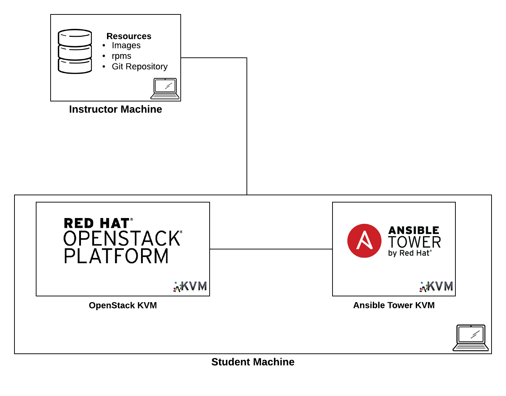

Managing the lifecycle of your OpenShift cluster from installation and beyond
==============================

The use of automation tooling to manage the installation and ongoing maintenance of the OpenShift Container Platform

# Note: The material contained within this repository has not been configured, tested or vetted outside of the lab environment. The anticipated date for this material to be available for use in other environments will be no later than June 15, 2017.

## Overview

This repository contains the assets associated with building a multi-product reference architecture to properly manage the lifecycle of the OpenShift Container platform using automation tooling such as [Ansible](https://www.ansible.com/). 

## Components

Infrastructure 
* 3 [KVM](https://www.linux-kvm.org/page/Main_Page) Instances
	* [Ansible Tower](https://www.ansible.com/tower)
	* [Red Hat OpenStack Platform](https://www.redhat.com/en/technologies/linux-platforms/openstack-platform)
	* Repository
		* Offline RPM, Docker registry and Git repository

* [Red Hat OpenShift Container Platform](https://www.openshift.com/container-platform/)
	* 1 master, 1 infrastructure node, 1 application node
* [Red Hat CloudForms](https://www.redhat.com/en/technologies/management/cloudforms)

## Repository Organization

The majority of the components are located on the `master` branch. This includes the tooling to provision the underlying virtual machines along with most *ansible* playbooks. The *L104353* branch contains a fork of the [openshift-ansible](https://github.com/openshift/openshift-ansible) with custom logic to install the OpenShift Container Platform. 

## Red Hat Summit 2017 Lab (L104353)

This project originated as a lab titled [Managing the lifecycle of your OpenShift cluster from installation and beyond](https://rh2017.smarteventscloud.com/connect/sessionDetail.ww?SESSION_ID=104353) at Red Hat Summit 2017.

* [Lab Guide](docs/rhsummit17-lab-guide.html)

The following diagram depicts the deployed components once the lab is completed

