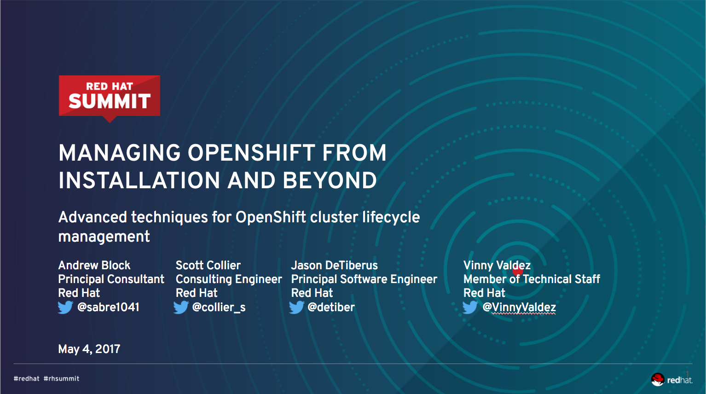
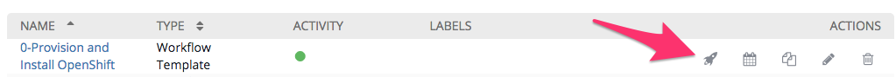

---
---

== Abstract
_Configuring distributed systems can be difficult. Fortunately, automation tools such as Ansible are available to help manage even the most complex environments. In this lab, you'll take the reigns of your own cluster and experience firsthand how Ansible can be used to install, configure, and maintain OpenShift to support mission-critical systems. Once you install Red Hat OpenShift, you'll learn how to diagnose, troubleshoot, and resolve common platform issues. Managing the platform doesn't stop once the installation is complete. You'll use Ansible to simplify ongoing maintenance in an automated fashion. Finally, the use of centralized management systems will be introduced into the environment in order to demonstrate its importance and to provide a streamlined experience for both platform maintainers and users._

toc::[]

== Lab 0 - Pre-Lab Setup

Welcome! We are going to jump right into the lab implementation and then review the overall architecture and strategy afterward. You have been tasked with managing a Red Hat Container Platform environment running on the Red Hat OpenStack platform. Ansible Tower is also available and being used to execute and manage the overall installation of OpenShift.

Let’s perform some brief validation of the environment and kick off the OpenShift installation.

NOTE: The installation of OpenShift Container Platform can take 20-25 minutes so must be started immediately. If bullet point 1 below takes longer than 1 minute to complete, skip it and go directly to bullet point 2.

. Connect to the running OpenStack environment to validate no servers exist:
    .. From the UI
        ... In a local web browser open link:http://rhosp.admin.example.com[http://rhosp.admin.example.com]
        ... Login with:
            .... Username: **user1** 
            .... Password: **summit2017**
        ... Click on **Compute** -> **Instances**
        ... Verify there are no instances running
    .. From the CLI (for advanced OpenStack users)
        ... SSH with password **summit2017**
+
[source, bash]
----
kiosk$ ssh user1@rhosp.admin.example.com
rhosp$ openstack server list
----

. Connect to Ansible Tower to start the OpenShift deployment:
    .. From a local web browser open https://tower.admin.example.com[https://tower.admin.example.com]
    .. **NOTE**: If you get an error **internal server error ** then SSH to the Tower VM and restart services. SSH with password **summit2017**
+
[source, bash]
----
kiosk$ ssh root@tower.admin.example.com
tower# ansible-tower-service restart
----
    .. Login with the following credentials:
        ... Username: **admin**
        ... Password: **summit2017**
    .. On Ansible Tower overview page, select **Templates** on the menu bar at the top of the screen.
    .. Locate the job template called **0-Provision and Install OpenShift**
    .. Execute the job by clicking the rocket ship icon on the right hand side of the screen under the _Actions_ column
+

