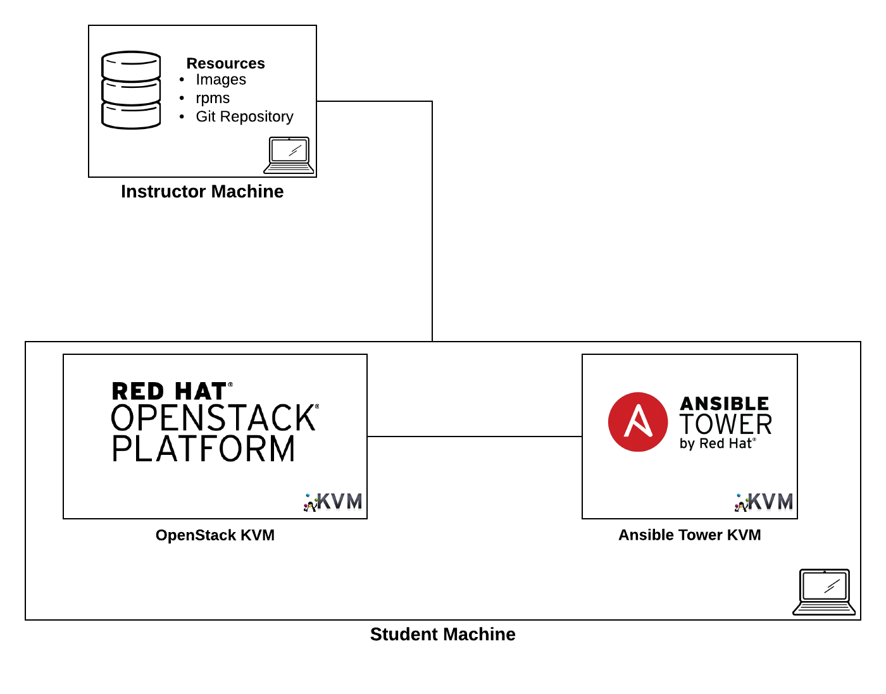
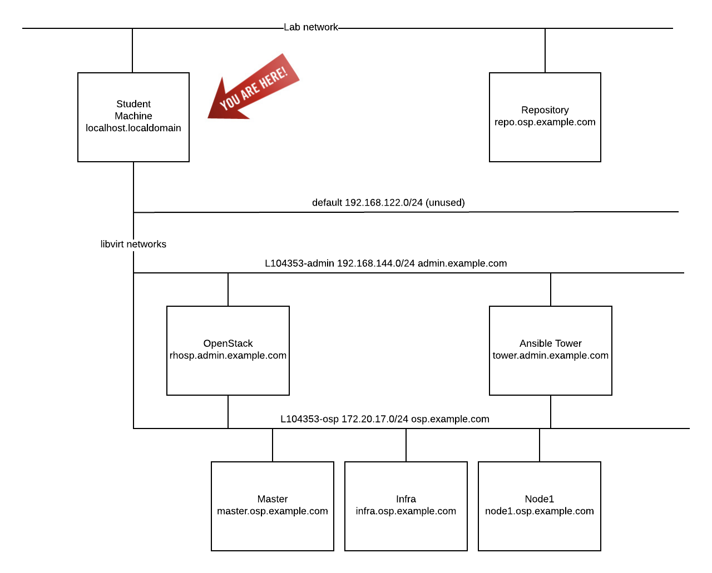
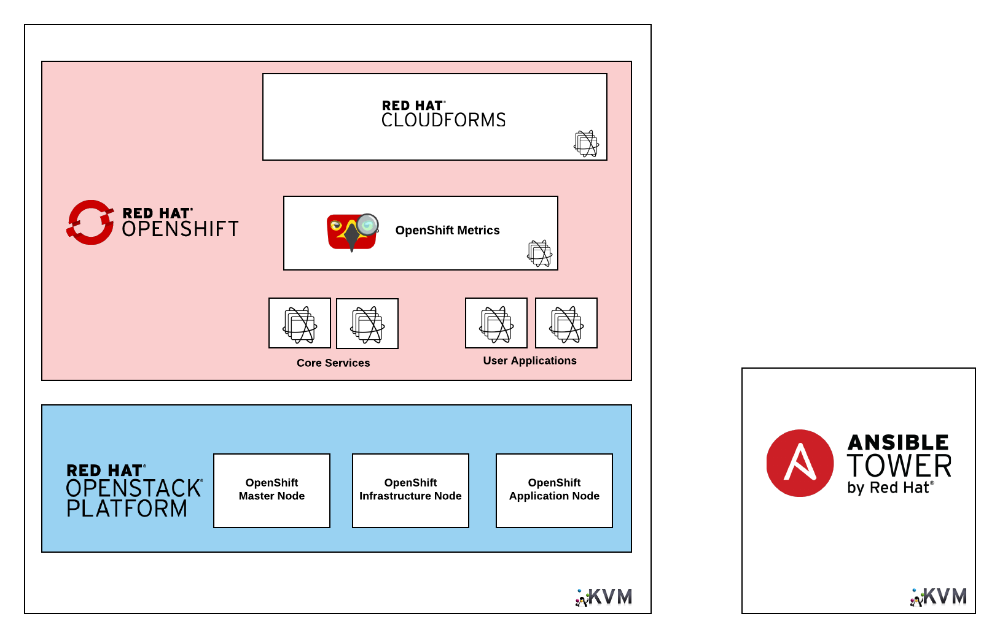

=== Lab Overview

Managing an ecosystem of infrastructure and applications can be challenging. Fortunately, there are automation tools and technologies available to handle the most intense workloads. Today, we will leverage tools such as Ansible Tower to automate the provisioning of the OpenShift Container Platform on top of Amazon Web Services to provide the foundation for running containerized applications. Afterward, Red Hat CloudForms will be deployed to manage and monitor the underlying infrastructure and applications that run in the environment. Finally, we will walk through expanding the environment by adding new compute resources to the environment. By the conclusion of the lab, you will learn how each of these technologies complement one another to offer solutions to effectively manage the most complex environment.

=== Environment Overview

The lab environment that we will utilize today consists of multiple virtual machines running in Amazon Web Services.  The details of each virtual machine are listed below:

* Student Workstation - This is the workstation / laptop that you brought with you to the lab.
* AWS is hosting instances that will be used for the Red Hat OpenShift Container Platform 3.6.
    * Red Hat OpenShift Container Platform
        ** 1 Master node
        ** 2 Application Nodes
           *** Red Hat CloudForms (containerized)
    * Ansible Tower 3.1.4
        ** hostname: tower-<student_id>.rhte.sysdeseng.com

In addition to the virtual machines that are running in AWS, an instructor machine is also contained within the environment and provides additional resources such as the AWS private key.

The following diagram depicts the network layout within the environment:

=== Target Environment

As you progress through the series of labs, you will build increased capabilities for effectively managing containerized workloads. The diagram below represents the environment that we will be building today.

=== Connectivity Details

There are several components that will be utilized throughout the course of this lab. The following table outlines how to connect to each resource:

[options="header"]
|======================
| *Item* | *URL* | *Access*
| Ansible Tower|
link:https://tower-<student_id>.rhte.sysdeseng.com[https://tower-<student_id>.rhte.sysdeseng.com] |
Username: admin +
Password: rhte2017
| OpenShift Container Platform |
link:https://:master-<student_id>.rhte.sysdeseng.com:8443[https://master-<student_id>.rhte.sysdeseng.com:8443] |
Username: student +
Password: rhte2017
| Red Hat CloudForms |
link:https://cloudforms-cloudforms.apps-<student_id>.rhte.sysdeseng.com[https://cloudforms-cloudforms.apps-<student_id>.rhte.sysdeseng.com] |
Username: admin +
Password: smartvm
|======================

Each component plays a critical role into the overall management of the environment. Now let’s get started!
