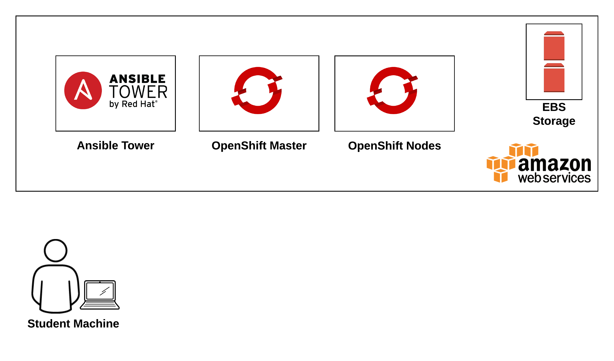
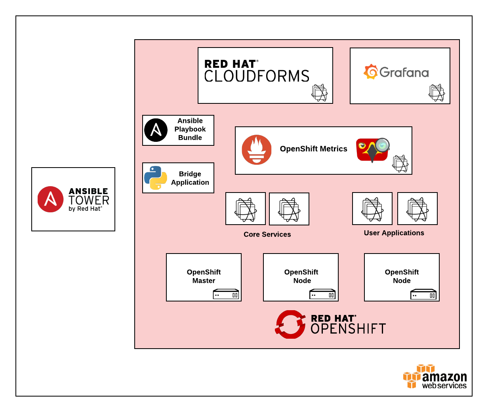

toc::[]
= Lab 0 - Overview

== Abstract
_Today’s complex application environments require a design that addresses several common themes: they must be automated, scalable and manageable. This starts from the ground up: from the infrastructure layer all the way up to the lifecycle of applications. Fortunately, working in unison, the collection of Red Hat’s cloud and automation technologies can be used to orchestrate the infrastructure and application deployment process along with providing insight into the operational environment. In this hands-on session, attendees will experience firsthand how Ansible and Ansible Tower can be a central fixture within the enterprise by coordinating an installation of the Red Hat OpenShift Container Platform on top of Amazon Web Services. Since containers can not only run mission critical applications, but also the components to manage the infrastructure, a containerized version of Red Hat CloudForms will then be deployed to provide insight into the runtime environment. The result is solution that demonstrates how the combination or the proper tools can solve the most complex challenges._

=== Lab Overview and Introduction

Managing an ecosystem of infrastructure and applications can be challenging. Fortunately, there are automation tools and technologies available to handle the most intense workloads. Today, we will leverage tools such as Ansible Tower to automate the provisioning of the OpenShift Container Platform on top of Amazon Web Services to provide the foundation for running containerized applications. Afterward, Red Hat CloudForms will be deployed to manage and monitor the underlying infrastructure and applications that run in the environment. Finally, we will walk through expanding the environment by adding new OpenShift compute resources to the environment. By the conclusion of the lab, you will learn how each of these technologies complement one another to offer solutions to effectively manage the most complex environment.

=== Environment Overview

The lab environment that we will utilize today consists of the workstation that you brought with you along with multiple virtual machines running in Amazon Web Services (AWS).  The details of each virtual machine are listed below:

* Student Workstation - This is the workstation / laptop that you brought with you to the lab.
* AWS is hosting instances that will be used for the Red Hat OpenShift Container Platform 3.7.
    * Red Hat OpenShift Container Platform
        ** 1 Master node
        ** 2 Application Nodes (1 Application node intitially, then scaled up to 2)
           *** Red Hat CloudForms (containerized)
    * Ansible Tower 3.2.2
        ** hostname: `tower-<student_id>.labs.sysdeseng.com`

In addition to the virtual machines that are running in AWS, an instructor machine is also contained within the environment and provides additional resources such as the AWS private key.

The following diagram depicts a high level overview of the environment:

=== Target Environment

As you progress through the series of labs, you will build increased capabilities for effectively managing containerized workloads. The diagram below represents the environment that we will be building today.

=== Connectivity Details

There are several components that will be utilized throughout the course of this lab. During the lab, you will be asked navigate to components running in the environment from a web browser as well as connect directly to the VMs running in AWS via _SSH_.

A specific `student_id` should have been assigned to you. This must be used consistently throughout the rest of this lab. A private key will also be provided in order to facilitate direct connectivity to the instances.

*IMPORTANT: If you have not been asigned a `student_id` immediately halt and raise your hand to speak with an instructor!*

The following table outlines how to connect to each resource:

[options="header"]
|======================
| *Item* | *URL* | *Access*
| Ansible Tower|
link:https://tower-<student_id>.labs.sysdeseng.com[https://tower-<student_id>.labs.sysdeseng.com] |
Username: <student_id> +
Password: INSTRUCTOR WILL PROVIDE
| OpenShift Container Platform |
link:https://:master-<student_id>.labs.sysdeseng.com:8443[https://master-<student_id>.labs.sysdeseng.com:8443] |
Username: <student_id> +
Password: INSTRUCTOR WILL PROVIDE
| Red Hat CloudForms |
link:https://cloudforms-cloudforms.apps-<student_id>.labs.sysdeseng.com[https://cloudforms-cloudforms.apps-<student_id>.labs.sysdeseng.com] |
Username: admin +
Password: INSTRUCTOR WILL PROVIDE
| Linux SSH private key
| link:https://instructor.labs.sysdeseng.com/rhte.pem[https://instructor.labs.sysdeseng.com/rhte.pem]
| Username: student +
Password: INSTRUCTOR WILL PROVIDE
| Windows PuTTY private key
| link:https://instructor.labs.sysdeseng.com/rhte.ppk[https://instructor.labs.sysdeseng.com/rhte.ppk]
| Username: student +
Password: INSTRUCTOR WILL PROVIDE
|======================

You will need to use a private key file to _SSH_ to the instances that are deployed on AWS. Choose the section below to follow based on your operating system type:

* For Linux/OSX

Retrieve the `rhte.pem` key from the instructor server so that you can _SSH_ into the instances by accessing the password protected directory from the table above. Download the _rhte.pem_ file to your local machine and change the permissions of the file to 600.

.workstation$
[source, bash]
----
chmod 600 rhte.pem
----

* For Windows

Install putty on your Windows machine. link:http://www.putty.org/[http://www.putty.org/]

Once installed, use the following instructions to SSH to the Tower instance link:http://docs.aws.amazon.com/AWSEC2/latest/UserGuide/putty.html[http://docs.aws.amazon.com/AWSEC2/latest/UserGuide/putty.html].

Each component plays a critical role into the overall management of the environment. Now let’s get started!

'''

==== <<../lab1/lab1.adoc#lab1,Next Lab: Lab 1 - Introduction / Setup>>
==== <<../../README.adoc#lab1,Home>>
