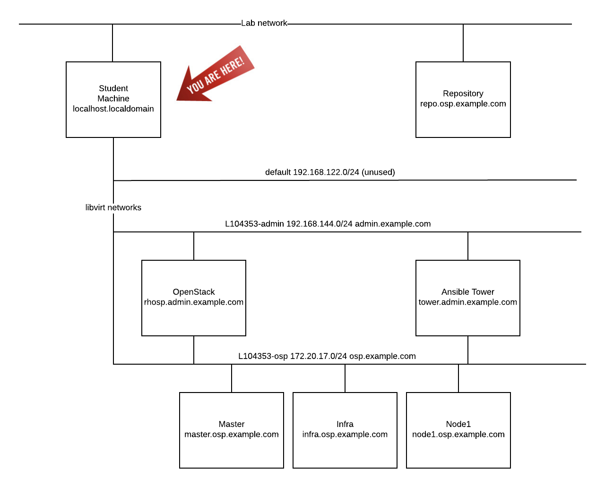

=== Lab Overview

With the OpenShift installation process kicked off, we can spend some time and provide an overview of the entire lab.

Managing an ecosystem of infrastructure and applications can be challenging. Fortunately, there are automation tools and technologies available to handle the most intense workloads. Today, we will leverage tools such as Ansible to automate the provisioning of the OpenShift Container Platform on top of Red Hat OpenStack Platform to provide the foundation for running containerized applications. Afterward, Red Hat CloudForms will be deployed to manage and monitor the underlying infrastructure and applications that run in the environment. Finally, we will walk through expanding the environment by adding new compute resources to the environment. By the conclusion of the lab, you will learn how each of these technologies complement one another to offer solutions to effectively manage the most complex environment.

=== Environment Overview

The lab environment that we will utilize today consists of multiple KVM virtual machines running within each student workstation. The details of each virtual machine are listed below:

* Student Workstation - KVM hypervisor (the system you are logged into now)
* AWS is hosting instances that will be used for the Red Hat OpenShift Container Platform 3.6.
    ** hostname: <YOUR PUBLIC DNS NAME FROM AWS>
    ** Red Hat OpenShift Container Platform
        *** 1 Master node
        *** 2 Application Nodes
            **** Red Hat CloudForms (containerized)
    ** Ansible Tower 3.1.2
        *** hostname: tower.admin.example.com

In addition to the virtual machines that are running on each student workstation, an instructor machine is also contained within the environment and provides additional resources.  

+

image::../images/image24.png[]

+

The following diagram depicts the network layout within the environment:

+

=== Target Environment

As you progress through the series of labs, you will build increased capabilities for effectively managing containerized workloads. The diagram below represents the environment that we will be building today.

image::../images/image25.png[]

=== Connectivity Details

There are several components that will be utilized throughout the course of this lab. The following table outlines how to connect to each resource:

[options="header]
|======================
|Item|URL|Access|Virt Level
| Ansible Tower|
link:https://tower.admin.example.com[https://tower.admin.example.com] |
Username: admin
Password: summit2017 |
L1
| OpenShift Container Platform |
link:https://master.osp.example.com:8443[https://master.osp.example.com:8443] |
Username: user1 
Password: summit2017 |
L2
| Red Hat CloudForms |
link:https://cloudforms-cloudforms.apps.example.com[https://cloudforms-cloudforms.apps.example.com] |
Username: admin
Password: smartvm |
L2 (container)
|======================

Each component plays a critical role into the overall management of the environment. Now let’s get started!
