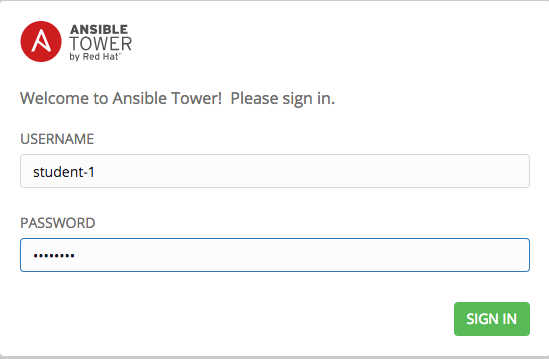
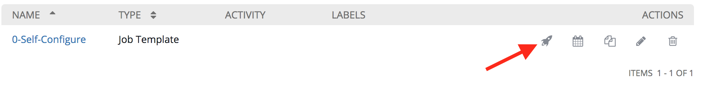
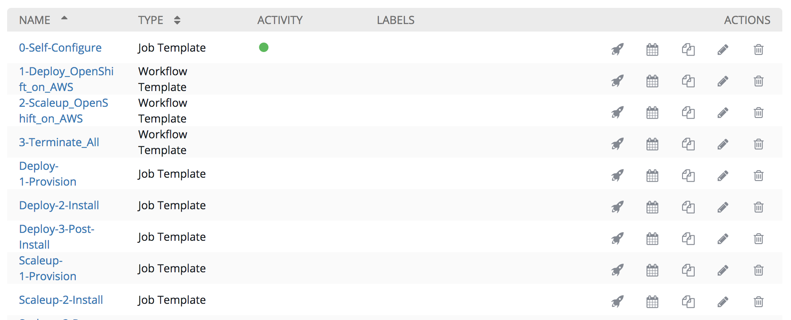

= Lab 1 - Lab Setup

== Connectivity Details for This Lab

[options="header"]
|======================
| *Item* | *URL* | *Access*
| Ansible Tower|
link:https://tower-<student_id>.labs.sysdeseng.com[https://tower-<student_id>.labs.sysdeseng.com] |
Username: <student_id> +
Password: INSTRUCTOR WILL PROVIDE
|======================

Welcome! We are going to jump right into the lab implementation and then review the overall architecture and strategy afterward. You have been tasked with managing a Red Hat Container Platform environment running in AWS. Ansible Tower is also deployed in this environment and being used to execute and manage the deployment of AWS services and installation of OpenShift.

=== Configure Ansible Tower:

Prior to installing the OpenShift Container Platform, Ansible Tower must be configured first. This section will introduce several key benefits for using Ansible Tower over standalone ansible and provide a solid baseline for the rest of the lab session. 

From a local web browser open https://tower-<student_id>.labs.sysdeseng.com[https://tower-<student_id>.labs.sysdeseng.com] and login using the credentials provided. This will be the tower instance that was assigned to you.

**IMPORTANT**: The value for “<student_id>” needs to be consistent throughout the rest of the lab. Failure to do so, can cause issues including losing the ability to successfully complete the lab.

The instance of tower has been minimally configured prior to the lab. The installation of OpenShift does take some time to complete, so we will provide a high level overview of each component we will be configuring until the installation has been initiated, and then circle back afterward for a deeper explanation. 

A link:http://docs.ansible.com/ansible-tower/latest/html/userguide/projects.html[Project] that references the Git based repository associated with has been configured on the _PROJECTS_ page called _Managing OCP from Install and Beyond_. 

image::images/tower-project-initial.png[]

A link:http://docs.ansible.com/ansible-tower/latest/html/userguide/job_templates.html[Job Template] that references a playbook within the Project will be used to execute a playbook that will complete the configuration process of Tower.

From the Tower overview page, select **TEMPLATES**.

A single Job Template called _0-Self-Configure_ is available that will finalize the rest of the setup of the Tower instance itself. Click the **RocketShip** to launch the template. Feel free to review the details of the playbook while it is running from here: link:https://github.com/sabre1041/managing-ocp-install-beyond/tree/summit2018/roles/tower_config/tasks[Tower Config]

Track the progress of the job until successful completion. The job configures several aspects of the Ansible Tower. A comprehensive explanation will be covered in the next lab. 

Now trigger the deployment of instances to AWS and the installation of OpenShift by scrolling down and selecting the **RocketShip** next to _1-Deploy_OpenShift_on_AWS_ Workflow Job.

The workflow job template takes about 30 minutes to complete. While that is going on, move on the the next lab and continue working. You can check back periodically for progress.

'''

==== <<../lab0/lab0.adoc#lab0,Previous Lab: Lab 0 - Lab Overview>>
==== <<../lab2/lab2.adoc#lab2,Next Lab: Lab 2 - Exploring the Environment>>
==== <<../../README.adoc#lab1,Home>>

