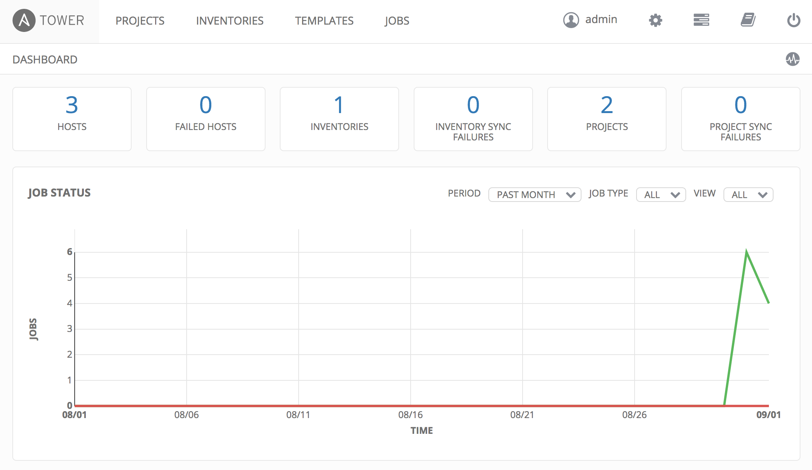
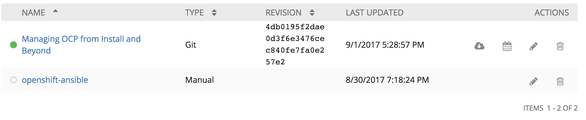
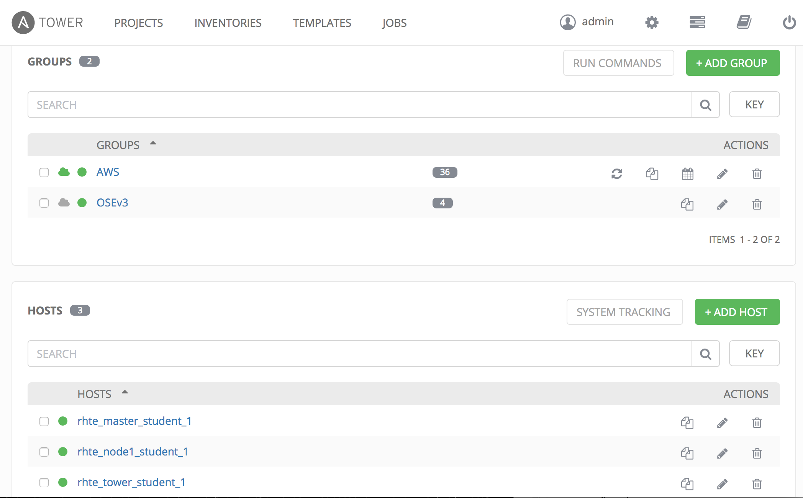
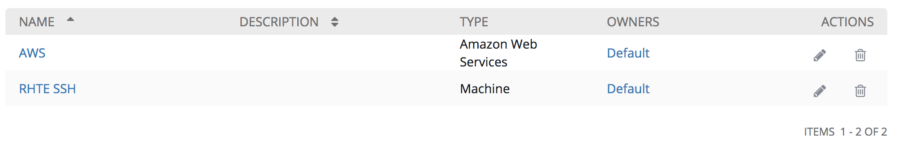
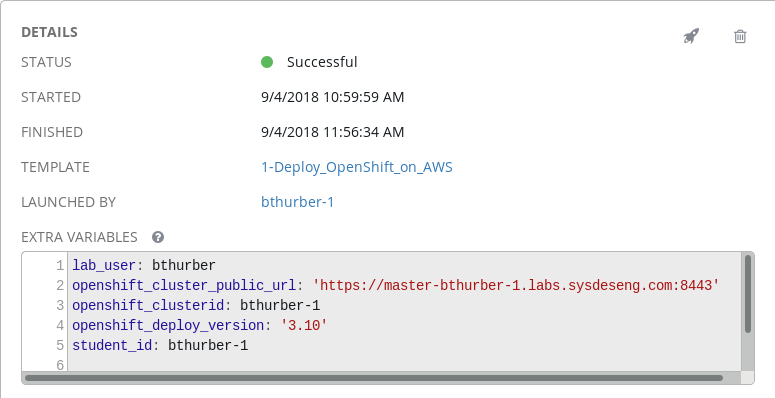
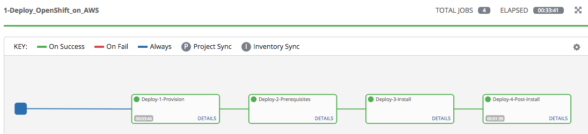

== Exploring the Environment

With the installation of the OpenShift Container Platform started and an understanding of the environment as as whole, we are going to take time waiting for the installation to complete to explore the existing environment in further detail.

=== Exploring Ansible Tower

Ansible is an agentless automation engine that automates cloud provisioning, configuration management, application deployment, intra-service orchestration, along with many other IT needs. Ansible is used to provision, install and deploy the OpenShift Container Platform to a cluster of instances.

Ansible Tower provides the central management of Ansible workloads to enable complex workflows to manage environments big and small. The entire installation and management of the OpenShift Container Platform can be managed from a centralized Ansible Tower environment. In this lab, Ansible Tower is configured as a stand-alone VM on AWS.

TIP: Use the SSH key referenced in lab0 to SSH to the Tower instanced.

==== Accessing Ansible Tower CLI

link:http://docs.ansible.com/ansible-tower/latest/html/towerapi/tower_cli.html[tower-cli] is a command line tool for Ansible Tower. It leverages the REST API to interact and manage Tower.

First, connect to the Ansible Tower instance via SSH

.workstation$
[source, bash]
----
ssh -i rhte.pem ec2-user@tower-<student_id>.rhte.sysdeseng.com
----

Once logged into Ansible Tower, explore the CLI.

.tower$
[source, bash]
----
sudo tower-cli --help
sudo tower-cli version
sudo tower-cli host list
sudo tower-cli inventory list
sudo tower-cli job list
sudo tower-cli credential list
sudo tower-cli job_template list
sudo tower-cli group list
sudo tower-cli workflow list
sudo tower-cli project list
----

==== Accessing Ansible Tower Web Console

From your workstation machine, open a web browser and navigate to link:https://tower-<student_id>.rhte.sysdeseng.com[https://https://tower-<student_id>.rhte.sysdeseng.com].

Login with the provided credentials.

If successful, you will then be placed at the Ansible Tower overview page:

====== Job Templates

First, let’s review the job template that was just executed to provision the OpenShift Container Platform. This workflow template consists of three chained job templates:

* Deploy-1-Provision - Prepares the AWS environment by provisioning two instances, a master and a node
* Deploy-2-Install - This step utilizes a dynamic inventory of AWS and then installs the OpenShift Container Platform on the instances provisioned previously
* Deploy-3-Post-Install - Customizes the OpenShift cluster for the lab

Additional job templates relating to scaling the OpenShift environment and terminating the AWS instances have also been configured. A portion of these will be discussed in subsequent labs.

===== Projects

The Job Templates utilize Projects, or collections of Ansible playbooks, that in this lab are sourced from both a Git repository and the local file system on the Ansible Tower instance. To view the projects that are being utilized, select the **PROJECTS** link on the menu bar. Two projects are being leveraged:

* openshift-ansible - Installs and configures the OpenShift Container Platform based on components from the `openshift-ansible-playbooks` rpm installed on the Tower machine 
* Managing OCP from Install and Beyond - Customized Ansible tooling to perform pre and post installation steps sourced from a Git repository

The configuration of each project can be viewed by selecting the pencil (edit) button under the _Actions_ column.

===== Inventory

An link:http://docs.ansible.com/ansible-tower/latest/html/userguide/inventories.html[inventory] within Ansible Tower is similar to a standalone inventory file and contains a collection of hosts in which jobs may be launched. The inventories defined within Tower can be accessed by clicking on the **INVENTORIES** link on the menu bar. The _OpenShift_ inventory provides a top level container over two child groups:

* AWS - link:docs.ansible.com/ansible/latest/intro_dynamic_inventory.html[Dynamic inventory] used to populate group and host metadata retrieved from AWS
* OSEv3 - Group utilized by the OpenShift Instllation. The instances being utilized are organized into _masters_ and _nodes_ child groups based on their overall role and purpose. Also included are child groups with the naming convention `tag_lab_role_*` that is populated with hosts from the AWS dynamic inventory.

Feel free to navigate through the various child groups within the _OSEv3_ group. Hosts and their attributes can also be shown to view the attributes retrieved from the AWS dynamic inventory.

The most important component of the inventory for this usecase is the sets of inventory group variables defined within the _OSEv3_ group. These variables describe the state of the target OpenShift environment and drive the installation process. The variables can be seen by selecting the **Pencil** icon next to the OSEv3 group under the _Actions_ column.

===== Credentials

link:http://docs.ansible.com/ansible-tower/latest/html/userguide/credentials.html[Credentials] are a mechanism for authenticating against secure resources including target machines, inventory sources and projects leveraging version control systems. Every one of the previously explored areas makes use of a credential. Credentials are configured within the Ansible Tower settings and can be accessed by selecting the **Settings** icon (gear) on the menu bar. Once within the settings page, select the **Credentials** link. The following credentials have been defined:

* AWS - Allows API access to AWS resources
* RHTE SSH - Corresponds to the private key downloaded in lab0. Allows Tower to log in and configure instances running in AWS
link:http://docs.ansible.com/ansible-tower/latest/html/userguide/credentials.html#amazon-web-services[AWS] platform

===== Monitor the Progress of the OpenShift Installation

While browsing through the features of Ansible Tower, keep an eye out on the progress of the job template executing the OpenShift installation. OpenShift will be successfully installed when the status of the _1-Deploy_OpenShift_on_AWS_ workflow job template reports as **Successful** from the **JOBS** page and the play recap reports no errors and appears similar to the following:

Further down, a visual depiction of the workflow can be seen. Click the **Details** link on each rectangle to see the details of each playbook. The overall workflow job is complete when all 3 playbooks are completed successfully.

This lab is concluded when the Ansible Tower job is completed successfully.

'''

==== <<../lab1/lab1.adoc#lab1,Previous Lab: Lab 1 - Introduction / Setup>>
==== <<../lab3/lab3.adoc#lab3,Next Lab: Lab 3 - Verifying Installation of Red Hat OpenShift Container Platform Using Ansible Tower>>
==== <<../../README.adoc#lab1,Home>>

