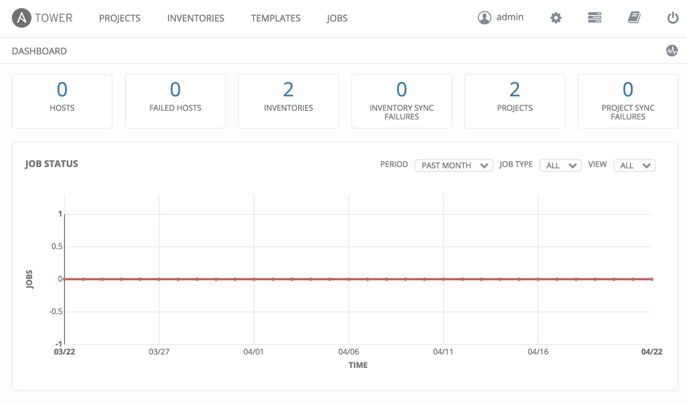
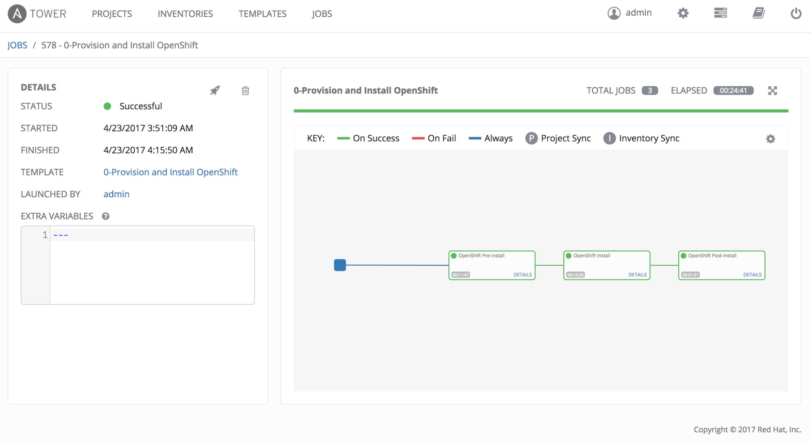
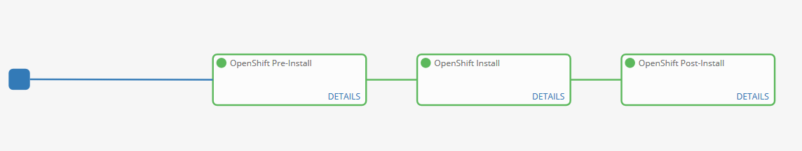

=== Exploring the Environment

With the installation of the OpenShift Container Platform started and an understanding of the environment as as whole, we are going to take time waiting for the installation to complete to explore the environment in further detail.

=== Exploring Ansible Tower

Since the installation of OpenShift can take anywhere from 20 - 30 mins, let us take this opportunity to explore the features and configurations of Ansible Tower in the lab environment.

Ansible is an agentless automation engine that automates cloud provisioning, configuration management, application deployment, intra-service orchestration, along with many other IT needs. Ansible is used to provision, install and deploy the OpenShift Container Platform to a cluster of instances.

Ansible Tower provides the central management of Ansible workloads to enable complex workflows to manage environments big and small. The entire installation and management of the OpenShift Container Platform can be managed from a centralized Ansible Tower environment. In this lab, Ansible Tower is configured as a stand-alone VM on AWS.

TIP: Remember to go back to lab0 to get the rhte.pem private key.

=== Accessing Ansible Tower CLI

[source, bash]
----
# ssh -i rhte.pem ec2-user@tower-<student_id>.rhte.sysdeseng.com
----

Once logged into Ansible Tower, explore the CLI.

[source, bash]
----
 ** sudo tower-manage --help
 ** sudo tower-cli version
 ** sudo tower-cli host list
 ** sudo tower-cli inventory list
 ** sudo tower-cli job list
 ** sudo tower-cli credential list
 ** sudo tower-cli job_template list
----

==== Accessing Ansible Tower Web Console

From the student machine, open a web browser and navigate to link:https://tower-<student_id>.rhte.sysdeseng.com[https://https://tower-<student_id>.rhte.sysdeseng.com].

Login with the following credentials:

Username **admin** +
Password **rhte2017**

If successful, you will then be placed at the Ansible Tower overview page:

===== Job Templates

First, let’s review the job template that we just executed to provision the OpenShift Container Platform. This workflow template consists of three chained job templates:

* Deployment-1-Provision - Prepares the AWS environment by provisioning two instances, a master and a node
* Deployment-2-Install - This step performs a dynamic inventory of AWS and then installs the OpenShift Container Platform
* Deployment-3-Post-Install - Customizes the OpenShift cluster for the lab

===== Projects

The Job Templates utilize Projects, or collections of Ansible playbooks, that in this lab are sourced from a Git repository. To view the projects that are being utilized, select the **Projects** link on the menu bar. Two projects are being leveraged:

* openshift-ansible - Installs and configures the OpenShift Container Platform
* Managing OCP from Install and Beyond - Customized Ansible tooling to prepare lab exercises

The configuration of each project can be viewed by selecting the pencil (edit) button under the _Actions_ column.

===== Inventory

An link:http://docs.ansible.com/ansible-tower/latest/html/userguide/inventories.html[inventory] within Ansible Tower is similar to a standalone inventory file and contains a collection of hosts in which jobs may be launched. The inventories defined within Tower can be accessed by clicking on the **Inventories** link on the menu bar. The _OpenShift_ inventory defines the hosts organized within groups to install and configure the environment. Each group along with the host and variables that have been defined can be accessed by selecting the pencil icon under the _Actions_ column next to each group.

===== Credentials

link:http://docs.ansible.com/ansible-tower/latest/html/userguide/credentials.html[Credentials] are a mechanism for authenticating against secure resources including target machines, inventory sources and projects leveraging version control systems. Every one of the previously explored areas makes use of a credential. Credentials are configured within the Ansible Tower settings and can be accessed by selecting the **Settings** icon (gear) on the menu bar. Once within the settings page, select the **Credentials** link. The following credentials have been defined:

* AWS - Allows API access to AWS resources
* RHTE SSH - Allows Tower to log in and configure instances running in AWS
link:http://docs.ansible.com/ansible-tower/latest/html/userguide/credentials.html#amazon-web-services[AWS] platform

===== Monitor the Progress of the OpenShift Installation

While browsing through the features of Ansible Tower, keep an eye out on the progress of the job template executing the OpenShift installation. OpenShift will be successfully installed when the status of the job template reports as **Successful** and the play recap reports no errors and appears similar to the following:

Click the **Details** link on each rectangle to see the details of each playbook. The overall workflow job is complete when all 3 playbooks are completed successfully.

This lab is concluded when the Ansible Tower job is completed successfully.

'''

==== <<../lab1/lab1.adoc#lab1,Previous Lab: Lab 1 - Introduction / Setup>>
==== <<../lab3/lab3.adoc#lab3,Next Lab: Lab 3 - Verifying Installation of Red Hat OpenShift Container Platform Using Ansible Tower>>
==== <<../../README.adoc#lab1,Home>>

