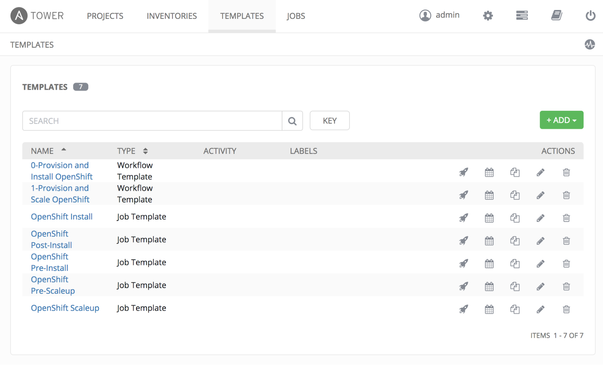
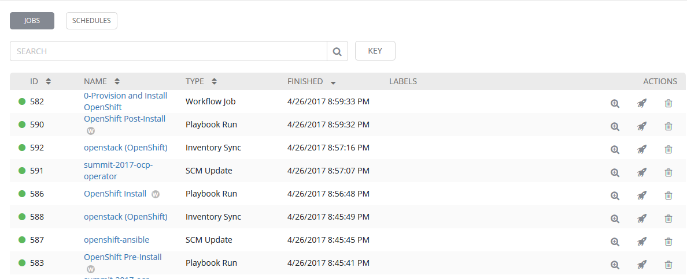
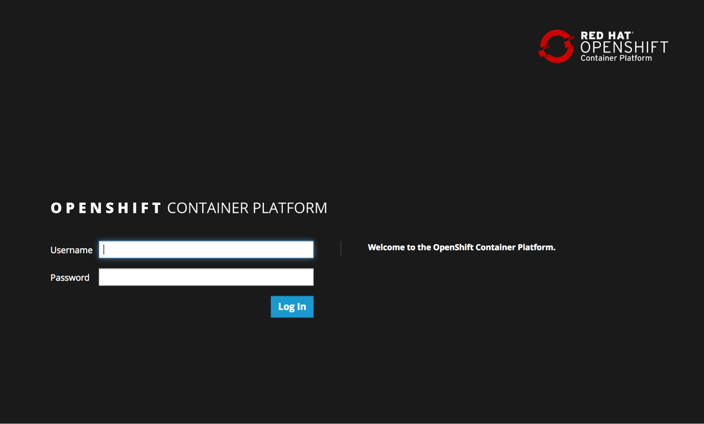

=== Reviewing Install of OpenShift

In this lab, we will review the install of the OpenShift Container Platform using Ansible Tower that we started at the beginning of this session.

The OpenShift Container Platform is installed through a collection of ansible resources. This automation toolset allows platform administrations the ability to quickly provision an environment with minimal effort. Ansible Tower has been configured with a link:http://docs.ansible.com/ansible-tower/latest/html/userguide/job_templates.html[Job Template] that makes use of these assets to install OpenShift on instances available in the OpenStack environment.

To view the list of Job Templates configured in Ansible Tower, select **Templates** on the menu bar at the top of the screen.

All of the job templates configured in Ansible Tower are listed below. Earlier you launched the job template called **0-Provision and Install OpenShift**. This is a link:https://docs.ansible.com/ansible-tower/latest/html/userguide/workflows.html[workflow job] type and will execute multiple chained job templates to provision OpenShift. Review the workflow jobs and playbooks that were run in the **Jobs** page. 

When you execute the job template, you will be transferred to the jobs page where you will be able to track the progress and status of the installation. For more information on the Ansible playbooks see link:https://github.com/openshift/openshift-ansible[https://github.com/openshift/openshift-ansible]

=== Validate the OpenShift Installation

With the OpenShift Container Platform installation complete, let’s perform a few tests to validate the status of the environment. There are two primary methods for accessing OpenShift: the web console and the Command Line tool (CLI).
From the student machine, open a web browser and navigate to the following address:

link:https://master.osp.example.com:8443[https://master.osp.example.com:8443]

If successful, you should see the following page representing the OpenShift landing page:

Use the following credentials to access the web console:

Username: **user1** +
Password: **summit2017**

The OpenShift web console provides an interactive way to interact with the OpenShift platform. After successfully authenticating, you are presented with an overview page containing all of the projects that you have access to. Since you are a normal user, you do not have access to any projects.
In subsequent labs, we will explore the OpenShift web console in further detail.

However, we will still use this opportunity to showcase the different items exposed within the web console.

Now that we have had an opportunity to login to the OpenShift web console from a developer's standpoint, let’s shift over to an administrative and operations point of view and access the cluster directly using the terminal.

Since the instances deployed within the OpenStack environment are utilizing cloud-init, login to the OpenShift Master instance as _cloud-user_:

.kiosk$
[source, bash]
----
kiosk$ ssh -i ~/.ssh/L104353-tower.pem cloud-user@master.osp.example.com
----

Access to the cluster is available using the _system:admin_ user which has the cluster-admin role. This can be confirmed by executing the following command which should confirm the currently logged in user is _system:admin_

.master$
[source, bash]
----
master$ oc whoami
----

As one would expect, users with the _cluster-admin_ role have elevated permissions in comparison to normal users, such as _user1_ which was utilized when browsing the web console.

Cluster administrators can view all of the nodes that have constitute the cluster:

.master$
[source, bash]
----
master$ oc get nodes
----

View all of the Projects that have been created by users or to support the platform:

.master$
[source, bash]
----
master$ oc get projects
----

Along with listing all of the Persistent Volumes that have been defined:

.master$
[source, bash]
----
master$ oc get pv
----

Now check out the OpenShift on OpenStack cloud provider integration.

.master$
[source, bash]
----
master$ cat /etc/origin/cloudprovider/openstack.conf

[Global]
auth-url = http://rhosp.admin.example.com:5000/v2.0/
username = admin
password = summit2017
tenant-name = L104353
----

The cloud provider integration file tells OpenShift how to interact with OpenStack. You can see that it’s doing so via the OpenStack API which requires an auth-url, credentials, and a tenant name. This integration between OpenShift and OpenStack enable capabilities like dynamic storage provisioning for applications. Cloud Provider configurations are specific to each provider, for example, you also have cloud provider configurations for AWS, Azure, VMware, etc…

Let’s check out the storage class as well, continuing on the integration story.

.master$
[source, bash]
----
master$ oc get storageclass
----

.master$
[source, bash]
----
master$ oc describe storageclass ocp
----

Notice that the provisioner is the cinder provisioner and the is-default-class is set to **'true'**.

You can use the OpenShift Command line tool as a user with cluster administrator role to access the entire set of configurations for the platform.

NOTE: With great power comes great responsibility. Executing commands as a user with cluster administrator rights has the potential to negatively impact the overall health of the environment.

IMPORTANT:  If you need to teardown the OpenShift Environment and start over, execute the **OpenShift Teardown** job template. However, please raise your hand and inform one of the lab instructors. _If you do this too late into the lab you may not have enough time to finish_. See this table for a reference of typical times for the Tower jobs: <<Appendix D - Average Tower Job Times>>

This concludes lab 3

