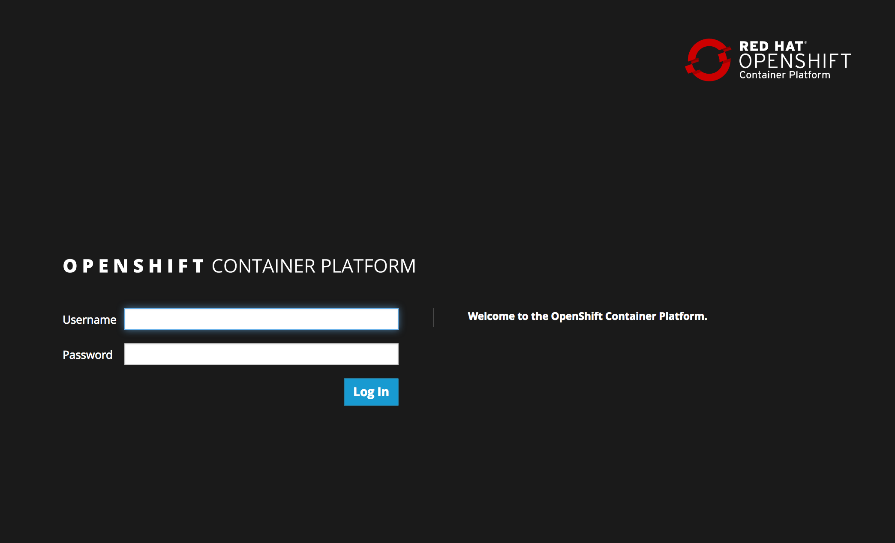

== Reviewing Install of OpenShift

In this lab, we will review the install of the OpenShift Container Platform using Ansible Tower that we started at the beginning of this session.

=== Validate the OpenShift Installation

With the OpenShift Container Platform installation complete, let’s perform a few tests to validate the status of the environment. There are two primary methods for accessing OpenShift: the link:https://docs.openshift.com/container-platform/latest/architecture/infrastructure_components/web_console.html[web console] and the link:https://docs.openshift.com/container-platform/latest/cli_reference/index.html[Command Line tool (CLI)].

==== OpenShift Web Console

From your workstation, open a web browser and navigate to the following address:

link:https://master-<student_id>.rhte.sysdeseng.com:8443[https://master-<student_id>.rhte.sysdeseng.com:8443]

If successful, you should see the following page representing the OpenShift landing page:

Login using the provided credentials to access the web console:

The OpenShift web console provides an interactive way to interact with the OpenShift platform. After successfully authenticating, you are presented with an overview page containing all of the projects that you have access to, along with resources that can be deployed to the platform. Since you are a normal user, you do not have access to any projects by default.

In subsequent labs, we will explore the OpenShift web console in further detail.

==== OpenShift Command Line Interface (CLI)

Now that we have had an opportunity to login to the OpenShift web console from a developer's standpoint, let’s shift over to an administrative and operations point of view and access the cluster directly using the terminal.

The instances are deployed within the AWS environment, login to the OpenShift Master instance as _ec2-user_:

.workstation$
[source, bash]
----
ssh -i rhte.pem ec2-user@master-<student_id>.rhte.sysdeseng.com
----

Access to the cluster is available using the _system:admin_ user which has the cluster-admin role. This can be confirmed by executing the following command which should confirm the currently logged in user is _system:admin_

.master$
[source, bash]
----
oc whoami
----

As one would expect, users with the _cluster-admin_ role have elevated permissions in comparison to normal users, such as _<student_id>_ which was utilized previously when browsing the web console.

Cluster administrators can view all of the nodes that constitute the cluster:

.master$
[source, bash]
----
oc get nodes
----

View all of the link:https://docs.openshift.com/container-platform/lastest/dev_guide/projects.html[Projects] that have been created by users or as part of the base infrastructure to support the platform:

.master$
[source, bash]
----
oc get projects
----

List all of the link:https://docs.openshift.com/container-platform/latest/architecture/additional_concepts/storage.html#persistent-volumes[Persistent Volumes] that have been defined:

.master$
[source, bash]
----
oc get pv
----

Now check out the link:https://docs.openshift.com/container-platform/latest/install_config/configuring_aws.html[OpenShift on AWS] cloud provider integration.

.master$
[source, bash]
----
master$ sudo cat /etc/origin/cloudprovider/aws.conf

[Global]
Zone = ap-southeast-1a
----

The cloud provider integration file tells OpenShift how to interact with AWS. You can see that it’s doing so via the AWS API which leverages the AWS credentials that were created prior to your going through the lab. This integration between OpenShift and AWS enable capabilities like dynamic storage provisioning for applications. Cloud Provider configurations are specific to each provider, for example, you also have cloud provider configurations for OpenStack, Azure, VMware, etc…

Let’s check out the link:https://docs.openshift.com/container-platform/latest/install_config/storage_examples/storage_classes_dynamic_provisioning.html[storage class] as well, continuing on the integration story.

.master$
[source, bash]
----
oc get storageclass
----

By defining the AWS cloud provider, the OpenShift installer automatically configures a storage class to support persistent storage. 

.master$
[source, bash]
----
oc describe storageclass gp2
----

Notice that the provisioner is the gp2/ebs provisioner and the `is-default-class` is set to **'true'**. The usage of the _is-default-class_ annotation defines a link:https://docs.openshift.com/container-platform/3.6/install_config/storage_examples/storage_classes_dynamic_provisioning.html#example2[Default Storage Class] that will automatically provision instances when a link:https://docs.openshift.com/container-platform/latest/architecture/additional_concepts/storage.html#persistent-volume-claims[Persistent Volume Claim] is created.

You can use the OpenShift Command line tool as a user with cluster administrator role to access the entire set of configurations for the platform as time permits.

NOTE: With great power comes great responsibility. Executing commands as a user with cluster administrator rights has the potential to negatively impact the overall health of the environment.

IMPORTANT: If you need to teardown the OpenShift Environment and start over, execute the _Terminate-OCP_ job template. However, be extremely careful not to launch _Terminate_All_ or _3-Terminate_All_ as this will also delete your Tower instance. Please raise your hand and inform one of the lab instructors if this happens. _If you do this too late into the lab you may not have enough time to finish_. See this table for a reference of typical times for the Tower jobs: <<Appendix D - Average Tower Job Times>>

This concludes lab 3

'''

==== <<../lab2/lab2.adoc#lab2,Previous Lab: Lab 2 - Exploring the Environment>>
==== <<../lab4/lab4.adoc#lab4,Next Lab: Lab 4 - Installing Red Hat CloudForms>>
==== <<../../README.adoc#lab1,Home>>

