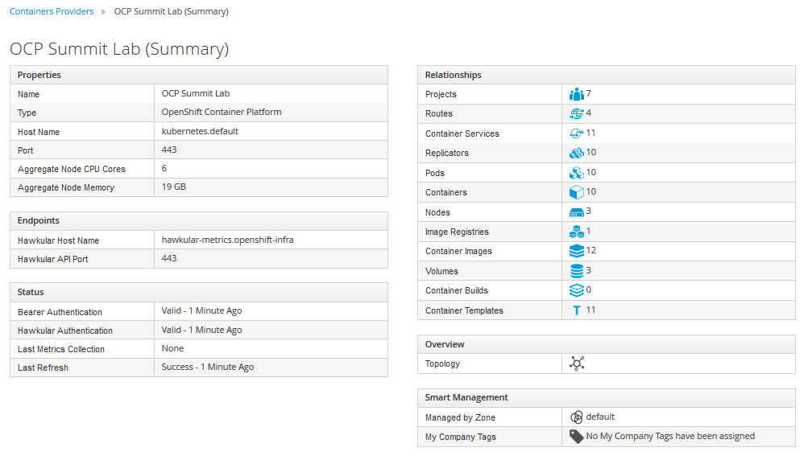

=== Installing Red Hat CloudForms

Red Hat CloudForms Management Engine (CFME) delivers the insight, control, and automation necessary to address the challenges of managing complex environments. CloudForms is available as a standalone appliance, but is also available as a containerized solution that can be deployed on the OpenShift Container Platform.

In this lab, you will deploy a single instance/replica of Red Hat CloudForms to the OpenShift Container Platform cluster and configure the container provider to monitor the OpenShift environment.

=== Deploy Red Hat CloudForms

NOTE: If you are repeating this lab due to an issue encountered, consider using <<Appendix B - Script For Deploying CloudForms>>

Since Red Hat CloudForms is available as a container, it can be deployed to the OpenShift Container Platform in a few short steps.

A user with cluster-admin permissions must be used to configure the environment as CloudForms requires access to privileged resources

First, using the OpenShift Command Line, create a new project called **cloudforms**

.master$
[source, bash]
----
master$ oc new-project cloudforms
----

By creating a new project, the context of the CLI is automatically switched into the _cloudforms_ project:

.master$
[source, bash]
----
master$ oc config current-context for context
----

When creating a new project, a set of service accounts are automatically provisioned. These accounts are used when building, deploying and running containers. The _default_ service account is the de facto service account used by pods. Since CloudForms is deployed within a pod and requires access to key metrics in the OpenShift environment along with the host, it must be granted elevated access as a privileged resource. In OpenShift, permissions associated to pods are managed by link:https://docs.openshift.com/container-platform/3.4/admin_guide/manage_scc.html[Security Context Constraints] and the service account that is used to run them.

Execute the following command to add the default service account in the cloudforms project to the privileged SCC:

.master$
[source, bash]
----
master$ oc adm policy add-scc-to-user privileged \
        system:serviceaccount:cloudforms:default
----

Confirm the user is associated to the privileged SCC:

.master$
[source, bash]
----
master$ oc get scc privileged -o yaml
----

Confirm _system:serviceaccount:cloudforms:default_ is in the result returned.

CloudForms retrieves metrics from applications deployed within OpenShift, and its leverages the data exposed by the onboard metrics infrastructure (Hawkular). Since the platform metrics are deployed in the _openshift-infra_ project and CloudForms is deployed in the cloudforms project, they cannot communicate with each other due to use of the link:https://docs.openshift.com/container-platform/3.4/architecture/additional_concepts/sdn.html[multitenant SDN plugin] which isolates each project at a network level.

Fortunately, as a cluster administrator, you can manage the configuration of the pod overlay network to allow traffic to traverse between specific projects or be exposed to all projects. Execute the following command to join the _cloudforms_ project to the _openshift-infra_ project

.master$
[source, bash]
----
master$ oc adm pod-network join-projects cloudforms --to=openshift-infra
----

Verify the NETID is the same for these projects

.master$
[source, bash]
----
master$ oc get netnamespace | egrep 'cloudforms|openshift-infra'
----

==== Instantiate CloudForms Templates

The components representing the containerized deployment of Red Hat CloudForms is available as a template and located on the repository server. Execute the following command to download the file to the openshift master VM and explore it:

.master$
[source, bash]
----
master$ curl -o cfme.yaml http://repo.osp.example.com/ocp/templates/cfme-template.yaml
master$ cat cfme-template.yaml
----

Notice how the services are set up, how variables are passed along, which containers are used, etc...  This is how we are defining how CloudForms is being configured.

Add the template to the OpenShift cloudforms project

NOTE: The `-n cloudforms` parameters specifies the namespace explicitly. You can omit this if you are sure you are in the _cloudforms_ project. Use `oc project -q` to verify.

Verify the template is available in the OpenShift environment

.master$
[source, bash]
----
master$ oc get -n cloudforms template cloudforms

NAME     DESCRIPTION                  PARAMETERS   OBJECTS
cloudforms  CloudForms appliance with persistent storage  23 (1 blank)  12
----

The persistent storage required by CloudForms will be dynamically provisioned by the link:https://docs.openshift.com/container-platform/3.4/install_config/configuring_openstack.html#install-config-configuring-openstack[OpenStack cloud provider].

Instantiate the template to deploy Red Hat CloudForms. Since no parameters were specified, the default values as defined in the template will be utilized.

.master$
[source, bash]
----
master$ oc new-app -n cloudforms --template=cloudforms
----

Red Hat CloudForms will now be deployed into the _cloudforms_ project.

==== Validating a Successful Deployment

There are several steps that can be taken in order to verify the deployment of Red Hat CloudForms in OpenShift.
First validate that all pods are successfully running by watching the status of the pods. When all pods are running and the _-deploy_ pods are terminated, stop the command with CTRL+C. The following output is a full deployment which took just over 4 minutes:

.master$ 
[source, bash]
----
master$ oc -n cloudforms get pods -w

NAME                  READY     STATUS              RESTARTS   AGE
cloudforms-1-deploy   0/1       ContainerCreating   0          0s
memcached-1-deploy    0/1       ContainerCreating   0          0s
NAME                  READY     STATUS    RESTARTS   AGE
postgresql-1-deploy   0/1       Pending   0          0s
postgresql-1-deploy   0/1       Pending   0         0s
postgresql-1-deploy   0/1       ContainerCreating   0         0s
memcached-1-nih8c   0/1       Pending   0         0s
memcached-1-nih8c   0/1       Pending   0         0s
memcached-1-nih8c   0/1       ContainerCreating   0         0s
memcached-1-deploy   1/1       Running   0         7s
cloudforms-1-sc191   0/1       Pending   0         0s
cloudforms-1-sc191   0/1       Pending   0         0s
cloudforms-1-sc191   0/1       ContainerCreating   0         0s
cloudforms-1-deploy   1/1       Running   0         8s
postgresql-1-deploy   1/1       Running   0         8s
postgresql-1-244w2   0/1       Pending   0         0s
postgresql-1-244w2   0/1       Pending   0         0s
postgresql-1-244w2   0/1       ContainerCreating   0         1s
memcached-1-nih8c   0/1       Running   0         5s
memcached-1-nih8c   1/1       Running   0         10s
memcached-1-deploy   0/1       Completed   0         19s
memcached-1-deploy   0/1       Terminating   0         19s
memcached-1-deploy   0/1       Terminating   0         19s
cloudforms-1-sc191   0/1       Running   0         15s
postgresql-1-244w2   0/1       Running   0         33s
postgresql-1-244w2   1/1       Running   0         51s
postgresql-1-deploy   0/1       Completed   0         59s
postgresql-1-deploy   0/1       Terminating   0         59s
postgresql-1-deploy   0/1       Terminating   0         59s
cloudforms-1-sc191   1/1       Running   0         4m
cloudforms-1-deploy   0/1       Completed   0         4m
cloudforms-1-deploy   0/1       Terminating   0         4m
cloudforms-1-deploy   0/1       Terminating   0         4m
^C
----

Red Hat CloudForms may take up to 5 minutes to start up for the first time as it builds the content of the initial database. As noted above, the deployment of CloudForms will be complete when the status has changed to “Running” for the containers.

Execute the following command to view the overall status of the pods in the cloudforms project

.master$
[source, bash]
----
master$ oc status -n cloudforms
----

For full details of the deployed application run

.master$
[source, bash]
----
master$ oc describe -n cloudforms pod/cloudforms-<pod_name>
----

Next, in order to validate the cloudforms pod is running with the proper _privileged_ SCC, export the contents and inspect the _openshift.io/scc_ annotation to confirm the _privileged_ value is present:

.master$
[source, bash]
----
master$ oc -n cloudforms get -o yaml pod cloudforms-<pod_name>

...
metadata:
 annotations:
  openshift.io/scc: privileged
...
----

For more details check events:

.master$
[source, bash]
----
master$ oc -n cloudforms get events
----

You can also check volumes:

.master$
[source, bash]
----
master$oc -n cloudforms get pv
----

NOTE: If the project may have to be removed and start over again.  **Only perform this task if there was an irrecoverable failure. Let and instructor know before doing this.** <<Appendix C - Recovering From Failed CloudForms  Deployment>>

==== Accessing the CloudForms User Interface

As part of the template instantiation, a route was created that allows for accessing resources from outside the OpenShift cluster. Execute the following command to locate the name of the route that was created for CloudForms

.master$
[source, bash]
----
master$ oc -n cloudforms get routes

NAME     HOST/PORT                   PATH   SERVICES   PORT   TERMINATION
cloudforms  cloudforms-cloudforms.apps.example.com       cloudforms  https   passthrough
----

Open a web browser and navigate securely to the to the hostname retrieved above:
link:https://cloudforms-cloudforms.apps.example.com[https://cloudforms-cloudforms.apps.example.com].

NOTE: If you get an error such as Application Not Available see <<Appendix E - Troubleshooting CloudForms>>

Since Red Hat CloudForms in the lab environment uses a self signed certificate, add an exception in the browser to add an exception.

Use the following credentials to access the console:

Username: **admin** +
Password: **smartvm**

Once successfully authenticated, you should be taken to the overview page

==== Configuring the Container Provider

Red Hat CloudForms gathers metrics from infrastructure components through the use of providers. An OpenShift container provider is available that queries the OpenShift API and platform metrics. As part of the OpenShift installation completed previously, cluster metrics were automatically deployed and configured. CloudForms must be configured to consume from each of these resources.

Configure the container provider:

    . Hover your mouse over the **Compute** tab.
    . Once over the compute tab, additional panes will appear. (do not click anything yet)
    .Hover over **Containers** and then click on **Providers**.
    . No container providers are configured by default. Add a new container provider by clicking on **Configuration** (with a gear icon)
    . Lastly select **Add Existing Container Provider**
+

Start adding a new Container Provider by specifying **OCP Summit Lab** as the name and **OpenShift Container Platform** as the type.

As mentioned previously, there are two endpoints in which CloudForms retrieves metrics from. First, configure the connection details to the OpenShift API. Since CloudForms is deployed within OpenShift, we can leverage the internal service associated with API called _kubernetes_ in the default project. Internal service names can be referenced across projects in the form _<service_name>.<namespace>_

Enter **kubernetes.default** in the _hostname_ field and **443** in the _port_ field.

The token field refers to the OAuth token used to authenticate CloudForms to the OpenShift API. The _management-infra_ project is a preconfigured project as part of the OpenShift installation. A service account called management-admin is available that has access to the requisite resources needed by CloudForms. Each service account has an OAuth token associated with its account. 

Execute the following command to retrieve the token.

.master$
[source, bash]
----
master$ oc serviceaccounts get-token -n management-infra management-admin
----

Copy the value returned into the token fields. Click the **Validate** button to verify the configuration.

Next, click on the **Hawkular** tab to configure CloudForms to communicate with the cluster metrics.

Enter **hawkular-metrics.openshift-infra** in the _hostname_ field and **443** in the _port_ field.

Click **Add** to add the new container provider.

You have now configured Red Hat CloudForms to retrieve metrics from OpenShift. It may take a few minutes to data to be displayed.

To force an immediate refresh of the newly added Provider:
 
    . Select the **OCP Summit Lab** provider icon
    . Notice all of the **Relationships** have 0 items
    . Now select the **Configuration** drop-down again
    . Choose **Refresh Items and Relationships**
    . Lastly, click the **Refresh** icon just to the left of **Configuration**
    . Now the Relationships should be populated with data from OpenShift
+

Select **Compute** -> **Containers** -> **Overview** to view the collected data. Once baseline metrics similar to what is shown below appears, you can move on to the next lab. Feel free to explore the CloudForms web console as time permits to view additional details exposed from the OpenShift cluster.

=== Configuring the OpenStack Cloud Provider

NOTE: This lab should be considered optional and/or stretch goal. If you are behind just skip this section and move onto the next lab.

Red Hat CloudForms can also gather metrics and infrastructure data from our Red Hat OpenStack Platform environment, in the same manner that it is now collecting information from our OpenShift Container Platform.

Configure the OpenStack cloud provider:

    . Hover your mouse over the **Compute** tab.
    . Once over the compute tab, additional panes will appear. (do not click anything yet)
    . Hover over **Clouds** and then click on **Providers**.
    . No cloud providers are configured by default. Add a new cloud provider by clicking on **Configuration** (with a gear icon)
    . Lastly select **Add New Cloud Provider**
    . For the _Add New Cloud Provider_ section use these values:
        .. For _Name_: enter **RHOSP Summit Lab**
        .. For _Type_: choose **OpenStack**
        .. Leave the other items in this upper section default (including empty _Region_)
        .. For _Tenant Mapping_ Enabled toggle this option to Yes
    . In the lower section labeled _Endpoints_ in the first tab labeled _Default_
        .. For _Hostname_ enter **rhosp.admin.example.com**
        .. Leave _API Port_ at **5000**
        .. For _Security Protocol_ change the drop-down to **Non-SSL**
        .. For _Username_ enter **admin**
        .. For the _Password_ fields use **summit2017**
        .. Select **Validate**
    . In the Events section leave **Ceilometer** selected
    . Lastly, **Add** the cloud provider to CloudForms.
+

You have now configured Red Hat CloudForms to retrieve metrics from Red Hat OpenStack Platform. It may take a few minutes to data to be displayed.

To force a refresh of the newly added Provider:

    . Select the **RHOSP Summit Lab** provider icon
    . Notice all of the **Relationships** have 0 items
    . Now select the **Configuration** drop-down again
    . Choose **Refresh Items** and **Relationships**
    Lastly, click the **Refresh** icon just to the left of Configuration
    . Now the Relationships should be populated with data from OpenStack in a few short minutes
    . Feel free to browse the new objects and get familiar with your newly connected OpenStack environment. In other words, click everything.
+

This concludes lab 4.

