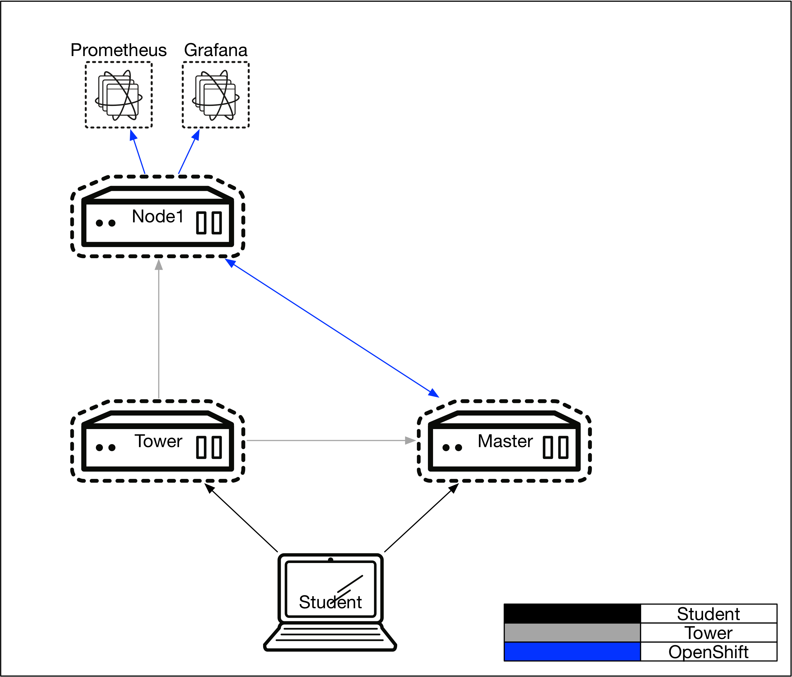
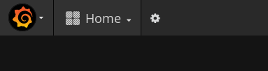
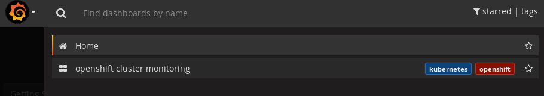

= Lab 4 - Prometheus and Grafana



== Connectivity Details for This Lab

[options="header"]
|======================
| *Item* | *URL* | *Access*
| OpenShift Container Platform
| link:https://:master-<student_id>.labs.sysdeseng.com:8443[https://master-<student_id>.labs.sysdeseng.com:8443]
| Username: <student_id> +
Password: INSTRUCTOR WILL PROVIDE
| Linux SSH private key
| link:https://instructor.labs.sysdeseng.com/summit/managing-ocp-install-beyond.pem[https://instructor.labs.sysdeseng.com/summit/managing-ocp-install-beyond.pem]
| Username: student +
Password: INSTRUCTOR WILL PROVIDE
| Grafana
| link:https://grafana-grafana.apps-<student_id>.labs.sysdeseng.com[grafana-grafana.apps-<student_id>.labs.sysdeseng.com]
| Username: <student_id>-admin +
Password: INSTRUCTOR WILL PROVIDE
| Prometheus
| link:https://prometheus-openshift-metrics.apps-<student_id>.labs.sysdeseng.com[prometheus-openshift-metrics.apps-<student_id>.labs.sysdeseng.com]
| Username: <student_id>-admin +
Password: INSTRUCTOR WILL PROVIDE
|======================

== Overview

Now that we have an overview of the environment, we are going to switch gears a little. In this lab, we will explore how to handle metrics and visualization of those metrics using OpenShift, link:https://prometheus.io/[Prometheus] and link:https://grafana.com/[Grafana]. We'll do a high level overview of each component, discuss how they interoperate and finally explore the environment to see how to these components together.

=== Prometheus

From the website: "Prometheus is an open-source systems monitoring and alerting toolkit originally built at SoundCloud". Prometheus has gained in popularity over the past couple of years and has native integration with OpenShift which enables us to leverage it's powerful capabilities to gain insight into our clusters. Prometheus is a project in the Cloud Native Computing Foundation. As all admins and developers know, Day 1 operations of installation and configuration are fun, but the fun really starts on Day 2.  Keeping an eye on our performance and making sure the cluster is functioning properly is easier with the right tools. That's where Prometheus comes in.

=== OpenShift

OpenShift is Red Hat's enterprise version of Kubernetes. Kubernetes has built in endpoints that Prometheus can scrape to gather information from and store in the Prometheus database. This tight integration is provided to you in a seamless out of box experience in Tech Preview status as of OpenShift 3.9.

=== Grafana

Grafana is "The open platform for beautiful analytics and monitoring". We will leverage Grafana to visualize the data that Prometheus is storing. Much of this is automated as we will simply point Grafana to the Prometheus datastore and it will provide a dashboard with several key metrics that we should and will be interested in.


==== Exploring Prometheus

To set some context here, Prometheus was deployed on your OpenShift cluster with the following options, which are subject to change in future iterations.

```
openshift_hosted_prometheus_deploy: true
openshift_prometheus_node_selector:
  type: infra
openshift_prometheus_namespace: openshift-metrics
openshift_prometheus_args:
  - '--storage.tsdb.retention=3d'
  - '--web.enable-lifecycle'
openshift_prometheus_additional_rules_file: {{ tower_openshift_prometheus_config_dir }}/prometheus_additional_rule.yml
openshift_node_open_ports:
  - service: "Prometheus Node Exporter"
    port: "9100/tcp"
openshift_prometheus_node_exporter_image_version: "{{ openshift_image_tag }}"
```

Now that we know how Prometheus was deployed, we are going to explore the environment a bit more. From your _master_ host, execute the following commands.

.master$
[source, bash]
----
$ oc whoami
----

Change to the `openshift-metrics` project and list the pods that are available.

.master$
[source, bash]
----
oc project openshift-metrics
oc get pods
----

We see a list of pods that are running. Now we want to see which containers are actually running in the Prometheus pod. You will see that there are several. Because those containers are running in the same pod, they are gauranteed to land on the same physical OpenShift node.

.master$
[source, bash]
----
$ oc get pods -l app=prometheus -o=custom-columns=NAME:.metadata.name,CONTAINERS:.spec.containers[*].name
----

Look at the routes, statefulsets, services and pods assocated with the openshift-metrics namespace.

.master$
[source, bash]
----
oc get all
----

Look at the Prometheus ConfigMap as well and explore it. ConfigMap's allow us to pass in parameters and configure applications on the fly.

.master$
[source, bash]
----
oc describe configmap prometheus
----


List the routes for Prometheus and open up the web interface. Copy the URL for prometheus and sign in with the user <student_id>-admin.

.master$
[source, bash]
----
oc get routes
----

Now that we have a route to Prometheus, lets go to web interface and add a graph manually and get a feel for that workflow. The credentials are listed in the table at the top of the page. Your route will look something like:

```
prometheus-openshift-metrics.apps-<student_id>.labs.sysdeseng.com
```

NOTE: Remember to add an `https://` to your route when you go the the browser.

NOTE: The first time you access Prometheus, you will need to authenticate using your OpenShift credentials. Do that, and authorize the proper access to the Prometheus project.

NOTE: If the Prometheus pods fail to start issue the following command on the master:

.master$
[source, bash]
----
sudo systemctl restart atomic-openshift-master-controllers.service atomic-openshift-node.service atomic-openshift-master-api.service
----

Once in the web UI, the `console` is the default view. 

* Click on `Graph` in the top navigation pane.  
* Next, click on the `"insert metric at cursor"` dropdown and scroll to `node_memory_MemAvailable`, then click `Execute`. 
* At this point, you will be on the _Console_ tab. 
* Click on the _Graph_ tab. This should create a graph on your screen. 

Make sure to hover over the lines in the graph and get a sense of what's being offered here. You can continue adding graphs and organizing your dashboard how you want it.

Once you have created a graph or two, take some time to explore the other options on the top navigation bar: `Alerts`, `Status`, `Help`. In the subsequent lab, we are going to spend some time on `Alerts`.

==== Deploy Grafana

Now that we have explored some of the capabilities of Prometheus, let's have a look at how we can use Graphana to do more visualization of the data.

Return to your OpenShift Master node and clone the OpenShift Origin repo and change to the Grafana directory. We are going to checkout a known good commit.

.master$
[source, bash]
----
cd ~
git clone https://github.com/openshift/origin.git
cd origin
git checkout 2075da460d166a98eb557fd9f4bfdaebee3659f7
cd examples/grafana/
----


Deploy Grafana via the setup script that's included in the OpenShift Origin git repository. Then confirm that Grafana is actually running.

.master$
[source, bash]
----
./setup-grafana.sh -n prometheus -p openshift-metrics
oc project
oc get all
oc get routes
----

To close out here, a new project has been created along with the accompanying resources including pods, deployments, etc...  In addition to those components, we also have added a new dashboard that we can log into and review.

=== Explore Grafana

Log in with your OpenShift admin account: <student_id>-admin and the password from your instructor.

https://grafana-grafana.apps-<student_id>.labs.sysdeseng.com

NOTE: The first time you access Grafana, you will need to authenticate using your OpenShift credentials. Do that, and authorize the proper access to the Grafana project.

In the upper left navigation pane, click the `Home` button.



That will expose the `openshift cluster monitoring` link which you should select.



At this point you have access to quite a few dashboards. Please do feel free to check out `Total Usage` to get a high level overview of available resources. Click on a lot of them and explore. See which metrics you are interested in and think about which metrics and thresholds you would be looking at in your environment.

This concludes lab 4

'''

==== <<../lab3/lab3.adoc#lab3,Previous Lab: Verifying Installation of Red Hat OpenShift Container Platform Using Ansible Tower>>
==== <<../lab5/lab5.adoc#lab5,Next Lab: Building an Ansible Playbook Bundle>>
==== <<../../README.adoc#lab1,Home>>
