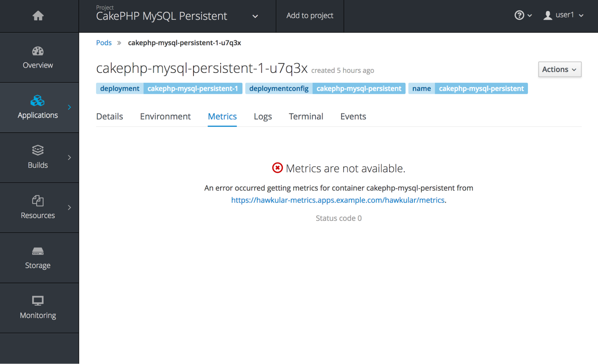
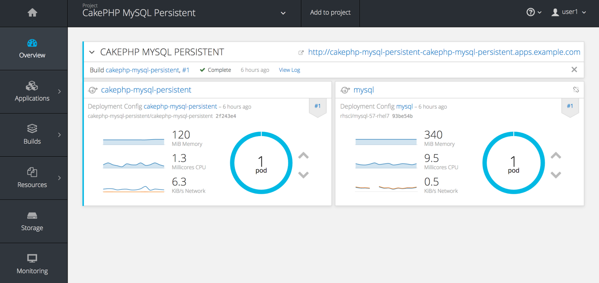

=== Managing the lifecycle of an Application

In this lab, you will deploy an application to Red Hat OpenShift Container Platform and use the tools previously deployed to investigate how to manage the application.

== Deploy a Sample Application

One of the steps to validate the successful installation of an OpenShift Container Platform cluster is to build and deploy a sample application. OpenShift contains a number of quickstart templates that can be used to demonstrate different application frameworks along with the integration with a backend data store. One of these example applications consists of a CakePHP based web application with state stored in a MySQL database.

We will now put our cluster administrator hat aside and complete the majority of this lab as a developer by using the OpenShift web console to build and deploy the sample application.

Navigate to link:https://master-<student_id>.rhte.sysdeseng.com:8443[https://master-<student_id>.rhte.sysdeseng.com:8443] and login using the following credentials.

Username: **student** +
Password: **rhte2017**

As seen in a prior lab, the OpenShift Web Console provides an intiutive interface for managing applications deployed to OpenShift. Introduced as a technical preview in OpenShift 3.6, a new user interface is available that streamlines how to explore available applications and deploy them to the platform. 

image::../images/image30.png[]

The overview page contains a collection of applications that can be deployed via traditional OpenShift link:https://docs.openshift.com/container-platform/3.4/architecture/core_concepts/templates.html[templates] as well as new offerings delivered through the link:https://docs.openshift.com/container-platform/latest/architecture/service_catalog/index.html[Service Catalog]. 

To deploy an application that is served by a persistent backend database running in OpenShift, select **CakePHP + MySQL (Persistent)**.

A new dialog appears that walks though configuring the application. Instead of using a two step process of first creating a project and then deploying an application into the project as in prior versions of OpenShift, both can now be completed using the same dialog. 

On the right hand side of the dialog, ensure **Create Project** is selected in the dropdown underneath _Add to Project_.

Enter the following information in the first few fields below:

Project Name: **cakephp-mysql-persistent** +
Project Display Name: **CakePHP MySQL Persistent** +
Project Description: **Sample Project Demonstrating A CakePHP MySQL Application Using Persistent Storage**

image::../images/image31.png[]

The template that is being utilized provides a set of default parameters for the rest of the fields in the right hand side of the dialog including the location of the source code, application name and additional items to customize the build and deployment.

The default values can be utilized in this case. Some of the values will be automatically generated (such as passords). Do spend a few moments reviewing each of the parameters are some of these items are frequently used in OpenShift templates.

Click the **Create** button to instantiate the template. 

A page displaying the successful instantiation of the template will be displayed along with a set of next steps that you can take against the application. Click the **Continue to Overview** link to return to the project homepage.

== Validating Application Deployment

After triggering instantiating the template, a new Source to Image build of the CakePHP application will begin.

The build can be viewed by selecing the _cakephp-mysql-persistent_ deployment and within the _Builds_ section, a log of the running build can be viewed.

image::../images/image32.png[]

Once the application build completes, the _Deployments_ section will fill in with contents related to the deployment including the running Pod. 

image::../images/image33.png[]

Collapse the _cakephp-mysql-persistent_ deployment and verify pods are running for both _cakephp-mysql-persistent_ and _mysql_. 

image::../images/image34.png[]

=== View Application

From the **Overview** page in the project, both pods should be running.

NOTE: You may see an error getting metrics. This is safe to ignore for now as it will be covered in a subsequent section.

image::../images/image35.png[]

The template automatically creates a route to provide external access to the application. The link is available at the top right corner of the page. Click the link to navigate to the application:

link:http://cakephp-mysql-persistent-cakephp-mysql-persistent.apps-<student_id>.rhte.sysdeseng.com/[http://cakephp-mysql-persistent-cakephp-mysql-persistent.apps-<student_id>.rhte.sysdeseng.com/]

Application users and administrators have the ability to leverage several facilities for monitoring the state of an application deployed to the OpenShift Container Platform. While not deployed to the lab environment, OpenShift provides an link:https://docs.openshift.com/container-platform/latest/install_config/aggregate_logging.html[aggregated logging framework] based on the ELK (Elasticsearch, Fluentd and Kibana) stack. However, you can still utilize the telemetry captured by the cluster metrics mechanisms. Cluster metrics were deployed as part of the OpenShift installation and are being used to drive Red Hat CloudForms.

With the _cakephp-mysql-persistent_ application deployed, you can use the OpenShift web console to view metrics that has been gathered by the cluster metrics facility. Since the metrics facility within the web console reaches out to Hawkular deployed in OpenShift from your web browser, you will need to perform one additional step to configure your browser to trust the self signed certificate configured before metrics can start to be displayed.

    . From the overview page, click on **Applications** on the lefthand side
    . Select **Pods**
    . Select the _Running cakephp_ pod
    . Navigate to the Metrics tab.
+

Click on the link displayed which will connect to the Hawkular endpoint. Accept the self signed certificate and if successful, you will see the Hawkular logo along with additional details about the status of the service.

Return to the OpenShift overview page for the _cakephp-mysql-persistent_ project by clicking the **Overview** link on the left side where you should be able to see metrics being displayed associated to each deployment.

An expanded set of information can be displayed by expanding the deployment.

image::../images/image36.png[]

Additional details relating to the performance of the application can be viewed by revisiting the _Metrics_ tab within each pod as previously described.

While normal consumers of the platform are able to view metrics for only the applications they have permissions to access, cluster administrators can make use of Red Hat CloudForms to view metrics from all applications deployed to the OpenShift Container platform from a single pane of glass.

=== Navigate through the OpenShift Web Console

With an application deployed to the OpenShift cluster, we can navigate through the various options exposed by the OpenShift web console. Use this time as an opportunity to explore the following sections at your own pace:

* Various details provided with each pod including pod details, application logs and the ability to access a remote shell
    ** Hover over **Applications** from the left hand navigation bar and select **Pods**. Select one of the available pods and navigate through each of the provided tabs
* Secrets used by the platform and the _CakePHP_ application
    ** Hover over **Resources** from the left hand navigation bar and select **Secrets**
* Persistent storage dynamically allocated by the cluster to support MySQL
    ** Click on the **Storage** tab

