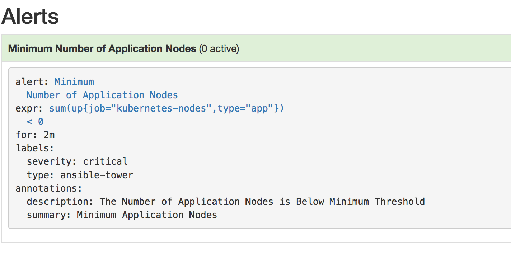
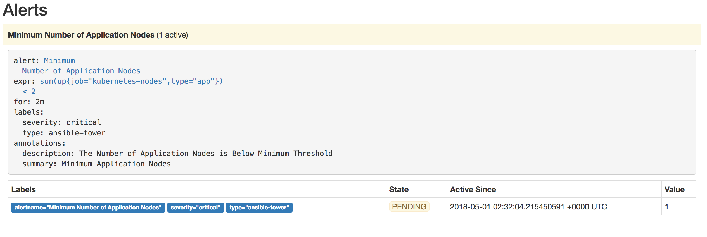
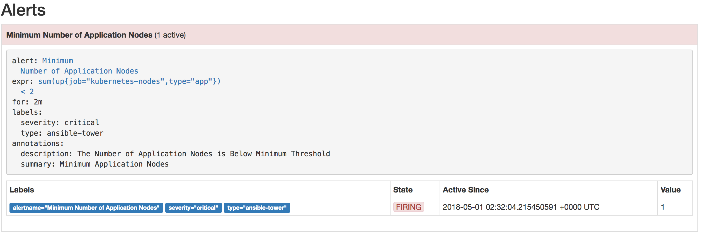
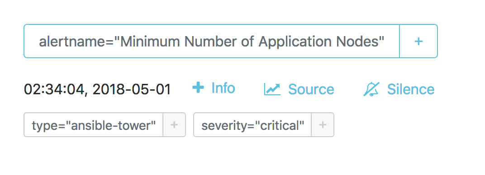
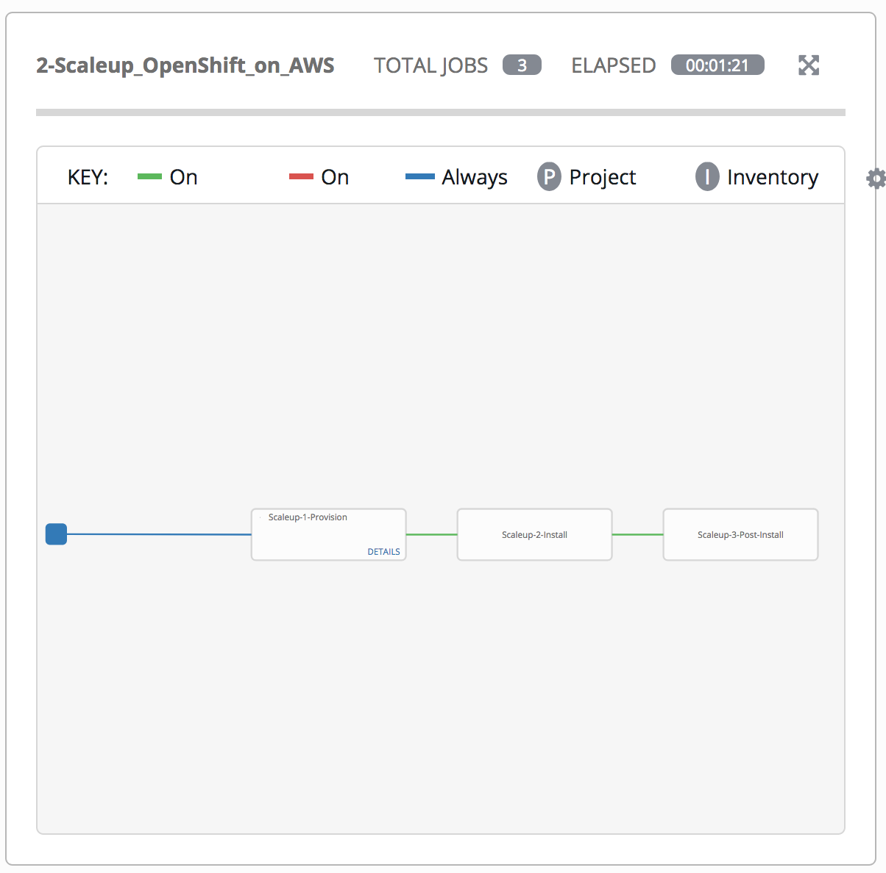
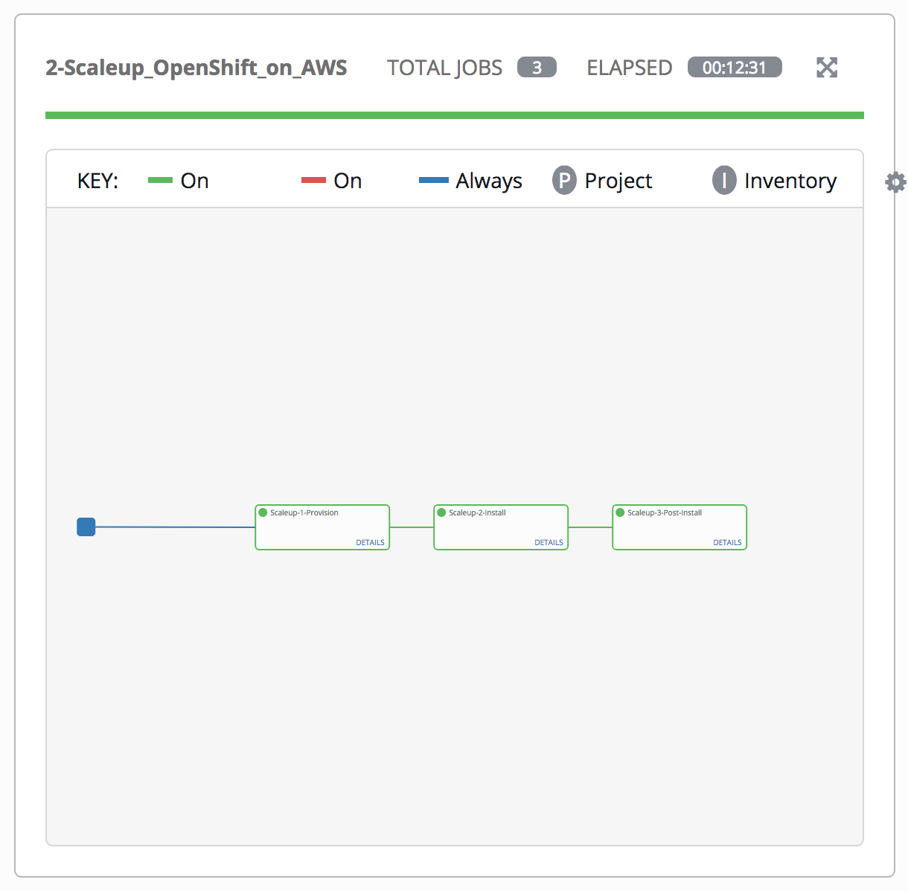
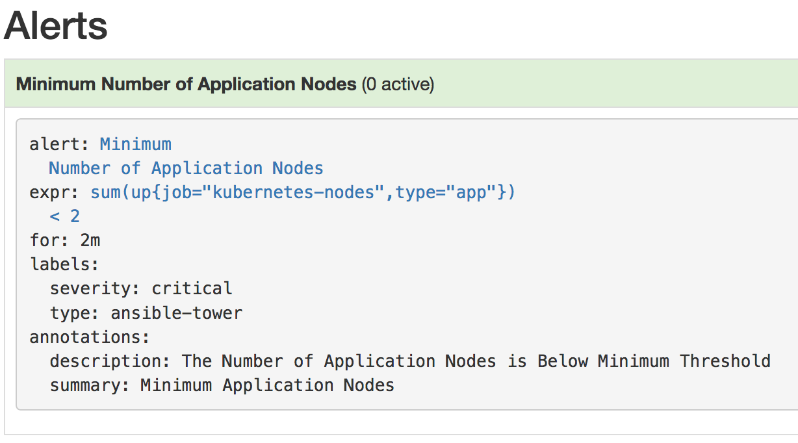

= Lab 5 - Expanding the OpenShift Container Platform Cluster

== Connectivity Details for This Lab

[options="header"]
|======================
| *Item* | *URL* | *Access*
| Ansible Tower|
link:https://tower-<student_id>.labs.sysdeseng.com[https://tower-<student_id>.labs.sysdeseng.com] |
Username: <student_id> +
Password: INSTRUCTOR WILL PROVIDE
| OpenShift Container Platform |
link:https://master-<student_id>.labs.sysdeseng.com:8443[https://master-<student_id>.labs.sysdeseng.com:8443] |
Username: <student_id>-admin +
Password: INSTRUCTOR WILL PROVIDE
| Prometheus |
link:https://prometheus-openshift-metrics.apps-<student_id>.labs.sysdeseng.com[https://prometheus-openshift-metrics.apps-<student_id>.labs.sysdeseng.com] |
Username: <student_id>-admin +
Password: INSTRUCTOR WILL PROVIDE
| AlertManager |
link:https://alertmanager-openshift-metrics.apps-<student_id>.labs.sysdeseng.com[https://alertmanager-openshift-metrics.apps-<student_id>.labs.sysdeseng.com] |
Username: <student_id>-admin +
Password: INSTRUCTOR WILL PROVIDE
| Red Hat CloudForms |
link:https://cloudforms-cloudforms.apps-<student_id>.labs.sysdeseng.com[https://cloudforms-cloudforms.apps-<student_id>.labs.sysdeseng.com] |
Username: admin +
Password: INSTRUCTOR WILL PROVIDE
| Linux SSH private key
| link:https://instructor.labs.sysdeseng.com/rhte.pem[https://instructor.labs.sysdeseng.com/rhte.pem]
| Username: student +
Password: INSTRUCTOR WILL PROVIDE
| Windows PuTTY private key
| link:https://instructor.labs.sysdeseng.com/rhte.ppk[https://instructor.labs.sysdeseng.com/rhte.ppk]
| Username: student +
Password: INSTRUCTOR WILL PROVIDE
|======================

== Overview

In this lab, you will leverage the tools and skills from prior labs to create an Ansible Playbook Bundle which will aid in automatically scaling the OpenShift cluster through metrics collected by Prometheus.

One of the benefits of the OpenShift Container Platform architecture is the effective scheduling of workloads onto compute resources (nodes). However, available capacity may result in the need to add additional resources. As an OpenShift cluster administrator, having a defined process for adding resources in an automated manner helps guarantee the stability of the overall cluster.

The OpenShift Container Platform provides methods for link:https://docs.openshift.com/container-platform/latest/install_config/adding_hosts_to_existing_cluster.html[adding resources to an existing cluster], whether it be a master or node. The method for executing the scale up task depends on the installation method used for the cluster. Both methods make use of an Ansible playbook to automate the process. The execution of the playbook can be driven through Ansible Tower to further simplify adding resources to a cluster. The triggering of this playbook can be executed manually from within Ansible Tower or invoked from a remote source using Ansible Tower Rest API.

== Dynamic Scaleup Architecture

The _0-Self-Configure_ job template executed earlier configured a set of templates to automate the process to expand the OpenShift cluster. A workflow job template called **2-Scaleup_OpenShift_on_AWS** was also created as a result. The workflow first creates a new AWS instance and once the instance has been created, the scaleup Ansible playbook will be executed to expand the cluster. Finally, a third job template performs the actions required to finalize the cluster scaleup.

As part of the deployment of Prometheus within OpenShift, another component of the Prometheus ecosystem includes a notification component called link:https://prometheus.io/docs/alerting/alertmanager/[AlertManager]. Alerts can be sent to a variety of endpoints ranging from commercial offerings such as Slack, HipChat and PagerDuty, or to generic endpoints using webhooks. 

As mentioned earlier, Ansible Tower features a Rest API for querying resources, including triggering Workflow/Job Templates. 

Unfortunately, the API is not compatible with the webhook notifications being emitted by AlertManager. To support the webhook function of AlertManager to trigger Job templates in Ansible Tower, a new custom "bridge" application has been developed for this lab and deployed to OpenShift.  

== Create an Ansible Playbook Bundle ==

In link:../lab5/lab5.adoc[Lab 5], an Ansible Playbook Bundle was used to deploy MediaWiki which was backed by a PostgreSQL database. In this lab, an Ansible Playbook Bundle will be created to build and deploy the AlertManager/Tower bridge application.

Developing Ansible Playbook bundles requires the following:

* The Ansible Playbook Bundle CLI Tool (apb)
* A user logged in to OpenShift
* Permissions to access cluster level resources

The Ansible Playbook Bundle CLI (apb) is available in the OpenShift yum repositories which have already been enabled on the OpenShift master. Execute the following command to install the _apb_ CLI:

.master$
[source, bash]
----
sudo yum install -y apb
----

Next, the content for both the AlertManger/Tower bridge application and associated Ansible Playbook Bundle are located in the lab repository on GitHub in the folders _alertmanager-tower-bridge_ and _alertmanager-tower-bridge-apb_ respectively.

Clone the repository to the master from the users' home directory:

.master$
[source, bash]
----
cd ~
git clone https://github.com/sabre1041/managing-ocp-install-beyond
----

The application itself is located in a file named link:../alertmanager-tower-bridge/bridge[bridge.py] which is Python based and creates a small HTTP based web server which accepts requests in the JSON format AlertManager is expected to send. After parsing the input, the application executes a POST request to Ansible Tower to execute the Job Template. Also included in the application is a set of custom link:https://docs.openshift.com/container-platform/latest/creating_images/s2i.html#s2i-scripts[Source to Image scripts] that dictate how the application should be built and run.

After browsing through the application, change directories to the _alertmanager-tower-bridge-apb_ directory where we will walkthrough the process of creating an Ansible Playbook Bundle.

.master$
[source, bash]
----
cd managing-ocp-install-beyond/alertmanager-tower-bridge-apb
----

The link:https://access.redhat.com/documentation/en-us/openshift_container_platform/3.9/html-single/ansible_playbook_bundle_development_guide/index[Ansible Playbook Development Guide] provides a detailed overview for developing Ansible Playbook Bundles. The majority of the functionality has already been provided for you.  Take a moment to navigate through the link:https://access.redhat.com/documentation/en-us/openshift_container_platform/3.9/html-single/ansible_playbook_bundle_development_guide/index#apb-devel-writing-ref-directory[folder structure] including the APB spec file (apb.yml) and the directories containing Ansible link:http://docs.ansible.com/ansible/latest/user_guide/playbooks.html[playbooks] and link:https://docs.ansible.com/ansible/devel/user_guide/playbooks_reuse_roles.html[roles].

Build the apb which will execute a Docker build using the _Dockerfile_ located within the _alertmanager-tower-bridge-apb_ directory.

.master$
[source, bash]
----
sudo apb build
----

A new image containing the APB was created locally. This can be confirmed by listing all of the images on the machine and locating the image called _alertmanager-tower-bridge-apb_.

.master$
[source, bash]
----
sudo docker images
----

The final step in the Ansible Playbook Bundle creation process is to push the image from the local machine to OpenShift's internal registry. In order to communicate with the registry, an authenticated user to the platform must be used as they contain an OAuth token needed to facilitate the communication.

Login as the "<student_id>-admin" user which has elevated cluster privileges:

.master$
[source, bash]
----
oc login -u <student_id>-admin
----

Push the APB to the OpenShift integrated registry

.master$
[source, bash]
----
sudo apb push
----

Confirm the APB is available in the Ansible Service broker by listing all registered APB's.

.master$
[source, bash]
----
apb list
----

Notice how the `localregistry-alertmanager-tower-bridge-apb` is displayed. `localregistry` refers to OpenShift's integrated registry as the source followed by the name of the APB.

NOTE: OpenShift was configured to allow the Ansible Service Broker to utilize APB's that exist in the `openshift` project in the OpenShift registry. The modifications can be seen within the _broker-config_ ConfigMap which exists in the `openshift-ansible-service-broker` project.

Since no additional interaction is needed with OpenShift's registry at this time, login to OpenShift using the _system:admin_ user.

.master$
[source, bash]
----
oc login -u system:admin
----

== Deploying the AlertManager-Tower-Bridge Application

The AlertManager-Tower-Bridge application aid in providing cluster capabilities to dynamically scale the size of the OpenShift. Since the application is loosely tied to the Prometheus ecosystem and specifically AlertManager, it should be deployed alongside Prometheus in the `openshift-metrics` project. Given this project requires elevated rights, the _<student_id>-admin_ should be utilized. 

Navigate to the OpenShift Web Console and login as the _<student_id>-admin_ user.

link:https://master-<student_id>.labs.sysdeseng.com:8443[https://master-<student_id>.labs.sysdeseng.com:8443]

After logging in, locate "My Projects" on the righthand side and select **View All** to view all projects the user has access to. Select **openshift-metrics**.

To deploy the APB to the project, in the right hand side of the top navigation panel, select **Add to Project** and then **Browse Catalog**.

Locate and select _AlertManager Ansible Tower Bridge_ from the catalog.

image::images/openshift-metrics-catalog.png[]

A dialog will appear to walk through the process of deploying the application. Click **Next** at the bottom right to process to the next dialog.

Several fields are defined on the Configuration page. The majority of these fields can be left to their default values. The following fields must be specified:

Ansible Tower Hostname: **tower-<student_id>.labs.sysdeseng.com** +
User with permissions on Tower: **<student_id>** +
Password for user with permission on Tower: **<provided_password>** +
Retype password for user with permission on Tower: **<provided_password>**

Click **Create** to provision the service which will launch the Ansible Playbook Bundle.

The APB will create a Secret containing credentials, a BuildConfig to build a new image containing the application, a Service and a DeploymentConfig to deploy the application after the image has been built.

Click the **Overview** tab to view the status of the image build and deployment.

image::images/alertmanager-tower-bridge-app-overview.png[]

A running pod similar to the image above indicates the application deployment was successful. 

== Scaling the Cluster

With the components in place to integrate AlertManager with Ansible Tower, lets turn our attention into how the cluster can be dynamically scaled. Alerts are sent to AlertManager based on rules that have been defined within Prometheus. The rules and their current status can be viewed from the Prometheus User Interface.

Navigate to the Prometheus user interface and login using the "<student_id>-admin" user account

link:https://prometheus-openshift-metrics.apps-<student_id>.labs.sysdeseng.com[https://prometheus-openshift-metrics.apps-<student_id>.labs.sysdeseng.com]

On the toolbar, select **Alerts**

One alert has been defined (_Minimum Number of Application Nodes_). Currently, the status is _Green_, or OK. If you click on the alert, the rule is shown.

The rule validates the number of OpenShift application nodes, or nodes with the label `type=app`.

Using the OpenShift Command Line Tool on the master, you can verify the label associated with the nodes

.master$
[source, bash]
----
oc get nodes --show-labels
----

Notice that only 1 node as denoted with _COMPUTE_ as the "ROLES" has a label with `type=app`. 

The expression for the  _Mininum Number of Application Nodes_ rule is defined using the link:https://prometheus.io/docs/prometheus/latest/querying/basics/[Prometheus Query Language (PromQL)] as follows:

[source, bash]
----
sum(up{job="kubernetes-nodes",type="app"}) < 0
----

This rule states that the alert will be fired when the number of nodes with the label `type=app` is below 0.

When an alert is triggered, a request is sent to AlertManager, a separate container within the Prometheus pod. AlertManager itself has its own web console for which to interact with the component. Open a new browser tab and navigate to the following location and use the same credentials ("<student_id>-admin") as were used to access Prometheus.

link:https://alertmanager-openshift-metrics.apps-<student_id>.labs.sysdeseng.com[https://alertmanager-openshift-metrics.apps-<student_id>.labs.sysdeseng.com]

The landing page will display any active alerts. Since no alerts are currently firing, it will display "No Alerts Found".

Select the **Status** link at the top of the page and scroll down to the _Config_. This is where the the rules for each alert that is received are defined. 

First, locate the _routes_ property. When a alert is received with a label of `type=ansible-tower`, it will instruct the alert to be sent to a _receiver_ with the name `ansible-tower`. In the Prometheus Alert _Minimum Number of Application Nodes_, a series of labels were defined. One of which was `type=ansible-tower`. Since a match will occur in AlertManager, the _ansible-tower_ receiver will be triggered. In the receiver definition, a webhook with a reference to _alertmanager-tower-bridge_ application is configured. Thus, when an alert with the label `type=ansible-tower` is received, a request is sent to the Ansible Tower Bridge application which in turn will invoke the Ansible Tower workflow job to scale up the OpenShift cluster.

Returning to the Prometheus rule again, notice how this rule wil never fire as it is impossible for a count such as this to have a negative number. This was done intentionally during the lab preparation to ensure an alert did not accidentally fire. 

In this lab, the minimum number of application nodes will be modified from 0 to 2, or 1 more than are currently running.

The configuration for Prometheus and AlertManager are defined in ConfigMaps and mounted as volumes into each container. Using the OpenShift CLI, first switch into the `openshift-metrics` project.

.master$
[source, bash]
----
oc project openshift-metrics
----

Now, list all defined ConfigMaps

.master$
[source, bash]
----
oc get configmaps
----

To modify the Prometheus rules, edit the prometheus ConfigMap

.master$
[source, bash]
----
oc edit configmap prometheus
----

Locate the rule that is defined in the key `prometheus.additional.rules`

Modify the expression for the _Minimum Number of Application Nodes_ rule as shown below:

[source, bash]
----
sum(up{type="app",job="kubernetes-nodes"}) < 2
----

One of the benefits of ConfigMaps is that once a change has been made, the resulting value is made available in the pod. 

With the value of the rule file changed, Prometheus can be instructed to reload its own configuration based on the updated values without having to stop the instance or the pod. This can be done by making a request against the API. The easiest method to do so is to obtain a remote session inside the pod.

Execute the following command to access the Prometheus container:

.master$
[source, bash]
----
oc rsh -c prometheus $(oc get pods -l=app=prometheus -o 'jsonpath={.items[0].metadata.name}')
----

Once inside the container, confirm the file mounted in the ConfigMap has been updated.

.prometheus container$
[source, bash]
----
cat /etc/prometheus/prometheus.additional.rules
----

It may take up to 1 minute for the value to change. Continue executing the prior command until a change is detected.

Once the value in the file has changed, to force Prometheus to reload its configuration, execute the following request

.prometheus container$
[source, bash]
----
curl -X POST http://localhost:9090/-/reload
----

Once complete, the container can be exited.

.prometheus container$
[source, bash]
----
exit
----

To confirm the configuration was reloaded properly, revisit the Alerts page within Prometheus and reload the page. The updated value of the rule should be showing which will trigger an alert if the number of application nodes is less than 2 instances.

Prometheus scrapes the OpenShift API once every 60 seconds. After the interval has passed, refresh the page again and the alert should turn _yellow_. This indicates the alert is pending:

If you recall in the rule, a _for_ clause was provided which defines that a rule will continue to be checked for a set period of time before firing. This allows a condition to resolve itself without a rule firing (such as a temporary network issue). The alert will stay in this condition for 2 minutes, then the alert wil fire. Refresh the page to see the status of the rule in _FIRING_ status:

The series of actions described previously should have been executed:

1. Prometheus notifies AlertManager
2. AlertManager parses the alert, passes it to the receiver and invokes the AlertManager Tower Bridge application
3. The AlertManager Tower Bridge Application parses the alert and invokes the Workflow Job in Ansible Tower
4. The Ansible Tower Workflow job runs to completion.

Let's validate that this occurred properly.

First, navigate to the AlertManager console or the tab that was previously open.

link:https://alertmanager-openshift-metrics.apps-<student_id>.labs.sysdeseng.com[https://alertmanager-openshift-metrics.apps-<student_id>.labs.sysdeseng.com]

An alert should now be indicated on the _Alerts_ page as shown below.

Notice how the `type=ansible-tower` is prominently displayed.

Now, verify the AlertManager Tower Bridge application has received the webhook and invoked Ansible Tower.

Navigate to the OpenShift web console and login using the _<student_id>-admin_ account using the provided credentials.

link:https://master-<student_id>.labs.sysdeseng.com:8443[https://master-<student_id>.labs.sysdeseng.com:8443]

From the landing page, on the righthand side of the page, select the _openshift-metrics_ project. 

From within the _openshift-metrics_ project, select **Applications** and then **Pods** from the lefthand side navigation. 

Locate and click the _Running_ pod starting with `alertmanager-tower-bridge` and then select the **Logs** tab. When a request is received, details of the alert along with the invocations to Ansible Tower are displayed. The final invocation is the actual request to launch the workflow job template. The response will include an the `id` of the job that was triggered. The presence of this field indicates the invocation was successful and can be used to correlate an action within Ansible Tower.

The final step to verify the status of the **2-Scaleup_OpenShift_on_AWS** workflow job template was invoked expand the OpenShift cluster.

In the web browser, navigate to to Ansible Tower and login if an active session has not been retained

link:https://tower-<student_id>.labs.sysdeseng.com[https://tower-<student_id>.labs.sysdeseng.com] 

Select the **JOBS** link on the navigation bar. Locate and select the ID of the job retrieved previously from the AlertManager Tower Bridge Application. The progress of the workflow job is then displayed

The job will take a few minutes to complete. Monitor the status until the workflow job completes successfully by selecting **Details** on each job as with the initial workflow job used to install the cluster initially.

TIP: Optionally explore the Playbooks that link:https://github.com/sabre1041/managing-ocp-install-beyond/blob/summit2018/aws_add_node.yml[provision] and link:https://github.com/sabre1041/managing-ocp-install-beyond/blob/summit2018/openshift_scaleup_postinstall.yml[configure] this additional node.

== Validate the Expanded Cluster

Once the Tower job is completed, there are multiple methods in which to validate the successful expansion of the OpenShift cluster.

First, as an OpenShift cluster administrator, you can use the OpenShift command line interface from the OpenShift master to view the available nodes and their status.

As the root user on the OpenShift master (_master-<student_id>.labs.sysdeseng.com_), execute the following command to list the available nodes:

.master$
[source, bash]
----
oc get nodes
----

If successful, you should see three (3) total nodes (1 master and 2 worker nodes) with **Ready** under the _Status_ column, as opposed to (2) total nodes before (1 master and 1 worker nodes).

Execute the following to display the nodes and their associated labels:

Red Hat CloudForms can also be used to confirm the total number of nodes has been expanded to four.

Login to CloudForms and once authenticated, hover over _Compute_, then _Containers_. Finally select **Container Nodes**. Confirm four nodes are displayed.

Finally, with 2 application nodes present and running, return to the Prometheus user interface and select the **Alerts** link at the top. Notice how the alert is no longer active as the number of running application instances has been satisfied

This concludes lab 5.

'''

==== <<../lab4/lab4.adoc#lab4,Previous Lab: Lab 4 - Prometheus and Grafana>>
==== <<../lab6/lab6.adoc#lab6,Next Lab: Lab 6 - Installing Red Hat CloudForms>>
==== <<../../README.adoc#lab1,Home>>

