= Lab 5 - Managing the lifecycle of Applications

== Connectivity Details for This Lab

[options="header"]
|======================
| *Item* | *URL* | *Access*
| OpenShift Container Platform |
link:https://:master-<student_id>.labs.sysdeseng.com:8443[https://master-<student_id>.labs.sysdeseng.com:8443] |
Username: <student_id> +
Password: INSTRUCTOR WILL PROVIDE
| Linux SSH private key
| link:https://instructor.labs.sysdeseng.com/rhte.pem[https://instructor.labs.sysdeseng.com/rhte.pem]
| Username: student +
Password: INSTRUCTOR WILL PROVIDE
| Windows PuTTY private key
| link:https://instructor.labs.sysdeseng.com/rhte.ppk[https://instructor.labs.sysdeseng.com/rhte.ppk]
| Username: student +
Password: INSTRUCTOR WILL PROVIDE
|======================

== Overview

The primary function of the Red Hat OpenShift Container Platform is to run end user applications executing in containers. Thus far, the applications that have been deployed were primarily for supporting the overall infrastructure of the platform.

In this lab, you will explore two separate methods for deploying applications to OpenShift and use the tools previously deployed to investigate how to manage the applications.

== Deploy a Sample Application and view Metrics

One of the steps to validate the successful installation of an OpenShift Container Platform cluster is to build and deploy a sample application. OpenShift contains a number of quickstart templates that can be used to demonstrate different application frameworks along with the integration with a backend data store. One of these example applications consists of a CakePHP based web application with state stored in a MySQL database.

We will now put our cluster administrator hat aside and complete the majority of this lab as a developer by using the OpenShift web console to build and deploy the sample application.

Navigate to link:https://master-<student_id>.labs.sysdeseng.com:8443[https://master-<student_id>.labs.sysdeseng.com:8443] and login using the provided credentials.

As seen in a prior lab, the OpenShift Web Console provides an intiutive interface for managing applications deployed to OpenShift. Introduced as a technical preview in OpenShift 3.6, a new user interface is available that streamlines how to explore available applications and deploy them to the platform. 

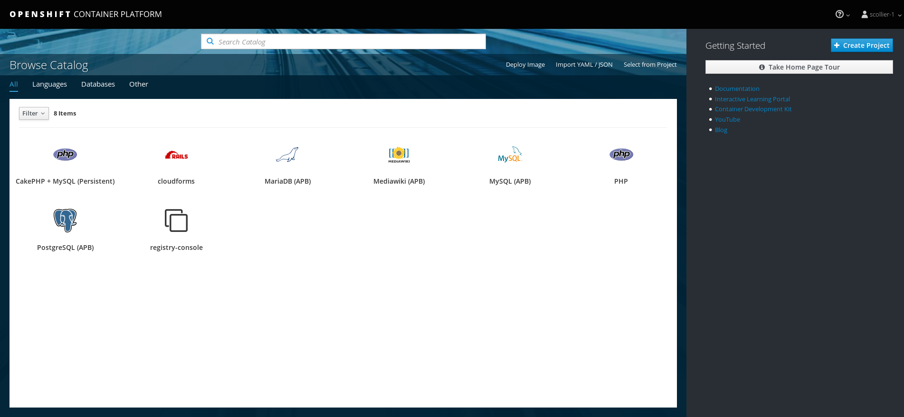

The overview page contains a collection of applications that can be deployed via traditional OpenShift link:https://docs.openshift.com/container-platform/latest/architecture/core_concepts/templates.html[templates] as well as new offerings delivered through the link:https://docs.openshift.com/container-platform/latest/architecture/service_catalog/index.html[Service Catalog]. 

To deploy an application that is served by a persistent backend database running in OpenShift using a template, select **CakePHP + MySQL (Persistent)**.

A new dialog appears that walks though configuring the application. Instead of using a two step process of first creating a project and then deploying an application into the project as in prior versions of OpenShift, both can now be completed using the same dialog. 

On the right hand side of the dialog, click **Next**.

Enter the following information in the first few fields below:

Project Name: **cakephp-mysql-persistent** +
Project Display Name: **CakePHP MySQL Persistent** +
Project Description: **Sample Project Demonstrating A CakePHP MySQL Application Using Persistent Storage**

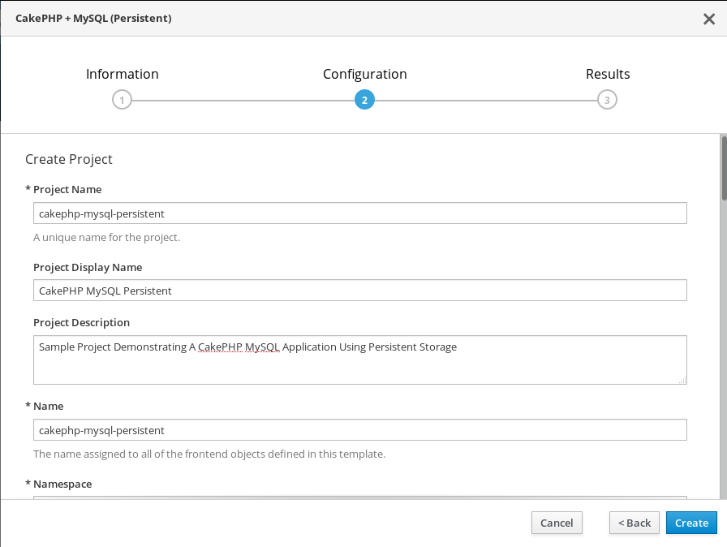

The template that is being utilized provides a set of default parameters for the rest of the fields in the right hand side of the dialog including the location of the source code, application name and additional items to customize the build and deployment.

The default values can be utilized in this case. Some of the values will be automatically generated (such as passords). Do spend a few moments reviewing each of the parameters are some of these items are frequently used in OpenShift templates.

Click the **Create** button to instantiate the template. 

A page displaying the successful instantiation of the template will be displayed along with a set of next steps that you can take against the application. Click the **Continue to the project overview** link to return to the project homepage.

== Validating Application Deployment

After triggering instantiating the template, a new Source to Image build of the CakePHP application will begin.

The build can be viewed by selecting the _cakephp-mysql-persistent_ deployment and within the _Builds_ section, a log of the running build can be viewed.

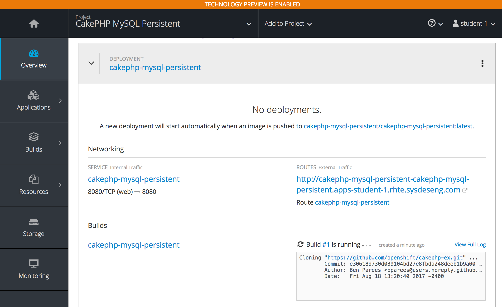

Once the application build completes, the _Deployments_ section will fill in with contents related to the deployment including the running Pod.

=== View Application

From the **Overview** page in the project, verify pods are running for both _cakephp-mysql-persistent_ and _mysql_ applications.

NOTE: You may see an error getting metrics. This is safe to ignore for now as it will be covered in a subsequent section.

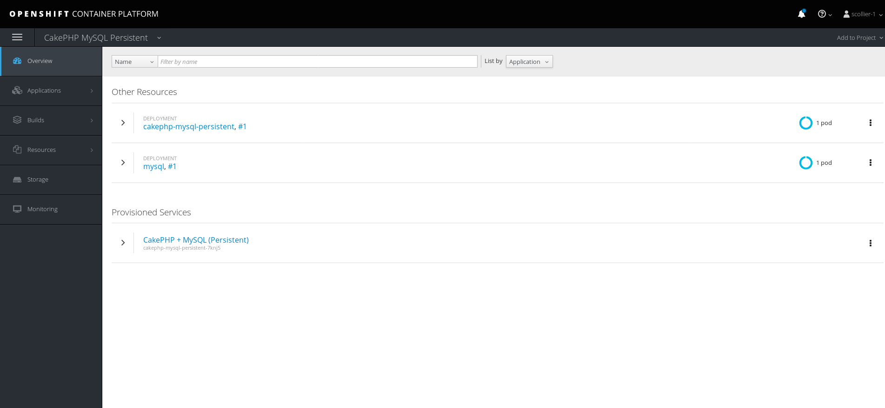

The template automatically creates a route to provide external access to the application. To get to the route, click on the _Applications_ button on the left navigation pane.  Then click on the _Hostname_ shown.

image::images/cakephp-route.png[]

link:http://cakephp-mysql-persistent-cakephp-mysql-persistent.apps-<student_id>.labs.sysdeseng.com/[http://cakephp-mysql-persistent-cakephp-mysql-persistent.apps-<student_id>.labs.sysdeseng.com/]

image::images/cakephp-app.png[]

Application users and administrators have the ability to leverage several facilities for monitoring the state of an application deployed to the OpenShift Container Platform. While not deployed to the lab environment, OpenShift provides an link:https://docs.openshift.com/container-platform/latest/install_config/aggregate_logging.html[aggregated logging framework] based on the ELK (Elasticsearch, Fluentd and Kibana) stack. However, you can still utilize the telemetry captured by the cluster metrics mechanisms. Cluster metrics were deployed as part of the OpenShift installation and are being used to drive Red Hat CloudForms.

With the _cakephp-mysql-persistent_ application deployed, you can use the OpenShift web console to view metrics that has been gathered by the cluster metrics facility. Since the metrics facility within the web console reaches out to Hawkular deployed in OpenShift from your web browser, you will need to perform one additional step to configure your browser to trust the self signed certificate configured before metrics can start to be displayed.

    . From the overview page, click on **Applications** on the lefthand side
    . Select **Pods**
    . Select the _Running cakephp_ pod
    . Navigate to the **Metrics tab**.
+

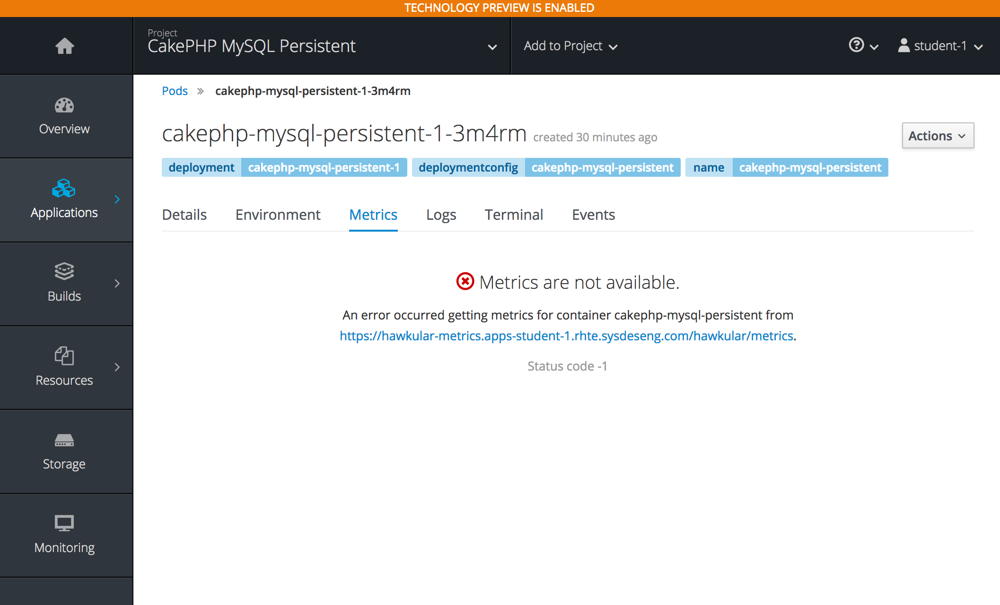

Click on the link displayed which will connect to the Hawkular endpoint. Accept the self signed certificate and if successful, the Hawkular logo along with additional details about the status of the service will be displayed.

Return to the OpenShift overview page for the _cakephp-mysql-persistent_ project by clicking the **Overview** link on the left side where you should be able to see metrics being displayed associated to each deployment.

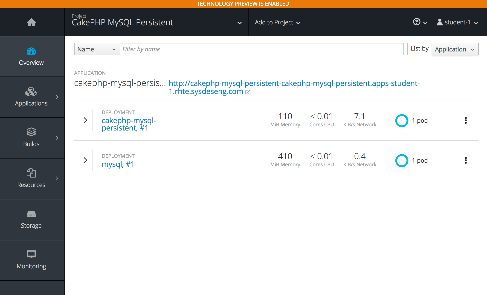

Additional details relating to the performance of the application can be viewed by revisiting the _Metrics_ tab within each pod as previously described.

While normal consumers of the platform are able to view metrics for only the applications they have permissions to access, cluster administrators can make use of Red Hat CloudForms to view metrics from all applications deployed to the OpenShift Container platform from a single pane of glass.

== Deploy an Application Through the Service Catalog

Introduced as a Technology Preview feature in OpenShift 3.6, the _service catalog_, is an implementation of the link:https://openservicebrokerapi.org/[Open Service Broker (OSB) API] for Kubernetes, and allows cluster administrators to integrate multiple platforms using a single API specification to provision and manage the lifecycle of applications. Users are given the opportunity to discover and instantiate services on their behalf which provides ease of use and consistency across different types of services and providers.

At the heart of the Service Catalog is a Service Broker, or a resource, that conforms to the OSB API and manages a set of services. Cluster administrators register brokers to the platform which enables the services each broker provides to the Service Catalog. A full discussion of the concepts and terminology associated with the Service Catalog can be found link:https://docs.openshift.com/container-platform/latest/architecture/service_catalog/index.html#service-catalog-concepts-terminology[here].

=== Ansible Service Broker

The link:https://docs.openshift.com/container-platform/latest/architecture/service_catalog/ansible_service_broker.html[Ansible Service Broker] is an implementation of the OSB API that manages applications defined by link:https://docs.openshift.com/container-platform/3.6/architecture/service_catalog/ansible_service_broker.html#service-catalog-apb[Ansible Playbook Bundles (APB's)] that provides a method for defining and distributing container images. The bundle consists of Ansible playbooks that automates complex deployments. The Ansible Service Broker provides two services in the form of APB's:

* link:https://www.mediawiki.org/wiki/MediaWiki[MediaWiki] - An Open Source wiki package
* link:https://www.postgresql.org/[PostgreSQL] - Open Source object-relational database

The APB's are shown alongside the traditional OpenShift Templates on the OpenShift Home Screen.

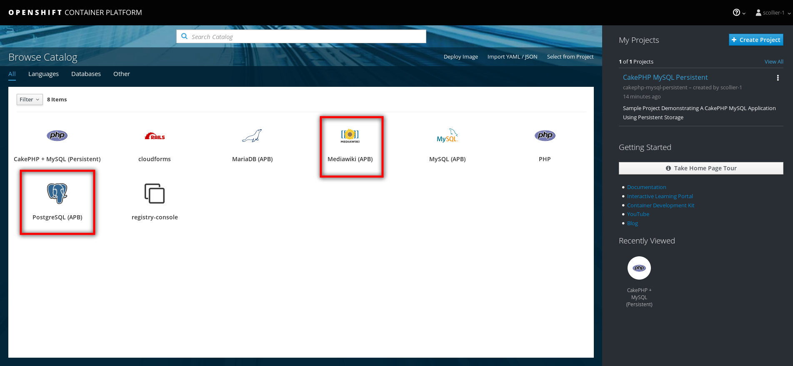

We will first use the MediaWiki APB to deploy an instance of MediaWiki. Navigate to the **Home** page by clicking the _OPENSHIFT CONTAINER PLATFORM_ link in the upper left and select the **MediaWiki (APB)**.  Click _Next_.

Ensure _Create Project_ is selected in the dropdown underneath _Add to Project_.

Enter the following information in the first few fields below:

Project Name: **mediawiki** +
Project Display Name: **MediaWiki** +
Project Description: **MediaWiki Deployed Using the Ansible Service Broker**

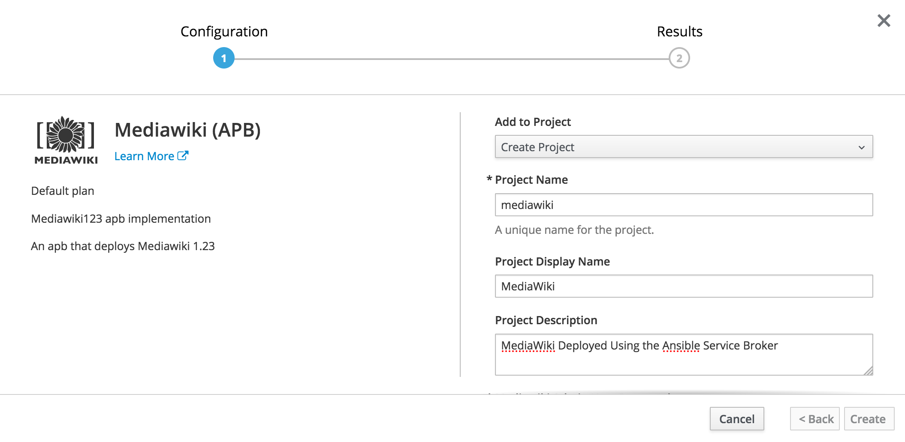

The rest of the dialog defines a set of parameters that can be used to customize the deployed application. These parameters are defined in the mediawiki-apb _ServiceClass_ and can be seen by showing the contents of the _ServiceClass_ from the OpenShift Master. 

.master$
[source, text]
----
oc get serviceclass mediawiki-apb -o yaml

...
    properties:
      mediawiki_admin_pass:
        title: Mediawiki Admin User Password
        type: string
      mediawiki_admin_user:
        default: admin
        title: Mediawiki Admin User
        type: string
      mediawiki_db_schema:
        default: mediawiki
        title: Mediawiki DB Schema
        type: string
      mediawiki_site_lang:
        default: en
        title: Mediawiki Site Language
        type: string
      mediawiki_site_name:
        default: MediaWiki
        title: Mediawiki Site Name
        type: string
    required:
    - mediawiki_db_schema
    - mediawiki_site_name
    - mediawiki_site_lang
    - mediawiki_admin_user
    - mediawiki_admin_pass
...
----

The majority of the parameters can be left as their default values. Set the _Mediawiki Admin User Password_ parameter to **s3curepw** and then click **Create**. 

The service will then be provisioned in the newly created project. Click **Continue to the project overview** link to view the status. The APB will start and execute actions to create the necessary resources using ansible. Additional insights into the actions the APB is performing can be viewed by selecting **Applications** from the left hand side of the page, and then **Pods**.

Locate the mediawiki pod and then click the **Logs** tab.

image::images/mediawiki-apb-logs.png[]

After reviewing the logs, navigate to the **Overview** page.

Once the mediawiki deployment is _Running_, navigate to the _hyperlink_ on the top right corner of the page to view the application (_http://mediawiki123-mediawiki2.apps-<student_id>.labs.sysdeseng.com_).

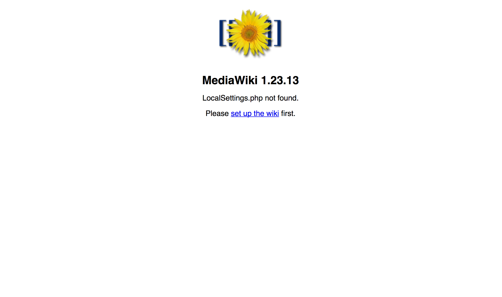

The application fails to load properly since there is no backing datastore available. Let's deploy the PostgreSQL APB to provision a database for the application which will allow the application to function properly.

Return to the _Home_ screen by clicking the **OPENSHIFT CONTAINER PLATFORM** link at the top left hand corner of the page.

Select **PostgreSQL (APB)** to launch the new application dialog. Click _Next_.

Select _Production_ from the available plans, click _Next_.

image::images/postgresql-apb-production-storage.png[]

Ensure **MediaWiki** is selected in the dropdown underneath  _Add to Project_.

Leave all of the parameters at their default values.

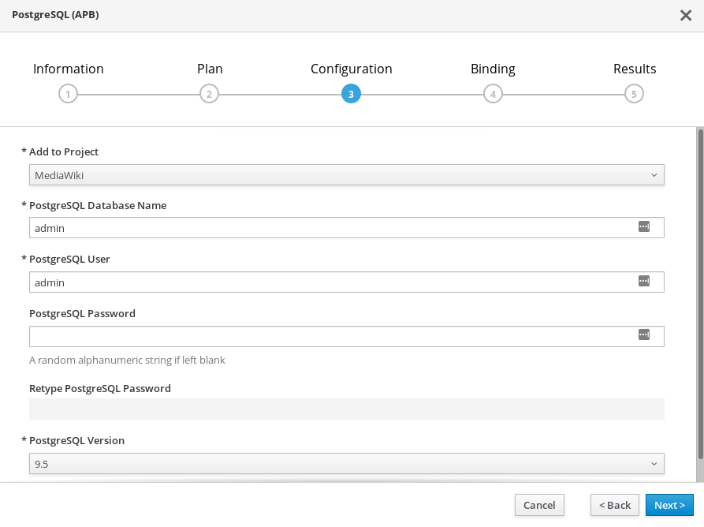

Click **Next** to move to the next portion of the dialog.

The 2nd dialog provides the opportunity for applications, such as MediaWiki, to _bind_ to the newly created service. A binding will inject an OpenShift secret that is created by the Service Broker containing the password for PostgreSQL into the MediaWiki application. While the end goal will make use of a binding, we will hold off for the moment. 

Select the **Do not bind at the time** radio button and then click **Create**.

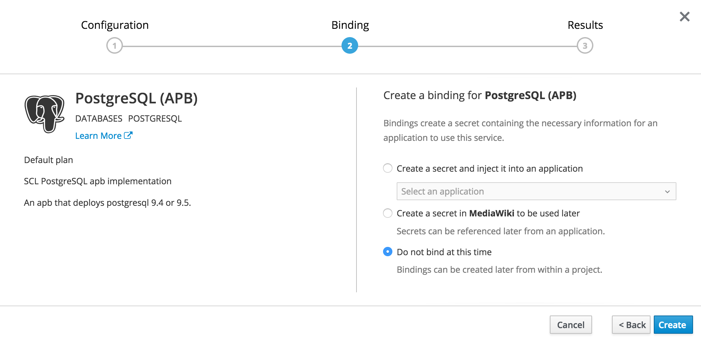

Click **Continue to the Project Overview** to return to the project overview page. 

The PostgreSQL APB will run and provision the PostgreSQL database in a similar fashion to the MediaWiki earlier.

Once the PostgreSQL application is running, we will need to inject credentials for the MediaWiki application to make use of the PostgreSQL database, a new _Binding_ must be created. 

From the _Overview_ page, locate the PostgreSQL deployment and create a new _Binding_ by clicking the **Create Binding** link.

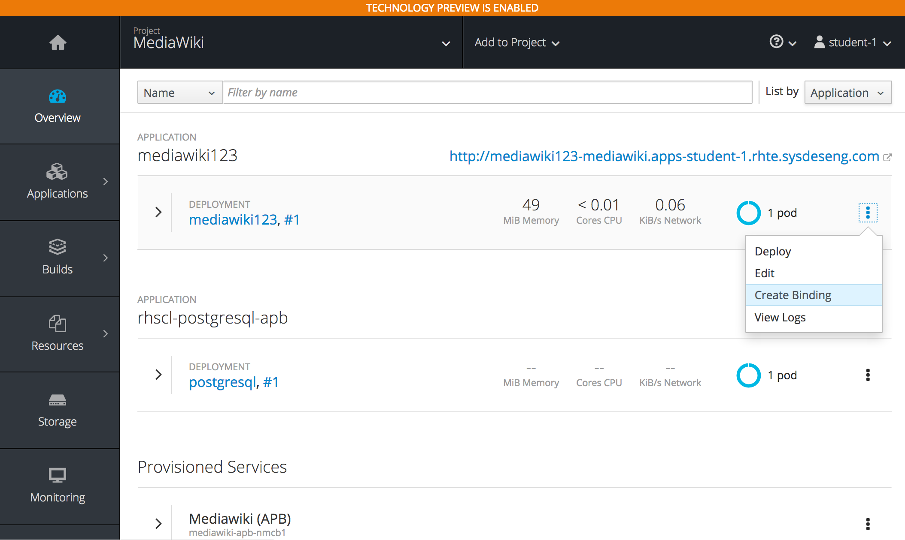

This will create a secret. Take note of the secret that the binding operation created. 

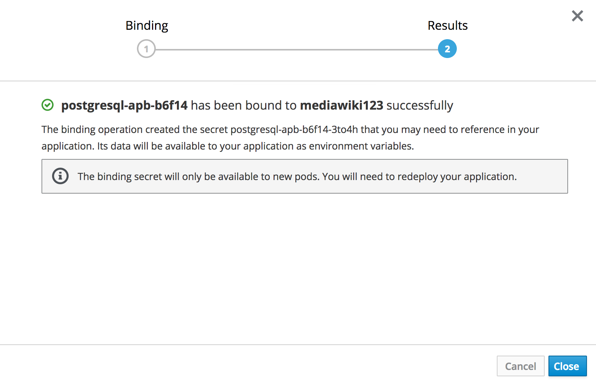

Click the **Close** button on the confirmation page.

Now we need to go in and associate the PostgreSQL secret that was just created, with the mediawiki application.  On the left hand navigation page, click **Resources** and then **Secrets**.  Look for the secret that was just created.

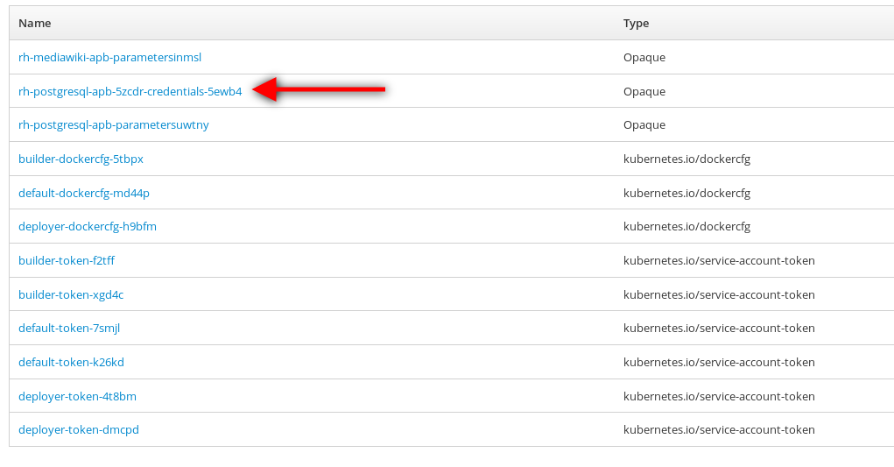

In the upper right hand corner, click **Add to Application**. 

image::images/postgres-apb-add-to-app.png[]

From the dropdown select **mediawiki123**, add the secret as an **Environment Variable**. Click **Save**.

image::images/postgres-apb-add-secret-to-app.png[]

That will trigger a new deployment and the application will be ready after the deployment is finished. Now go back to the application page and click refresh.

image::images/mediawiki-running.png[]

You have now demonstrated two mechanisms for deploying applications to the OpenShift Container Platform!

== Navigate through the OpenShift Web Console

With an applications deployed to the OpenShift cluster, we can navigate through the various options exposed by the OpenShift web console. Use this time as an opportunity to explore the following sections at your own pace if time allots:

* Various details provided with each pod including pod details, application logs and the ability to access a remote shell
    ** Hover over **Applications** from the left hand navigation bar and select **Pods**. Select one of the available pods and navigate through each of the provided tabs
* Secrets used by the platform and the applications
    ** Hover over **Resources** from the left hand navigation bar and select **Secrets**
* Persistent storage dynamically allocated by the cluster to support persistent storage
    ** Click on the **Storage** tab

'''

==== <<../lab4/lab4.adoc#lab4,Previous Lab: Lab 4 - Installing Red Hat CloudForms>>
==== <<../lab6/lab6.adoc#lab6,Next Lab: Lab 6 - Expanding the OpenShift Container Platform Cluster>>
==== <<../../README.adoc#lab1,Home>>

