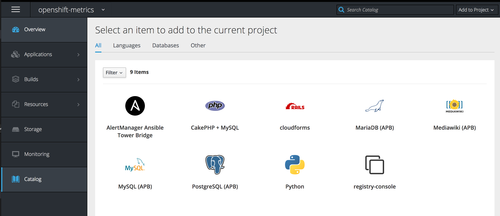
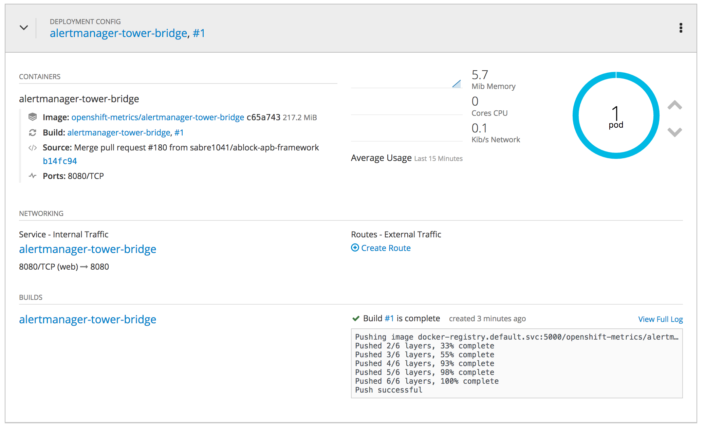

= Lab 5 - Building an Ansible Playbook Bundle to Aid in Cluster Management

== Connectivity Details for This Lab

[options="header"]
|======================
| *Item* | *URL* | *Access*
| OpenShift Container Platform |
link:https://master-<student_id>.labs.sysdeseng.com:8443[https://master-<student_id>.labs.sysdeseng.com:8443] |
Username: <student_id>-admin +
Password: INSTRUCTOR WILL PROVIDE
| Prometheus |
link:https://prometheus-openshift-metrics.apps-<student_id>.labs.sysdeseng.com[https://prometheus-openshift-metrics.apps-<student_id>.labs.sysdeseng.com] |
Username: <student_id>-admin +
Password: INSTRUCTOR WILL PROVIDE
| AlertManager |
link:https://alertmanager-openshift-metrics.apps-<student_id>.labs.sysdeseng.com[https://alertmanager-openshift-metrics.apps-<student_id>.labs.sysdeseng.com] |
Username: <student_id>-admin +
Password: INSTRUCTOR WILL PROVIDE
| Linux SSH private key
| link:https://instructor.labs.sysdeseng.com/summit/managing-ocp-install-beyond.pem[https://instructor.labs.sysdeseng.com/summit/managing-ocp-install-beyond.pem]
| Username: student +
Password: INSTRUCTOR WILL PROVIDE
|======================

== Overview

Maintaining a healthy cluster is at the heart of any "Day Two" operations of OpenShift. One way to maintain a stable environment is to ensure enough compute resources are available for applications. In this lab, you will realize the benefits DevOps by taking your existing infrastructure knowledge that you have gained thus far and build a custom Ansible Playbook Bundle (APB) that will aid in the dynamic scaling of applications.

Over the course of the next two labs, you will create an Ansible Playbook Bundle which will aid in automatically scaling the OpenShift cluster through metrics collected by Prometheus.

One of the benefits of the OpenShift Container Platform architecture is the effective scheduling of workloads onto compute resources (nodes). However, available capacity may result in the need to add additional resources. As an OpenShift cluster administrator, having a defined process for adding resources in an automated manner helps guarantee the stability of the overall cluster.

The OpenShift Container Platform provides methods for link:https://docs.openshift.com/container-platform/latest/install_config/adding_hosts_to_existing_cluster.html[adding resources to an existing cluster], whether it be a master or node. The method for executing the scale up task depends on the installation method used for the cluster. Both methods make use of an Ansible playbook to automate the process. The execution of the playbook can be driven through Ansible Tower to further simplify adding resources to a cluster. The triggering of this playbook can be executed manually from within Ansible Tower or invoked from a remote source using Ansible Tower Rest API.

== Dynamic Scaleup Architecture

The _0-Self-Configure_ job template executed earlier configured a set of templates to automate the process to expand the OpenShift cluster. A workflow job template called **2-Scaleup_OpenShift_on_AWS** was also created as a result. The workflow first creates a new AWS instance and once the instance has been created, the scaleup Ansible playbook will be executed to expand the cluster. Finally, a third job template performs the actions required to finalize the cluster scaleup.

As part of the deployment of Prometheus within OpenShift, another component of the Prometheus ecosystem includes a notification component called link:https://prometheus.io/docs/alerting/alertmanager/[AlertManager]. Alerts can be sent to a variety of endpoints ranging from commercial offerings such as Slack, HipChat and PagerDuty, or to generic endpoints using webhooks.

As mentioned earlier, Ansible Tower features a Rest API for querying resources, including triggering Workflow/Job Templates.

Unfortunately, the API is not compatible with the webhook notifications being emitted by AlertManager. To support the webhook function of AlertManager to trigger Job templates in Ansible Tower, a new custom "bridge" application has been developed for this lab and deployed to OpenShift through the use of an Ansible Playbook Bundle.

== The Service Catalog

The _service catalog_, is an implementation of the link:https://openservicebrokerapi.org/[Open Service Broker (OSB) API] for Kubernetes, and allows cluster administrators to integrate multiple platforms using a single API specification to provision and manage the lifecycle of applications. Users are given the opportunity to discover and instantiate services on their behalf which provides ease of use and consistency across different types of services and providers.

At the heart of the Service Catalog is a Service Broker, or a resource, that conforms to the OSB API and manages a set of services. Cluster administrators register brokers to the platform which enables the services each broker provides to the Service Catalog. A full discussion of the concepts and terminology associated with the Service Catalog can be found link:https://docs.openshift.com/container-platform/latest/architecture/service_catalog/index.html#service-catalog-concepts-terminology[here].

=== Ansible Service Broker

The link:https://docs.openshift.com/container-platform/latest/architecture/service_catalog/ansible_service_broker.html[Ansible Service Broker] is an implementation of the OSB API that manages applications defined by link:https://docs.openshift.com/container-platform/latest/architecture/service_catalog/ansible_service_broker.html#service-catalog-apb[Ansible Playbook Bundles (APB's)] that provides a method for defining and distributing container images. The bundle consists of Ansible playbooks that automates complex deployments.

== Create an Ansible Playbook Bundle ==

In this lab, an Ansible Playbook Bundle will be created to build and deploy the AlertManager/Tower bridge application.

Developing Ansible Playbook bundles requires the following:

* The Ansible Playbook Bundle CLI Tool (apb)
* A user logged in to OpenShift
* Permissions to access cluster level resources

The Ansible Playbook Bundle CLI (apb) is available in the OpenShift yum repositories which have already been enabled on the OpenShift master. Execute the following command to install the _apb_ CLI:

.master$
[source, bash]
----
sudo yum install -y apb
----

Next, the content for both the AlertManger/Tower bridge application and associated Ansible Playbook Bundle are located in the lab repository on GitHub in the folders _alertmanager-tower-bridge_ and _alertmanager-tower-bridge-apb_ respectively.

Clone the repository to the master from the users' home directory:

.master$
[source, bash]
----
cd ~
git clone https://github.com/sabre1041/managing-ocp-install-beyond
----

The application itself is located in a file named link:../alertmanager-tower-bridge/bridge[bridge.py] which is Python based and creates a small HTTP based web server which accepts requests in the JSON format AlertManager is expected to send. After parsing the input, the application executes a POST request to Ansible Tower to execute the Job Template. Also included in the application is a set of custom link:https://docs.openshift.com/container-platform/latest/creating_images/s2i.html#s2i-scripts[Source to Image scripts] that dictate how the application should be built and run.

After browsing through the application, change directories to the _alertmanager-tower-bridge-apb_ directory where we will walkthrough the process of creating an Ansible Playbook Bundle.

.master$
[source, bash]
----
cd managing-ocp-install-beyond/alertmanager-tower-bridge-apb
----

The link:https://access.redhat.com/documentation/en-us/openshift_container_platform/3.9/html-single/ansible_playbook_bundle_development_guide/index[Ansible Playbook Development Guide] provides a detailed overview for developing Ansible Playbook Bundles. The majority of the functionality has already been provided for you.  Take a moment to navigate through the link:https://access.redhat.com/documentation/en-us/openshift_container_platform/3.9/html-single/ansible_playbook_bundle_development_guide/index#apb-devel-writing-ref-directory[folder structure] including the APB spec file (apb.yml) and the directories containing Ansible link:http://docs.ansible.com/ansible/latest/user_guide/playbooks.html[playbooks] and link:https://docs.ansible.com/ansible/devel/user_guide/playbooks_reuse_roles.html[roles].

Build the apb which will execute a Docker build using the _Dockerfile_ located within the _alertmanager-tower-bridge-apb_ directory.

.master$
[source, bash]
----
sudo apb build
----

A new image containing the APB was created locally. This can be confirmed by listing all of the images on the machine and locating the image called _alertmanager-tower-bridge-apb_.

.master$
[source, bash]
----
sudo docker images
----

The final step in the Ansible Playbook Bundle creation process is to push the image from the local machine to OpenShift's internal registry. In order to communicate with the registry, an authenticated user to the platform must be used as they contain an OAuth token needed to facilitate the communication.

Login as the "<student_id>-admin" user which has elevated cluster privileges:

.master$
[source, bash]
----
sudo oc login -u <student_id>-admin
----

Push the APB to the OpenShift integrated registry

.master$
[source, bash]
----
sudo apb push
----

Confirm the APB is available in the Ansible Service broker by listing all registered APB's.

.master$
[source, bash]
----
sudo apb list
----

Notice how the `localregistry-alertmanager-tower-bridge-apb` is displayed. `localregistry` refers to OpenShift's integrated registry as the source followed by the name of the APB.

NOTE: OpenShift was configured to allow the Ansible Service Broker to utilize APB's that exist in the `openshift` project in the OpenShift registry. The modifications can be seen within the _broker-config_ ConfigMap which exists in the `openshift-ansible-service-broker` project.

Since no additional interaction is needed with OpenShift's registry at this time, login to OpenShift using the _system:admin_ user.

.master$
[source, bash]
----
oc login -u system:admin
----

== Deploying the AlertManager-Tower-Bridge Application

The AlertManager-Tower-Bridge application aid in providing cluster capabilities to dynamically scale the size of the OpenShift. Since the application is loosely tied to the Prometheus ecosystem and specifically AlertManager, it should be deployed alongside Prometheus in the `openshift-metrics` project. Given this project requires elevated rights, the _<student_id>-admin_ should be utilized.

Navigate to the OpenShift Web Console and login as the _<student_id>-admin_ user.

link:https://master-<student_id>.labs.sysdeseng.com:8443[https://master-<student_id>.labs.sysdeseng.com:8443]

After logging in, locate "My Projects" on the righthand side and select **View All** to view all projects the user has access to. Select **openshift-metrics**.

To deploy the APB to the project, in the right hand side of the top navigation panel, select **Add to Project** and then **Browse Catalog**.

Locate and select _AlertManager Ansible Tower Bridge_ from the catalog.

A dialog will appear to walk through the process of deploying the application. Click **Next** at the bottom right to process to the next dialog.

Several fields are defined on the Configuration page. The majority of these fields can be left to their default values. The following fields must be specified:

Ansible Tower Hostname: **tower-<student_id>.labs.sysdeseng.com** +
User with permissions on Tower: **<student_id>** +
Password for user with permission on Tower: **<provided_password>** +
Retype password for user with permission on Tower: **<provided_password>**

Click **Create** to provision the service which will launch the Ansible Playbook Bundle.

The APB will create a Secret containing credentials, a BuildConfig to build a new image containing the application, a Service and a DeploymentConfig to deploy the application after the image has been built.

Click the **Overview** tab to view the status of the image build and deployment.

A running pod similar to the image above indicates the application deployment was successful.

'''

==== <<../lab4/lab4.adoc#lab4,Previous Lab: Lab 4 - Prometheus and Grafana>>
==== <<../lab6/lab6.adoc#lab6,Next Lab: Lab 6 - Building an Ansible Playbook Bundle to Aid in Cluster Managemen>>
==== <<../../README.adoc#lab1,Home>>
