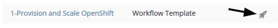
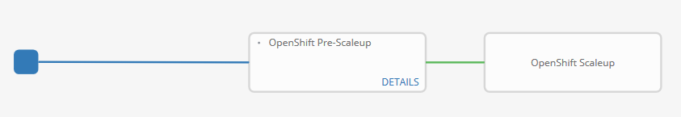

=== Expanding the OpenShift Container Platform Cluster

In this lab, you will use Ansible Tower to add an additional application node to the OpenShift Container Platform cluster.

One of the benefits of the OpenShift Container Platform architecture is the effective scheduling of workloads onto compute resources (nodes). However, available capacity may result in the need to add additional resources. As an OpenShift cluster administrator, having a defined process for adding resources in an automated manner helps guarantee the stability of the overall cluster.

The OpenShift Container Platform provides methods for link:https://docs.openshift.com/container-platform/latest/install_config/adding_hosts_to_existing_cluster.html[adding resources to an existing cluster], whether it be a master or node. The method for executing the scale up task depends on the installation method used for the cluster. Both methods make use of an Ansible playbook to automate the process. The execution of the playbook can be driven through Ansible Tower to further simplify adding resources to a cluster.

== Review Cluster

Recall the number of nodes in the cluster by either visiting CloudForms or Ansible Tower.

From the Ansible Tower:

* Click on "Inventories" in the top navigation pane
* Click on "OpenShift Inventory"

Review the nodes on the right hand navigation pane

From the OpenShift master:

.master$
[source, bash]
----
master$ oc get nodes

NAME                                            STATUS    AGE       VERSION
ip-10-10-0-25.ap-southeast-1.compute.internal   Ready     2h        v1.6.1+5115d708d7
ip-10-10-0-60.ap-southeast-1.compute.internal   Ready     2h        v1.6.1+5115d708d7
----

== Expand the Cluster

## Add Scaleup Job Templates

Perform these steps from the Ansible Tower host

## Create Job Template for ScaleUp Provision

* Click "TEMPLATES" on the top navigation pane.
** Click "+ADD", select "Job Template"
** Provide a name of: ScaleUp-1-Provision
** Click the "SEARCH" icon for the "INVENTORY" input box and select "OpenShift Inventory" and then click "SELECT".
** Click the "SEARCH" icon for the "PROJECT" input box and select "Managing OCP from Install and Beyond" and then click "SELECT".
** Click the "Choose a playbook" in the "PLAYBOOK" input box and select the "openshift-infra/aws_add_node.yml" playbook.
** Click the "SEARCH" icon for the "MACHINE CREDENTIAL" input box and select "RHTE SSH Machine" and then click "SELECT".
** Click the "SEARCH" icon for the "SELECT CLOUD CREDENTIAL" input box and select "AWS" and then click "SELECT".
** Add the following to the "EXTRA VARIABLES" pane.

+
[source, bash]
----
ec2_access_key: "{{ lookup('env', 'AWS_ACCESS_KEY') }}"
ec2_secret_key: "{{ lookup('env', 'AWS_SECRET_KEY') }}"
student_id: <YOUR STUDENT ID>
openshift_cluster_public_url: "https{{':'}}//master-{{ student_id }}.{{ domain_name }}{{':'}}8443"
----

** Click "SAVE".

## Create Job Template for Scale Up Install

* Click "TEMPLATES" on the top navigation pane.
** Click "+ADD", select "Job Template"
** Provide a name of: ScaleUp-1-Install
** Click the "SEARCH" icon for the "INVENTORY" input box and select "openshift-ansible" and then click "SELECT".
** Click the "SEARCH" icon for the "PROJECT" input box and select "Managing OCP from Install and Beyond" and then click "SELECT".
** Click the "Choose a playbook" in the "PLAYBOOK" input box and select the "ansible/openshift-ansible/playbooks/byo/openshift-node/scaleup.yml" playbook.
** Click the "SEARCH" icon for the "MACHINE CREDENTIAL" input box and select "RHTE SSH Machine" and then click "SELECT".
** Click the "SEARCH" icon for the "SELECT CLOUD CREDENTIAL" input box and select "AWS" and then click "SELECT".
** Enable "Privileged Escalation"
** Click "SAVE".

## Create Workflow Job Template for the Deployment

* Click "+ADD", select "Workflow Job Template"
** Provide a name of "2-Provision-and-Scale-Openshift"
** Click “SAVE”
** Click “Workflow Editor”
** Click “Start” and a box will appear to the right.
** On the right under “Add Template” select “Deployment Provision” and “Select”
** Now click on the box after start labeled “Deploy Provision” and click the green “+” in the top right.
** Again, on the right under “Add a Template” select “Deployment Install” and “Select”
** Lastly, click on the new box again, green “+” in the top right.
** Select “Deployment Post-install” and “Select
** Select “SAVE” at the bottom right.
** Launch Workflow Job
** Click “Templates”
** Click rocket ship icon next to “1-Deploy OpenShift on AWS”
** Watch progress.

Once again, using the web browser from the student machine, navigate to the Ansible Tower instance:

link:https://tower-<Student-ID>.rhte.sysdeseng.com[https://<student_id>.rhte.sysdeseng.com] 

If the web session has not been retained from a prior lab, login with the following credentials:

Username **admin** +
Password **rhte2017**

After logging in, navigate to the **Templates** page and locate the **1-Provision-and-Scale-OpenShift** workflow job template. Click the `rocket` icon to start the job.

The workflow first creates a new AWS instance and once the instance has been created, the scaleup Ansible playbook will be executed to expand the cluster. The workflow job will take a few minutes to complete. Monitor the status until the workflow job completes successfully by selecting **Details** as with the initial workflow job.

== Validate the Expanded Cluster

Once the Tower job is completed, there are multiple methods in which to validate the successful expansion of the OpenShift cluster.

First, as an OpenShift cluster administrator, you can use the OpenShift command line interface from the OpenShift master to view the available nodes and their status.

As the root user on the OpenShift master (_master-<student_id>.rhte.sysdeseng.com_), execute the following command to list the available nodes:

.master$
[source, bash]
----
master$ oc get nodes
----

If successful, you should see four (3) total nodes (1 master and 2 worker nodes) with **Ready** under the _Status_ column, as opposed to (2) total nodes before (1 master and 1 worker nodes).

Red Hat CloudForms can also be used to confirm the total number of nodes has been expanded to four.

Login to CloudForms and once authenticated, hover over _Compute_, then _Containers_, and finally select **Container Nodes**. Confirm four nodes are displayed.

This concludes lab 6.

