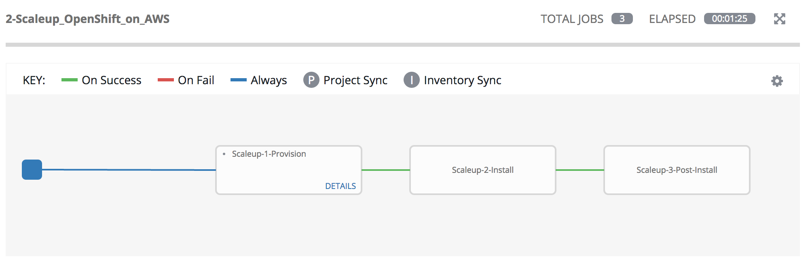

= Lab 6 - Expanding the OpenShift Container Platform Cluster

== Connectivity Details for This Lab

[options="header"]
|======================
| *Item* | *URL* | *Access*
| Ansible Tower|
link:https://tower-<student_id>.rhte.sysdeseng.com[https://tower-<student_id>.rhte.sysdeseng.com] |
Username: <student_id> +
Password: INSTRUCTOR WILL PROVIDE
| OpenShift Container Platform |
link:https://:master-<student_id>.rhte.sysdeseng.com:8443[https://master-<student_id>.rhte.sysdeseng.com:8443] |
Username: <student_id> +
Password: INSTRUCTOR WILL PROVIDE
| Red Hat CloudForms |
link:https://cloudforms-cloudforms.apps-<student_id>.rhte.sysdeseng.com[https://cloudforms-cloudforms.apps-<student_id>.rhte.sysdeseng.com] |
Username: admin +
Password: INSTRUCTOR WILL PROVIDE
| Linux SSH private key
| link:http://rhte-instructor.rhte.sysdeseng.com/key/rhte.pem[http://rhte-instructor.rhte.sysdeseng.com/key/rhte.pem]
| Username: student +
Password: INSTRUCTOR WILL PROVIDE
| Windows PuTTY private key
| link:http://rhte-instructor.rhte.sysdeseng.com/key/rhte.ppk[http://rhte-instructor.rhte.sysdeseng.com/key/rhte.ppk]
| Username: student +
Password: INSTRUCTOR WILL PROVIDE
|======================

== Overview

In this lab, you will use Ansible Tower to add an additional application node to the OpenShift Container Platform cluster.

One of the benefits of the OpenShift Container Platform architecture is the effective scheduling of workloads onto compute resources (nodes). However, available capacity may result in the need to add additional resources. As an OpenShift cluster administrator, having a defined process for adding resources in an automated manner helps guarantee the stability of the overall cluster.

The OpenShift Container Platform provides methods for link:https://docs.openshift.com/container-platform/latest/install_config/adding_hosts_to_existing_cluster.html[adding resources to an existing cluster], whether it be a master or node. The method for executing the scale up task depends on the installation method used for the cluster. Both methods make use of an Ansible playbook to automate the process. The execution of the playbook can be driven through Ansible Tower to further simplify adding resources to a cluster.

== Review Cluster

Recall the number of nodes in the cluster by either visiting CloudForms or Ansible Tower.

From the Ansible Tower:

* Click on **INVENTORIES** in the top navigation pane
* Click on **OpenShift** inventory
* Select the **OSEv3** group and review child groups and the instances within the _Hosts_ section

The lists of instances in the OpenShift cluster can also be viewed from the OpenShift master using the OpenShift CLI:

.master$
[source, bash]
----
oc get nodes

NAME                                            STATUS    AGE       VERSION
ip-10-10-0-25.ap-southeast-1.compute.internal   Ready     2h        v1.6.1+5115d708d7
ip-10-10-0-60.ap-southeast-1.compute.internal   Ready     2h        v1.6.1+5115d708d7
----

== Expand the Cluster

The _0-Self-Configure_ job template executed earlier configured a set of templates to automate the process to expand the OpenShift cluster.

Using a web browser from the student workstation machine, navigate to the Ansible Tower instance:

link:https://tower-<student_id>.rhte.sysdeseng.com[https://tower-<student_id>.rhte.sysdeseng.com] 

If the web session has not been retained from a prior lab, login once again.

After logging in, navigate to the **TEMPLATES** page and locate the **2-Scaleup_OpenShift_on_AWS** workflow job template. Click the **RocketShip** icon to start the job.

image::images/ansible-tower-scaleup-template.png[]

The workflow first creates a new AWS instance and once the instance has been created, the scaleup Ansible playbook will be executed to expand the cluster. Finally, a third job template performs final actions to finalize the cluster scaleup.

The job will take a few minutes to complete. Monitor the status until the workflow job completes successfully by selecting **Details** on each job as with the initial workflow job used to install the cluster initially.

TIP: Optionally explore the Playbooks that link:https://github.com/sabre1041/managing-ocp-install-beyond/blob/rhte/aws_add_node.yml[provision] and link:https://github.com/sabre1041/managing-ocp-install-beyond/blob/rhte/openshift_postinstall.yml[configure] this additional node.

== Validate the Expanded Cluster

Once the Tower job is completed, there are multiple methods in which to validate the successful expansion of the OpenShift cluster.

First, as an OpenShift cluster administrator, you can use the OpenShift command line interface from the OpenShift master to view the available nodes and their status.

As the root user on the OpenShift master (_master-<student_id>.rhte.sysdeseng.com_), execute the following command to list the available nodes:

.master$
[source, bash]
----
oc get nodes
----

If successful, you should see three (3) total nodes (1 master and 2 worker nodes) with **Ready** under the _Status_ column, as opposed to (2) total nodes before (1 master and 1 worker nodes). The role the instance plays can be seen through labels asociated with each node. The master node in this environment is also acting as a scheduldable instance that hosts platform infrastructure related components, such as the router and registry. Thus it has been set with the label `type=infra`. 

Execute the following to display the nodes and their associated labels:

.master$
[source, bash]
----
oc get nodes --show-labels
----

Red Hat CloudForms can also be used to confirm the total number of nodes has been expanded to four.

Login to CloudForms and once authenticated, hover over _Compute_, then _Containers_. Finally select **Container Nodes**. Confirm four nodes are displayed.

This concludes lab 6.

'''

==== <<../lab5/lab5.adoc#lab5,Previous Lab: Lab 5 - Managing the Lifecycle of an Application>>
==== <<../lab7/lab7.adoc#lab7,Next Lab: Lab 7 - Where do we go from here?>>
==== <<../../README.adoc#lab1,Home>>

