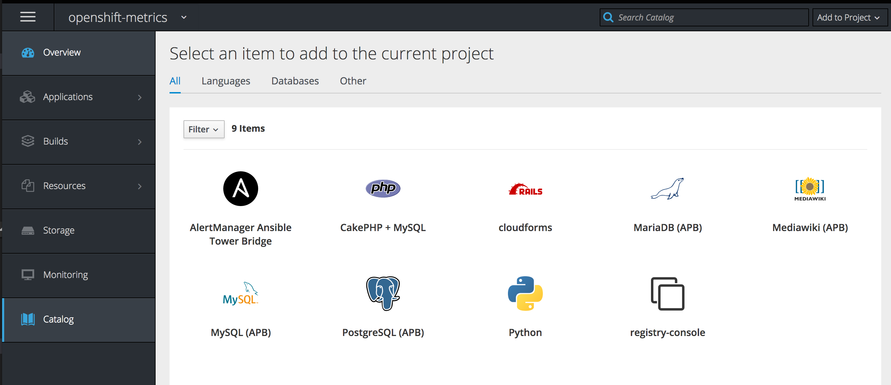

= Lab 6 - Expanding the OpenShift Container Platform Cluster

== Connectivity Details for This Lab

[options="header"]
|======================
| *Item* | *URL* | *Access*
| Ansible Tower|
link:https://tower-<student_id>.labs.sysdeseng.com[https://tower-<student_id>.labs.sysdeseng.com] |
Username: <student_id> +
Password: INSTRUCTOR WILL PROVIDE
| OpenShift Container Platform |
link:https://:master-<student_id>.labs.sysdeseng.com:8443[https://master-<student_id>.labs.sysdeseng.com:8443] |
Username: <student_id>-admin +
Password: INSTRUCTOR WILL PROVIDE
| Red Hat CloudForms |
link:https://cloudforms-cloudforms.apps-<student_id>.labs.sysdeseng.com[https://cloudforms-cloudforms.apps-<student_id>.labs.sysdeseng.com] |
Username: admin +
Password: INSTRUCTOR WILL PROVIDE
| Linux SSH private key
| link:https://instructor.labs.sysdeseng.com/rhte.pem[https://instructor.labs.sysdeseng.com/rhte.pem]
| Username: student +
Password: INSTRUCTOR WILL PROVIDE
| Windows PuTTY private key
| link:https://instructor.labs.sysdeseng.com/rhte.ppk[https://instructor.labs.sysdeseng.com/rhte.ppk]
| Username: student +
Password: INSTRUCTOR WILL PROVIDE
|======================

== Overview

In this lab, you will leverage the tools and skills from prior labs to create an Ansible Playbook Bundle which will aid in automatically scaling the OpenShift cluster through metrics collected by Prometheus.

One of the benefits of the OpenShift Container Platform architecture is the effective scheduling of workloads onto compute resources (nodes). However, available capacity may result in the need to add additional resources. As an OpenShift cluster administrator, having a defined process for adding resources in an automated manner helps guarantee the stability of the overall cluster.

The OpenShift Container Platform provides methods for link:https://docs.openshift.com/container-platform/latest/install_config/adding_hosts_to_existing_cluster.html[adding resources to an existing cluster], whether it be a master or node. The method for executing the scale up task depends on the installation method used for the cluster. Both methods make use of an Ansible playbook to automate the process. The execution of the playbook can be driven through Ansible Tower to further simplify adding resources to a cluster. The triggering of this playbook can be executed manually from within Ansible Tower or invoked from a remote source using Ansible Tower Rest API.

== Dynamic Scaleup Architecture

The _0-Self-Configure_ job template executed earlier configured a set of templates to automate the process to expand the OpenShift cluster. A workflow job template called **2-Scaleup_OpenShift_on_AWS** was also created as a result. The workflow first creates a new AWS instance and once the instance has been created, the scaleup Ansible playbook will be executed to expand the cluster. Finally, a third job template performs final actions to finalize the cluster scaleup.

As part of the deployment of the Prometheus within OpenShift, another component of the Prometheus ecosystem includes a notification component called link:https://prometheus.io/docs/alerting/alertmanager/[AlertManager]. Alerts can be sent to a variety of endpoints ranging from commercial offerings such as Slack, HipChat and PagerDuty, or to generic endpoints using webhooks. 

As mentioned earlier, Ansible Tower features a Rest API for querying resources, including triggering Workflow/Job Templates. 

Unfortunately, the API is not compatible with the webhook notifications being emitted by AlertManager. To support the webhook function of AlertManager to trigger Job templates in Ansible Tower, a new "bridge" application will be developed and deployed to OpenShift.  

== Create an Ansible Playbook Bundle ==

In link:../lab5/lab5.adoc[Lab 5], an Ansible Playbook Bundle was used to deploy MediaWiki which was backed by a PostgreSQL database. In this lab, an Ansible Playbook Bundle will be created to build and deploy the AlertManager/Tower bridge application.

Developing Ansible Playbook bundles requires the following:

* The Ansible Playbook Bundle CLI Tool (apb)
* A user logged in to OpenShift
* Permissions to access cluster level resources

The Ansible Playbook Bundle CLI (apb) is available in the OpenShift yum repositories which have already been enabled on the OpenShift master. Execute the following command to install the _apb_ CLI:

.master$
[source, bash]
----
yum install -y apb
----

Next, the content for both the AlertManger/Tower bridge application and associated Ansible Playbook Bundle are located in the lab repository on GitHub in the folders _alertmanager-tower-bridge_ and _alertmanager-tower-bridge-apb_ respectively.

Clone the repository to the master:

.master$
[source, bash]
----
git clone https://github.com/sabre1041/managing-ocp-install-beyond
----

The application itself is located in a file named link:../alertmanager-tower-bridge/bridge[bridge.py] which is Python based and creates a small HTTP based web server which accepts requests in the JSON format AlertManager is expected to send. After parsing the input, the application executes a POST request to Ansible Tower to execute the Job Template. Also included in the application is a set of custom link:https://docs.openshift.com/container-platform/latest/creating_images/s2i.html#s2i-scripts[Source to Image scripts] that dictate how the application should be built and run.

After browsing through the application, change directories to the _alertmanager-tower-bridge-apb_ directory where we will walkthrough the process of creating an Ansible Playbook Bundle.

The link:https://access.redhat.com/documentation/en-us/openshift_container_platform/3.9/html-single/ansible_playbook_bundle_development_guide/index[Ansible Playbook Development Guide] provides a detailed overview for developing Ansible Playbook Bundles. The majority of the functionality has already been provided for you.  Take a moment to navigate through the link:https://access.redhat.com/documentation/en-us/openshift_container_platform/3.9/html-single/ansible_playbook_bundle_development_guide/index#apb-devel-writing-ref-directory[folder structure] including the APB spec file (apb.yml) and the directories containing Ansible link:http://docs.ansible.com/ansible/latest/user_guide/playbooks.html[playbooks] and link:https://docs.ansible.com/ansible/devel/user_guide/playbooks_reuse_roles.html[roles].

Build the apb which will execute a Docker build using the _Dockerfile_ located within the _alertmanager-tower-bridge-apb_ directory.

.master$
[source, bash]
----
apb build
----

A new image containing the APB was created locally. This can be confirmed by listing all of the images on the machine and locating the image called _alertmanager-tower-bridge-apb_.

.master$
[source, bash]
----
docker images
----

The final step in the Ansible Playbook Bundle creation process is to push the image from the local machine to OpenShift's internal registry. In order to communicate with the registry, an authenticated user to the platform must be used as they contain an OAuth token needed to facilitate the communication.

Login as the "<student_id>-admin" user which has elevated cluster privileges:

.master$
[source, bash]
----
oc login -u <student_id>-admin
----

Push the APB to the OpenShift integrated registry

.master$
[source, bash]
----
apb push
----

Confirm the APB is available in the Ansible Service broker by listing all registered APB's.

.master$
[source, bash]
----
apb list
----

Since no additional interaction is needed with OpenShift's registry at this time, login to OpenShift using the _system:admin_ user.

.master$
[source, bash]
----
oc login -u system:admin
----

== Deploying the AlertManager-Tower-Bridge Application

The AlertManager-Tower-Bridge application aid in providing cluster capabilities to dynamically scale the size of the OpenShift. Since the application is loosely tied to the Prometheus ecosystem and specifically AlertManager, it should be deployed alongside Prometheus in the `openshift-metrics` project. Given this project requires elevated rights, the _<student_id>-admin_ should be utilized. 

Navigate to the OpenShift Web Console and login as the _<student_id>-admin_ user.

link:https://master-<student_id>.labs.sysdeseng.com:8443[https://master-<student_id>.labs.sysdeseng.com:8443]

After logging in, locate "My Projects" on the righthand side and select **View All** to view all projects the user has access to. Select **openshift-metrics**.

To deploy the APB to the project, select **Add to Project** and then **Browse Catalog** from the link on the top righthand side of the page.

Locate and select _AlertManager Ansible Tower Bridge_ from the catalog.

A dialog will appear to walk through the process of deploying the application. Click **Next** at the bottom right to process to the next dialog.

Several fields are defined on the Configuration page. The majority of these fields can be left to their default values. The following fields must be specified:

Ansible Tower Hostname: **tower-<student_id>.labs.sysdeseng.com** +
User with permissions on Tower: **<student_id>** +
Password for user with permission on Tower: **<provided_password>** +
Retype password for user with permission on Tower: **<provided_password>**

Click **Create** to provision the service which will launch the Ansible Playbook Bundle.

The APB will create a Secret containing credentials, a BuildConfig to build a new image containing the application, a Service and a DeploymentConfig to deploy the application after the image has been built.

Click the **Overview** tab to view the status of the image build and deployment.

image::images/alertmanager-tower-bridge-app-overview.png[]

A running pod similar to the image above indicates the application deployment was successful. 

== Review Cluster

Recall the number of nodes in the cluster by either visiting CloudForms or Ansible Tower.

From the Ansible Tower:

* Click on **INVENTORIES** in the top navigation pane
* Click on **OpenShift** inventory
* Click on the **Groups** button to view the groups within the inventory
* Select the **OSEv3** group and review child groups and the instances within the _Hosts_ section

The lists of instances in the OpenShift cluster can also be viewed from the OpenShift master using the OpenShift CLI:

.master$
[source, bash]
----
oc get nodes

NAME                                            STATUS    AGE       VERSION
ip-10-10-0-25.ap-southeast-1.compute.internal   Ready     2h        v1.6.1+5115d708d7
ip-10-10-0-60.ap-southeast-1.compute.internal   Ready     2h        v1.6.1+5115d708d7
----

== Expand the Cluster

The _0-Self-Configure_ job template executed earlier configured a set of templates to automate the process to expand the OpenShift cluster.

Using a web browser from the student workstation machine, navigate to the Ansible Tower instance:

link:https://tower-<student_id>.labs.sysdeseng.com[https://tower-<student_id>.labs.sysdeseng.com] 

If the web session has not been retained from a prior lab, login once again.

After logging in, navigate to the **TEMPLATES** page and locate the **2-Scaleup_OpenShift_on_AWS** workflow job template. Click the **RocketShip** icon to start the job.

image::images/ansible-tower-scaleup-template.png[]

The workflow first creates a new AWS instance and once the instance has been created, the scaleup Ansible playbook will be executed to expand the cluster. Finally, a third job template performs final actions to finalize the cluster scaleup.

The job will take a few minutes to complete. Monitor the status until the workflow job completes successfully by selecting **Details** on each job as with the initial workflow job used to install the cluster initially.

TIP: Optionally explore the Playbooks that link:https://github.com/sabre1041/managing-ocp-install-beyond/blob/rhte/aws_add_node.yml[provision] and link:https://github.com/sabre1041/managing-ocp-install-beyond/blob/rhte/openshift_postinstall.yml[configure] this additional node.

image::images/ansible-tower-scaleup-workflow-diagram.png[]

== Validate the Expanded Cluster

Once the Tower job is completed, there are multiple methods in which to validate the successful expansion of the OpenShift cluster.

First, as an OpenShift cluster administrator, you can use the OpenShift command line interface from the OpenShift master to view the available nodes and their status.

As the root user on the OpenShift master (_master-<student_id>.labs.sysdeseng.com_), execute the following command to list the available nodes:

.master$
[source, bash]
----
oc get nodes
----

If successful, you should see three (3) total nodes (1 master and 2 worker nodes) with **Ready** under the _Status_ column, as opposed to (2) total nodes before (1 master and 1 worker nodes). The role the instance plays can be seen through labels asociated with each node. The master node in this environment is also acting as a scheduldable instance that hosts platform infrastructure related components, such as the router and registry. Thus it has been set with the label `type=infra`. 

Execute the following to display the nodes and their associated labels:

.master$
[source, bash]
----
oc get nodes --show-labels
----

Red Hat CloudForms can also be used to confirm the total number of nodes has been expanded to four.

Login to CloudForms and once authenticated, hover over _Compute_, then _Containers_. Finally select **Container Nodes**. Confirm four nodes are displayed.

This concludes lab 6.

'''

==== <<../lab5/lab5.adoc#lab5,Previous Lab: Lab 5 - Managing the Lifecycle of an Application>>
==== <<../lab7/lab7.adoc#lab7,Next Lab: Lab 7 - Where do we go from here?>>
==== <<../../README.adoc#lab1,Home>>

