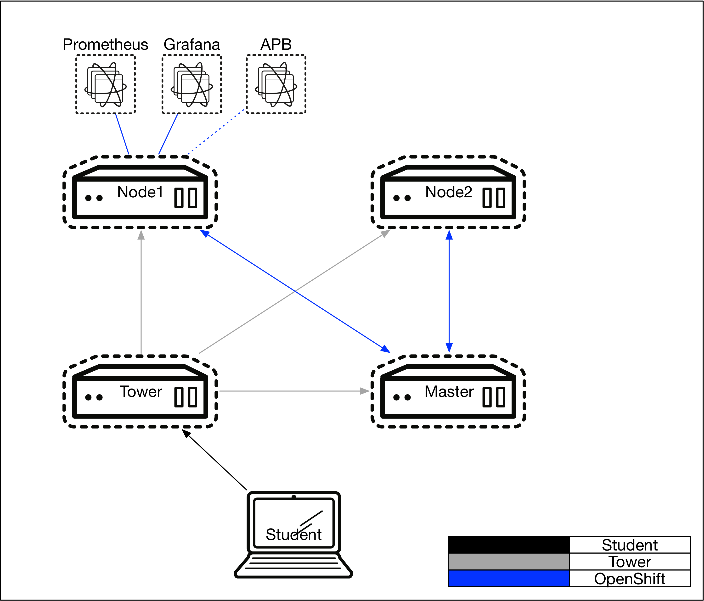
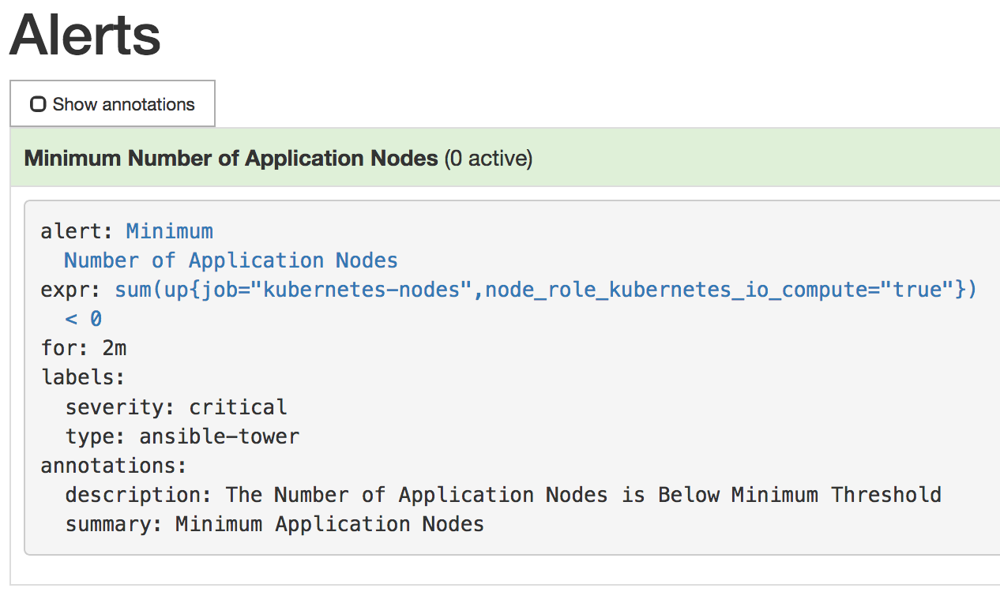
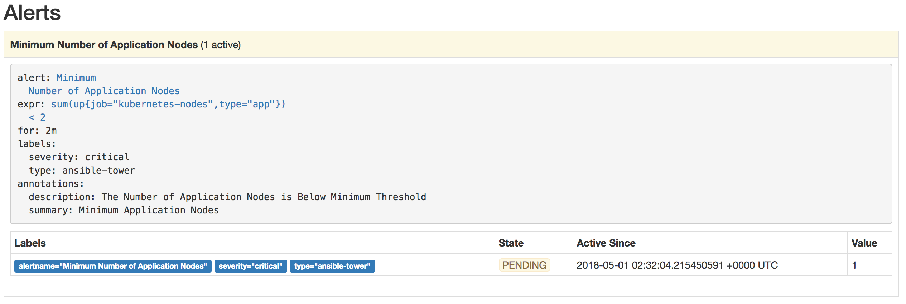
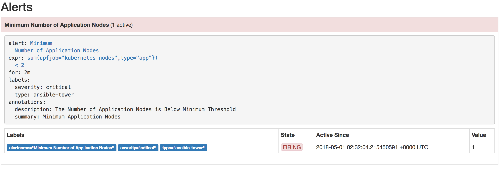
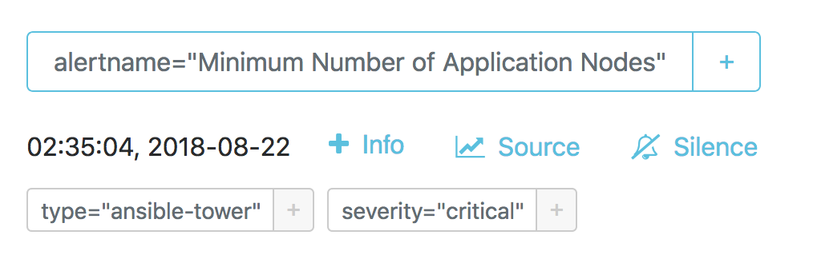
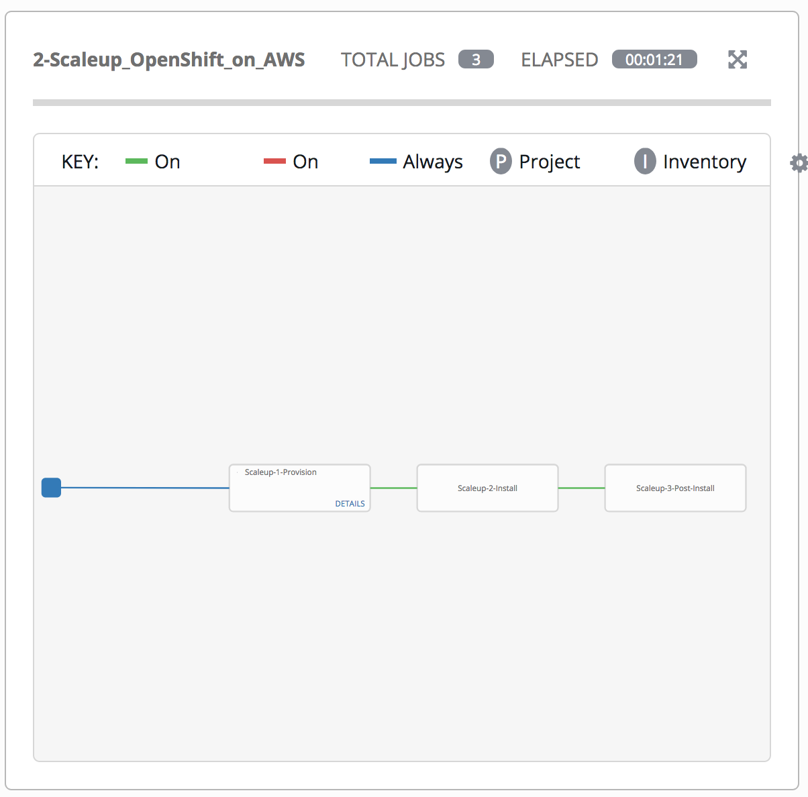
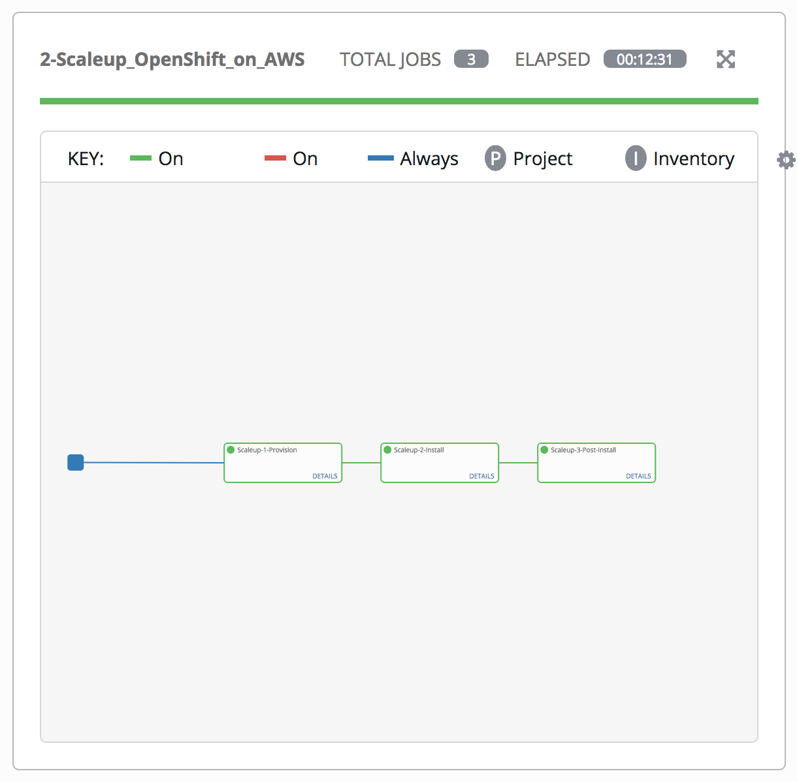
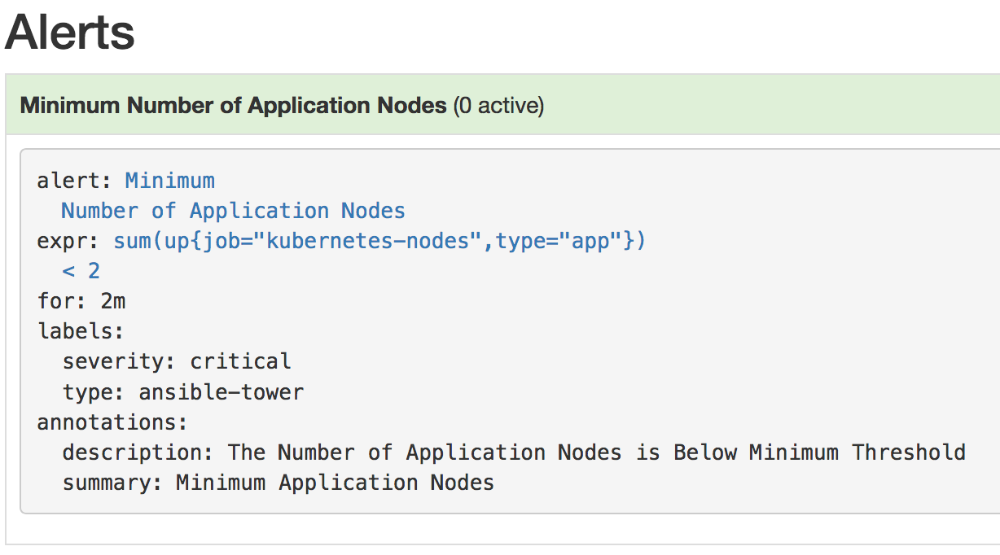

= Lab 6 - Expanding the OpenShift Container Platform

== Connectivity Details for This Lab

[options="header"]
|======================
| *Item* | *URL* | *Access*
| Ansible Tower|
link:https://tower-<student_id>.labs.sysdeseng.com[https://tower-<student_id>.labs.sysdeseng.com] |
Username: <student_id> +
Password: INSTRUCTOR WILL PROVIDE
| OpenShift Container Platform |
link:https://master-<student_id>.labs.sysdeseng.com:8443[https://master-<student_id>.labs.sysdeseng.com:8443] |
Username: <student_id>-admin +
Password: INSTRUCTOR WILL PROVIDE
| Prometheus |
link:https://prometheus-openshift-metrics.apps-<student_id>.labs.sysdeseng.com[https://prometheus-openshift-metrics.apps-<student_id>.labs.sysdeseng.com] |
Username: <student_id>-admin +
Password: INSTRUCTOR WILL PROVIDE
| AlertManager |
link:https://alertmanager-openshift-metrics.apps-<student_id>.labs.sysdeseng.com[https://alertmanager-openshift-metrics.apps-<student_id>.labs.sysdeseng.com] |
Username: <student_id>-admin +
Password: INSTRUCTOR WILL PROVIDE
| Linux SSH private key
| link:https://instructor.labs.sysdeseng.com/summit/managing-ocp-install-beyond.pem[https://instructor.labs.sysdeseng.com/summit/managing-ocp-install-beyond.pem]
| Username: student +
Password: INSTRUCTOR WILL PROVIDE
|======================

== Overview

In the prior lab, you developed provisioned the AlertManager/Ansible Tower Bridge application that will be used to aid in the scaling of the OpenShift Container Platform based on the metrics aggregated by Prometheus. In this lab, you will extend that work to dynamically using Prometheus, AlertManager, the AlertManager/Ansible Tower Bridge and finally Ansible Tower.

== Scaling the Cluster

With the components in place to integrate AlertManager with Ansible Tower, lets turn our attention into how the cluster can be dynamically scaled. Alerts are sent to AlertManager based on rules that have been defined within Prometheus. The rules and their current status can be viewed from the Prometheus User Interface.

Navigate to the Prometheus user interface and login using the **<student_id>-admin** user account

link:https://prometheus-openshift-metrics.apps-<student_id>.labs.sysdeseng.com[https://prometheus-openshift-metrics.apps-<student_id>.labs.sysdeseng.com]

On the toolbar, select **Alerts**

One alert has been defined (_Minimum Number of Application Nodes_). Currently, the status is _Green_, or OK. If you click on the alert, the rule is shown.

The rule validates the number of OpenShift application nodes, or nodes with the label `type=app`.

Using the OpenShift Command Line Tool on the master, you can verify the label associated with the nodes

.master$
[source, bash]
----
oc get nodes --show-labels
----

Notice that only 1 node as denoted with _COMPUTE_ as the "ROLES" has a label with `node-role.kubernetes.io/compute=true`. Prometheus replaces special characters, such as periods (`.`) and slashes (`/`), with underscores (`_`).

The expression for the  _Mininum Number of Application Nodes_ rule is defined using the link:https://prometheus.io/docs/prometheus/latest/querying/basics/[Prometheus Query Language (PromQL)] as follows:

[source, bash]
----
sum(up{job="kubernetes-nodes",node_role_kubernetes_io_compute="true"}) < 0
----

This rule states that the alert will be fired when the number of nodes with the label `node.role.kubernetes.io/compute="true"` is below 0.

When an alert is triggered, a request is sent to AlertManager, a separate container within the Prometheus pod. AlertManager itself has its own web console for which to interact with the component. Open a new browser tab and navigate to the following location and use the same credentials **<student_id>-admin** as were used to access Prometheus.

link:https://alertmanager-openshift-metrics.apps-<student_id>.labs.sysdeseng.com[https://alertmanager-openshift-metrics.apps-<student_id>.labs.sysdeseng.com]

The landing page will display any active alerts. Since no alerts are currently firing, it will display "No Alerts Found".

Select the **Status** link at the top of the page and scroll down to the _Config_. This is where the the rules for each alert that is received are defined. 

First, locate the _routes_ property. When a alert is received with a label of `type=ansible-tower`, it will instruct the alert to be sent to a _receiver_ with the name `ansible-tower`. In the Prometheus Alert _Minimum Number of Application Nodes_, a series of labels were defined. One of which was `type=ansible-tower`. Since a match will occur in AlertManager, the _ansible-tower_ receiver will be triggered. In the receiver definition, a webhook with a reference to _alertmanager-tower-bridge_ application is configured. Thus, when an alert with the label `type=ansible-tower` is received, a request is sent to the Ansible Tower Bridge application which in turn will invoke the Ansible Tower workflow job to scale up the OpenShift cluster.

Returning to the Prometheus rule again, notice how this rule wil never fire as it is impossible for a count such as this to have a negative number. This was done intentionally during the lab preparation to ensure an alert did not accidentally fire. 

In this lab, the minimum number of application nodes will be modified from 0 to 2, or 1 more than are currently running.

The configuration for Prometheus and AlertManager are defined in ConfigMaps and mounted as volumes into each container. Using the OpenShift CLI, first switch into the `openshift-metrics` project.

.master$
[source, bash]
----
oc project openshift-metrics
----

Now, list all defined ConfigMaps

.master$
[source, bash]
----
oc get configmaps
----

To modify the Prometheus rules, edit the prometheus ConfigMap

.master$
[source, bash]
----
oc edit configmap prometheus
----

Locate the rule that is defined in the key `prometheus.additional.rules`

Modify the expression for the _Minimum Number of Application Nodes_ rule as shown below:

[source, bash]
----
sum(up{node_role_kubernetes_io_compute="true",job="kubernetes-nodes"}) < 2
----

One of the benefits of ConfigMaps is that once a change has been made, the resulting value is made available in the pod. 

With the value of the rule file changed, Prometheus can be instructed to reload its own configuration based on the updated values without having to stop the instance or the pod. This can be done by making a request against the API. The easiest method to do so is to obtain a remote session inside the pod.

Execute the following command to access the Prometheus container:

.master$
[source, bash]
----
oc rsh -c prometheus $(oc get pods -l=app=prometheus -o 'jsonpath={.items[0].metadata.name}')
----

Once inside the container, confirm the file mounted in the ConfigMap has been updated.

.prometheus container$
[source, bash]
----
cat /etc/prometheus/prometheus.additional.rules
----

It may take up to 1 minute for the value to change. Continue executing the prior command until a change is detected.

Once the value in the file has changed, to force Prometheus to reload its configuration, execute the following request

.prometheus container$
[source, bash]
----
curl -X POST http://localhost:9090/-/reload
----

Once complete, the container can be exited.

.prometheus container$
[source, bash]
----
exit
----

To confirm the configuration was reloaded properly, revisit the Alerts page within Prometheus and reload the page. The updated value of the rule should be showing which will trigger an alert if the number of application nodes is less than 2 instances.

Prometheus scrapes the OpenShift API once every 60 seconds. After the interval has passed, refresh the page again and the alert should turn _yellow_. This indicates the alert is pending:

If you recall in the rule, a _for_ clause was provided which defines that a rule will continue to be checked for a set period of time before firing. This allows a condition to resolve itself without a rule firing (such as a temporary network issue). The alert will stay in this condition for 2 minutes, then the alert wil fire. Refresh the page to see the status of the rule in _FIRING_ status:

The series of actions described previously should have been executed:

1. Prometheus notifies AlertManager
2. AlertManager parses the alert, passes it to the receiver and invokes the AlertManager Tower Bridge application
3. The AlertManager Tower Bridge Application parses the alert and invokes the Workflow Job in Ansible Tower
4. The Ansible Tower Workflow job runs to completion.

Let's validate that this occurred properly.

First, navigate to the AlertManager console or the tab that was previously open.

link:https://alertmanager-openshift-metrics.apps-<student_id>.labs.sysdeseng.com[https://alertmanager-openshift-metrics.apps-<student_id>.labs.sysdeseng.com]

An alert should now be indicated on the _Alerts_ page as shown below.

Notice how the `type=ansible-tower` is prominently displayed.

Now, verify the AlertManager Tower Bridge application has received the webhook and invoked Ansible Tower.

Navigate to the OpenShift web console and login using the **<student_id>-admin** account using the provided credentials.

link:https://master-<student_id>.labs.sysdeseng.com:8443[https://master-<student_id>.labs.sysdeseng.com:8443]

From the landing page, on the righthand side of the page, select the _openshift-metrics_ project. 

From within the _openshift-metrics_ project, select **Applications** and then **Pods** from the lefthand side navigation. 

Locate and click the _Running_ pod starting with `alertmanager-tower-bridge` and then select the **Logs** tab. When a request is received, details of the alert along with the invocations to Ansible Tower are displayed. The final invocation is the actual request to launch the workflow job template. The response will include the `id` of the job that was triggered. The presence of this field indicates the invocation was successful and can be used to correlate an action within Ansible Tower.

The final step to verify the status of the **2-Scaleup_OpenShift_on_AWS** workflow job template was invoked expand the OpenShift cluster.

In the web browser, navigate to to Ansible Tower and login if an active session has not been retained

link:https://tower-<student_id>.labs.sysdeseng.com[https://tower-<student_id>.labs.sysdeseng.com] 

Select the **JOBS** link on the navigation bar. Locate and select the ID of the job retrieved previously from the AlertManager Tower Bridge Application. The progress of the workflow job is then displayed

The job will take a few minutes to complete. Monitor the status until the workflow job completes successfully by selecting **Details** on each job as with the initial workflow job used to install the cluster initially.

TIP: Optionally explore the Playbooks that link:https://github.com/sabre1041/managing-ocp-install-beyond/blob/summit2018/aws_add_node.yml[provision] and link:https://github.com/sabre1041/managing-ocp-install-beyond/blob/summit2018/openshift_scaleup_postinstall.yml[configure] this additional node.

== Validate the Expanded Cluster

Once the Tower job is completed, there are multiple methods in which to validate the successful expansion of the OpenShift cluster.

First, as an OpenShift cluster administrator, you can use the OpenShift command line interface from the OpenShift master to view the available nodes and their status.

As the root user on the OpenShift master (_master-<student_id>.labs.sysdeseng.com_), execute the following command to list the available nodes:

.master$
[source, bash]
----
oc get nodes
----

If successful, you should see three (3) total nodes (1 master and 2 worker nodes) with **Ready** under the _Status_ column, as opposed to (2) total nodes before (1 master and 1 worker nodes).

Finally, with 2 application nodes present and running, return to the Prometheus user interface and select the **Alerts** link at the top. Notice how the alert is no longer active as the number of running application instances has been satisfied

The OpenShift Container Platform has been successfully scaled to provide additional compute resources for maintain a healthy environment. 

'''

==== <<../lab5/lab5.adoc#lab5,Previous Lab: Building an Ansible Playbook Bundle to Aid in Cluster Management>>
==== <<../lab7/lab7.adoc#lab6,Next Lab: Installing Red Hat CloudForms>>
==== <<../../README.adoc#lab1,Home>>

