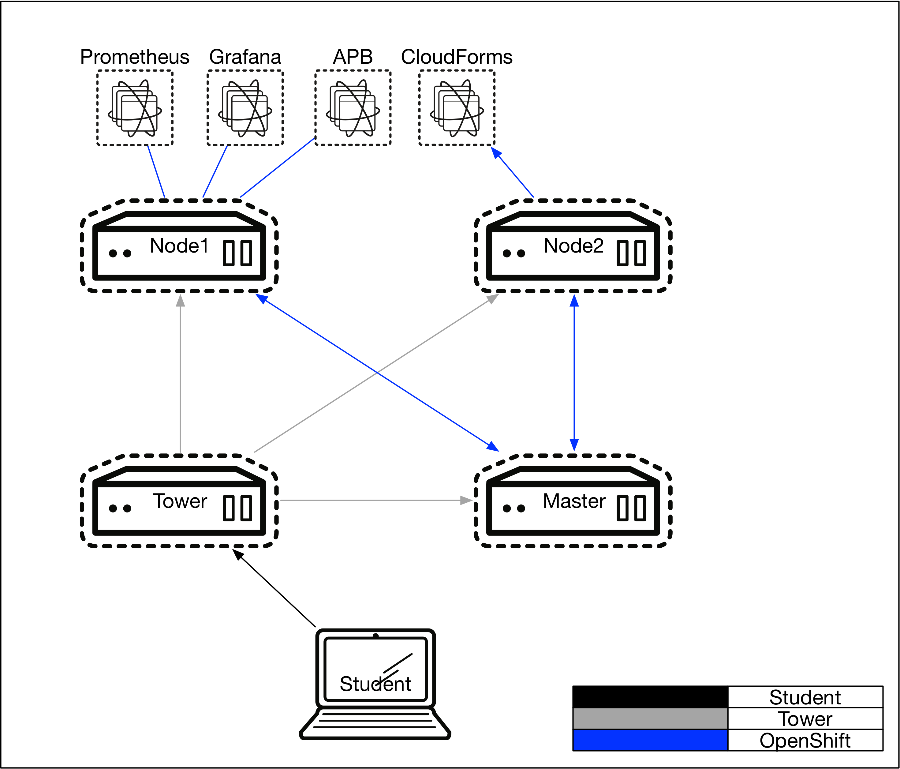
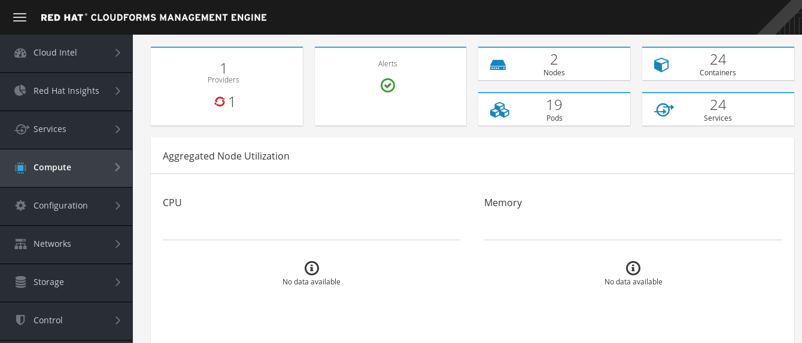

= Lab 7 - Installing Red Hat CloudForms

== Connectivity Details for This Lab

[options="header"]
|======================
| *Item* | *URL* | *Access*
| OpenShift Container Platform |
link:https://:master-<student_id>.labs.sysdeseng.com:8443[https://master-<student_id>.labs.sysdeseng.com:8443] |
Username: <student_id> +
Password: INSTRUCTOR WILL PROVIDE
| Red Hat CloudForms |
link:https://cloudforms-cloudforms.apps-<student_id>.labs.sysdeseng.com[https://cloudforms-cloudforms.apps-<student_id>.labs.sysdeseng.com] |
Username: admin +
Password: INSTRUCTOR WILL PROVIDE
| Linux SSH private key
| link:https://instructor.labs.sysdeseng.com/summit/managing-ocp-install-beyond.pem[https://instructor.labs.sysdeseng.com/summit/managing-ocp-install-beyond.pem]
| Username: student +
Password: INSTRUCTOR WILL PROVIDE
|======================

== Overview

Red Hat CloudForms Management Engine (CFME) delivers the insight, control, and automation necessary to address the challenges of managing complex environments. CloudForms is available as a standalone appliance, but is also available as a containerized solution that can be deployed on the OpenShift Container Platform.

In this lab, you will deploy a single instance/replica of Red Hat CloudForms to the OpenShift Container Platform cluster and configure the container provider to monitor the OpenShift environment.

=== Deploy Red Hat CloudForms

Since Red Hat CloudForms is available as a set of containers, it can be deployed to the OpenShift Container Platform in a few short steps.

A user with _cluster-admin_ permissions must be used to configure the environment as CloudForms requires access to privileged resources

First, using the OpenShift Command Line, create a new project called **cloudforms**

.master$
[source, bash]
----
oc new-project cloudforms
----

By creating a new project, the context of the CLI is automatically switched into the _cloudforms_ project:

.master$
[source, bash]
----
oc config current-context
----

When creating a new project, a set of service accounts are automatically provisioned. These accounts are used when building, deploying and running containers. The _default_ service account is the de facto service account used by pods. Since CloudForms is deployed within a pod and requires access to key metrics in the OpenShift environment along with the host, it must be granted elevated access as a privileged resource. In OpenShift, permissions associated to pods are managed by link:https://docs.openshift.com/container-platform/latest/admin_guide/manage_scc.html[Security Context Constraints] and the service account that is used to run them.

Execute the following commands to add the service accounts in the cloudforms project to the privileged SCC:

.master$
[source, bash]
----
oc adm policy add-scc-to-user anyuid system:serviceaccount:cloudforms:cfme-anyuid
oc adm policy add-scc-to-user anyuid system:serviceaccount:cloudforms:cfme-orchestrator
oc adm policy add-scc-to-user anyuid system:serviceaccount:cloudforms:cfme-httpd
oc adm policy add-scc-to-user privileged system:serviceaccount:cloudforms:cfme-privileged
----

Verify the SCCs are added correctly to the service accounts and project:

.master$
[source, bash]
----
oc describe scc anyuid | grep Users
----

Confirm the following is returned:
----
Users:					system:serviceaccount:cloudforms:cfme-anyuid,system:serviceaccount:cloudforms:cfme-orchestrator,system:serviceaccount:cloudforms:cfme-httpd
----

Add the view and edit roles to the cfme-orchestrator service account: 

.master$
[source, bash]
----
oc policy add-role-to-user view system:serviceaccount:cloudforms:cfme-orchestrator -n cloudforms
oc policy add-role-to-user edit system:serviceaccount:cloudforms:cfme-orchestrator -n cloudforms
----

==== Instantiate CloudForms

CloudForms currently ships with OpenShift Container Platform 3.10 which greatly simplifies the deployment.

The persistent storage required by CloudForms will be dynamically provisioned by the link:https://docs.openshift.com/container-platform/3.10/install_config/configuring_aws.html[AWS cloud provider].

In order to instantiate cloudforms, first configure the CloudForms template.  For this lab we will use the default settings:

.master$
[source, bash]
----
cd /usr/share/ansible/openshift-ansible/roles/openshift_examples/files/examples/v3.10/cfme-templates
oc create -f cfme-template.yaml
----

Verify the template is available with your project:

.master$
[source, bash]
----
oc get templates

NAME         DESCRIPTION                                    PARAMETERS     OBJECTS
cloudforms   CloudForms appliance with persistent storage   56 (1 blank)   26
----

Finally we will initiate the CloudForms deployment with one custom setting, _APPLICATION_DOMAIN_=cloudforms-cloudforms.apps-<student_id>.labs.sysdeseng.com

This will allow connectivity to the CloudForms appliance outside of the OpenShift environment.

.master$
[source, bash]
----
oc new-app --template=cloudforms -p APPLICATION_DOMAIN=cloudforms-cloudforms.apps-<student_id>.labs.sysdeseng.com
----

NOTE: There may be a failure message indicated for deployment. This can be ignored and is caused by the service accounts and SCC's being previously added/created.

Red Hat CloudForms is now deployed into the _cloudforms_ project.

==== Validating a Successful Deployment

There are several steps that can be taken in order to verify the deployment of Red Hat CloudForms in OpenShift.
First validate that all pods are successfully running by watching the status of the pods.

.master$ 
[source, bash]
----
watch oc get pods -n cloudforms
----

Red Hat CloudForms may take up to 5 minutes to start up for the first time as it builds the content of the initial database. When the Memcached, PostgreSQL and CloudForms pods (ones that are not suffixed by "-deploy") have a _Status_ of **Running** and a _Ready_ field of **1/1**, the deployment is complete and successful. A successful deployment is represented below:

[source, bash]
----
NAME                 READY     STATUS    RESTARTS   AGE
cloudforms-0         1/1       Running   0          5m
httpd-1-tmnv9        1/1       Running   0          5m
memcached-1-j2xj9    1/1       Running   0          5m
postgresql-1-trssj   1/1       Running   0          5m
----

Once the deployment is complete, stop the _watch_ command with CTRL+C.

Further validation can be completed using the steps below.

Execute the following command to view the overall status of the pods in the cloudforms project

.master$
[source, bash]
----
oc status -n cloudforms
----

For full details of the deployed application run:

.master$
[source, bash]
----
oc get pods
oc describe -n cloudforms pod/cloudforms-<pod_name>
----

For more details check events:

.master$
[source, bash]
----
oc -n cloudforms get events
----

You can also check volumes:

.master$
[source, bash]
----
oc -n cloudforms get pv
----

NOTE: If for any reason failures are observed, you may need to remove the project and start this section over again.  **Only perform this task if there was an irrecoverable failure. Let and instructor know before doing this.**

==== Accessing the CloudForms User Interface

As part of the template instantiation, a route was created that allows for accessing resources from outside the OpenShift cluster. Execute the following command to locate the name of the route that was created for CloudForms

.master$
[source, bash]
----
oc -n cloudforms get routes

NAME      HOST/PORT                                                  PATH        SERVICES   PORT      TERMINATION     WILDCARD
httpd     cloudforms-cloudforms.apps-<student_id>.labs.sysdeseng.com             httpd      http      edge/Redirect   None
----

Open a web browser and navigate securely to the to the hostname retrieved above. This may take a minute or two to completely initialize the web console.
link:https://cloudforms-cloudforms.apps-<student_id>.labs.sysdeseng.com[https://cloudforms-cloudforms.apps-<student_id>.labs.sysdeseng.com]

NOTE: If you get an error such as _Application Not Available_ allow some time for the POD's to start and if they are running; run **oc -n cloudforms get events** to reivew for errors.

Since Red Hat CloudForms in the lab environment uses a self signed certificate, add an exception in the browser to add an exception. Login with the provided credentials.

Once successfully authenticated, you should be taken to the overview page:

image::images/cfme-infrastructure-providers.png[]

==== Configuring the Container Provider

Red Hat CloudForms gathers metrics from infrastructure components through the use of providers. An OpenShift container provider is available that queries the OpenShift API and platform metrics. As part of the OpenShift installation completed previously, cluster metrics were automatically deployed and configured. CloudForms must be configured to consume from each of these resources.

Configure the container provider:

    . Hover your mouse over the **Compute** tab.
    . Once over the compute tab, additional panes will appear. (do not click anything yet)
    . Hover over **Containers** and then click on **Providers**.
    . No container providers are configured by default. Add a new container provider by clicking on **Configuration** (with a gear icon)
    . Lastly select **Add a new Containers Provider**
+

image::images/cfme-add-provider.png[]

Start adding a new Container Provider by specifying **OCP** as the name and **OpenShift Container Platform** as the type. Set _Alerts_ to and _Metrics_ to **Prometheus**.

As mentioned previously, there are two endpoints in which CloudForms retrieves metrics from. First, configure the connection details to the OpenShift API. 

Since CloudForms is deployed within OpenShift, we can leverage the internal service associated with API called _kubernetes_ in the default project. Internal service names can be referenced across projects in the form _<service_name>.<namespace>_

Enter **kubernetes.default** in the _hostname_ field and **443** in the _port_ field.

The token field refers to the OAuth token used to authenticate CloudForms to the OpenShift API. The _management-infra_ project is a preconfigured project as part of the OpenShift installation. A service account called management-admin is available that has access to the requisite resources needed by CloudForms. Each service account has an OAuth token associated with its account. 

Execute the following command to retrieve the token.

.master$
[source, bash]
----
oc serviceaccounts get-token -n management-infra management-admin
----

Copy the value returned into the token fields.

Finally, since the SSL certificates for the OpenShift API are not currently configured within CloudForms, SSL validation would fail. To work around this issue, select the dropdown next to _Security Protocol_ and select **SSL without validation**

Click the **Validate** button to verify the configuration.

image::images/cfme-add-provider-dialog.png[]

Next, click on the **Metrics** tab to configure CloudForms to communicate with the cluster metrics.

Enter **prometheus-openshift-metrics.apps-<student_id>.labs.sysdeseng.com** in the _hostname_ field, **443** in the _port_ field and **SSL without validation** for the _Security Protocol_ dropdown.

image::images/cfme-metrics-dialog.png[]

Click on the **Alerts** tab to configure CloudForms to communicate with the cluster alerts.

Enter **alerts-openshift-metrics.apps-<student_id>.labs.sysdeseng.com** in the _hostname_ field, **443** in the _port_ field and **SSL without validation** for the _Security Protocol_ dropdown.

image::images/cfme-alerts-dialog.png[]

Click **Validate** to confirm the configuration is correct for each.

Finally, click **Add** to add the new container provider.

You have now configured Red Hat CloudForms to retrieve metrics and alerts from OpenShift. It may take a few minutes to data to be displayed.

To force an immediate refresh of the newly added Provider:
 
    . Select the **OCP** provider icon
    . Notice all of the components have 0 items
    . Now select the **Configuration** drop-down again
    . Choose **Refresh Items and Relationships**
    . Hit _F5_ to refresh the browser
    . Now the Relationships should be populated with data from OpenShift
    . Navigate to _Compute > Containers > Overview_
    . Note that the Utilization metrics will not be immediately populated as these are collected and aggregated over a longer period of time.
+

Feel free to explore the CloudForms web console as time permits to view additional details exposed from the OpenShift cluster.

This concludes lab 7.

'''

==== <<../lab6/lab6.adoc#lab6,Previous Lab: Expanding the OpenShift Container Platform Cluster>>
==== <<../lab8/lab8.adoc#lab8,Next Lab: Where do we go from here?>>
==== <<../../README.adoc#lab1,Home>>
